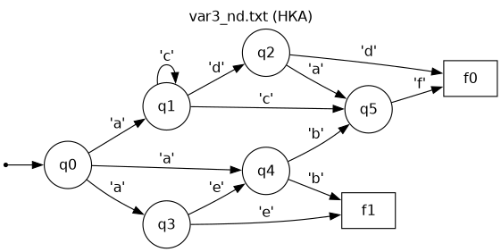
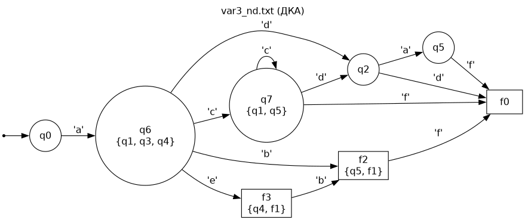
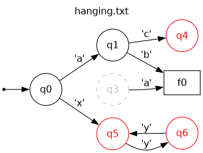

# Лабораторная работа №2. Конечные автоматы

**Дисциплина:** Теория алгоритмических языков и компиляторов (ТАЯК)
**Тема:** Конечные детерминированные автоматы. Преобразование недетерминированного конечного автомата к детерминированному
**Студент:** Алешин Иван Кириллович
**Уровень:** задание максимум (на 5)

Методичка — [`ТАЯК_ЛР2.docx`](ТАЯК_ЛР2.docx), шпаргалка к защите — [SUMMARY.md](SUMMARY.md),
теория подробнее — [THEORY.md](THEORY.md).

## Задание

Написать программу, реализующую работу конечного автомата.

**Входные данные:**

1. Текстовый файл с графом переходов. Каждая строка — одно правило `q<N>,<C>=<q|f><N>`:
   `q` — состояние, `f` — конечное состояние, `<N>` — номер, `<C>` — один символ.
   Пример: `q12,g=f0` — из состояния 12 по символу `g` перейти в конечное состояние 0.
   Число строк не ограничено, начальное состояние — `q0`, строки не отсортированы,
   номера состояний не обязательно идут подряд.
2. Строка символов, которую надо разобрать автоматом.

**Выходные данные:** заключение о детерминированности автомата; для НКА — переходы
эквивалентного детерминированного автомата в формате входного файла; заключение, допускает ли
автомат введённую строку.

**Задание максимум:** файл может содержать синтаксические ошибки, автомат может быть
недетерминированным и содержать висячие вершины. Нужно вывести информацию об автомате,
детерминизировать его, вывести таблицу переходов нового автомата и разобрать строку.
Желательно ООП; дополнительно — графическое представление автомата до и после детерминизации.

## Как запустить

Python 3.13+, только стандартная библиотека, сборки нет. Один раз в корне репозитория
(там `.envrc` с `use flake`, Python приходит из `flake.nix`):

```bash
cd ~/repos/uni
direnv allow
```

Дальше из папки лабы:

```bash
cd compilers/lab-2
python3 main.py examples/var1.txt                # строки вводятся с клавиатуры, пустая строка — выход
python3 main.py examples/var3_nd.txt ab aebf a   # строки сразу аргументами
bash tests/run_tests.sh                          # автотесты
```

Без direnv — через `nix develop -c …` (из папки лабы):
`nix develop -c python3 main.py examples/var1.txt`, `nix develop -c bash tests/run_tests.sh`.

Полный синтаксис:

```
python3 main.py <файл автомата> [строка ...] [--dot] [--dfa-out <файл>]
  --dot              записать графы <файл>.dot и <файл>.dfa.dot для Graphviz
  --dfa-out <файл>   сохранить правила ДКА в формате входного файла
```

Строку с пробелами в аргументе надо взять в кавычки: `python3 main.py examples/var1.txt "ab + cd * e =357"`.

## Формат файла и принятые решения

Методичка описывает формат одной строкой, а в примерах преподавателя есть случаи, которые
надо было как-то трактовать. Что решено и почему:

| Ситуация | Решение |
| --- | --- |
| Символ перехода — пробел, `=`, `,`, `;`, `"`, `\`, `/`, `*`, `+` (`q3, =q3`, `q7,==q10`, `q2,,=q4`) | Символ — это ровно один символ сразу после **первой** запятой, за ним обязан стоять `=`. Поэтому `q7,==q10` — переход по `=`, а `q2,,=q4` — переход по `,` |
| Строки `;ab -> ...`, `;aa`, `;ba` в конце `var1.txt` | **Комментарии.** Правило всегда начинается с `q`, так что строка с `;` в начале правилом быть не может, а по содержанию это подсказка преподавателя. Комментарием считается и строка с `#` |
| Пустые строки, `\r` в конце (файлы из Windows), пробелы по краям строки | Пропускаются / срезаются. Пробел-символ стоит в середине правила, обрезка краёв его не задевает |
| Синтаксическая ошибка | Строка пропускается, печатается номер строки, сама строка и что именно не так; чтение продолжается |
| Одно и то же правило записано дважды | Не ошибка: учитывается один раз, программа сообщает номер строки повтора |
| `q0` и `f0` | Разные состояния: буква входит в имя. `f0` не «конечная версия» `q0` |
| Буквы `Q`/`F` | Допускаются наравне с `q`/`f`, как в примере кода из методички |
| `f<N>` в левой части (`f2,f=f0`) | **Разрешено** (расширение формата). Конечные состояния с выходящими переходами есть уже в методичке: на рис. 2 из конечного `q4` идёт стрелка по `c` (строка `abc` допускается). И без этого ДКА нельзя записать в формате входного файла: при детерминизации появляются такие состояния (например, `{q5, f1}` в `var3_nd.txt`) |
| Когда строка допускается | Автомат прочитал **всю** строку и стоит в конечном (`f`) состоянии. Если из `f`-состояния есть переходы и строка не кончилась, разбор продолжается. Если переходов нет — строка отвергается, потому что дальше идти некуда. Для файлов, где у `f` нет выходящих переходов, это ровно поведение `isExpressionCorrect` из примера в методичке |
| Пустая строка | Не допускается: `q0` никогда не конечное. С клавиатуры её проверить нельзя (пустой ввод завершает работу), аргументом `""` — можно |
| Символ не ASCII (`q0,д=q1`) | Символ — один символ UTF-8, а не байт; входная строка тоже режется на символы UTF-8. Если байты не складываются в UTF-8 (файл в cp1251), каждый байт — отдельный символ |
| Метка BOM в начале файла (Блокнот Windows) | Срезается, иначе первое правило стало бы ошибкой |
| Номера состояний | До 18 цифр; ведущие нули не важны (`q007` — это `q7`). Новые номера ДКА (максимум + 1, …) не переполняются и читаются обратно |
| Переход без символа (`q1,=q2`, ε-переход) | Синтаксическая ошибка с отдельным сообщением: формат требует ровно один символ |

## Что делает программа

1. Читает файл (класс `RuleFileReader`), собирает правильные правила и список ошибок.
2. Строит автомат (класс `FiniteAutomaton`) и печатает: состояния, конечные состояния, алфавит,
   число правил, таблицу переходов (у НКА в клетке может быть множество `{q1,q3,q4}`).
3. Проверяет детерминированность и перечисляет **все** конфликты: из какого состояния, по какому
   символу, в какие состояния и в каких строках файла записаны конфликтующие правила.
4. Ищет висячие вершины:
   - **недостижимые** — в них нельзя попасть из `q0` (обход в ширину от `q0`);
   - **тупиковые** — из них нельзя попасть ни в одно конечное состояние (обход в ширину от
     конечных состояний против стрелок). Отдельно отмечено, есть ли у тупика переходы вообще
     («висит» без выхода) или он ходит по кругу.
5. Если автомат недетерминирован — строит ДКА методом подмножеств, печатает состав новых
   состояний, правила ДКА в формате входного файла и таблицу переходов ДКА.
6. Разбирает строки: для ДКА — сразу, для НКА — через построенный ДКА. Печатает заключение,
   путь по состояниям, а при отказе — номер символа, на котором автомат застрял, и какие символы
   там ожидались. Для НКА ответ дополнительно сверяется с прямым моделированием НКА
   (множеством текущих состояний).
7. По флагу `--dot` пишет граф до и после детерминизации в формате Graphviz.

## Алгоритм детерминизации

Как в методичке: если `t(q, a)` даёт множество состояний `{p1, …, pk}`, это множество
объявляется одним новым состоянием `q'`, а переходы из него — объединение переходов его элементов:
`t(q', a) = ∪ t(p, a)` по всем `p ∈ q'`. Новое состояние конечное, если в нём есть хотя бы одно
конечное. Программа делает это обходом в ширину, начиная с `{q0}`, поэтому в ДКА попадают только
достижимые подмножества (пустое множество в ДКА не добавляется: «перехода нет» и так означает отказ).

Имена новых состояний: одноэлементное множество `{qK}` сохраняет имя `qK`, составное получает
следующий свободный номер — `q<max+1>`, если оно не конечное, и `f<max+1>`, если конечное.
Так ДКА легко сверить с исходным графом, а имена не пересекаются со старыми.

### Разбор на `examples/var3_nd.txt`

Исходный НКА (4 конфликта: `q0` по `a`, `q1` по `c`, `q3` по `e`, `q4` по `b`):



Построение подмножеств вручную (новые номера: максимум `q` — 5, значит `q6, q7, …`;
максимум `f` — 1, значит `f2, f3, …`):

| Шаг | Состояние ДКА | Множество | a | b | c | d | e | f |
| --- | --- | --- | --- | --- | --- | --- | --- | --- |
| 1 | `q0` (нач.) | {q0} | {q1,q3,q4} = **q6** | | | | | |
| 2 | `q6` | {q1,q3,q4} | | {q5,f1} = **f2** | {q1,q5} = **q7** | {q2} = q2 | {q4,f1} = **f3** | |
| 3 | `f2` (кон.) | {q5,f1} | | | | | | {f0} = f0 |
| 4 | `q7` | {q1,q5} | | | {q1,q5} = q7 | q2 | | f0 |
| 5 | `q2` | {q2} | {q5} = q5 | | | f0 | | |
| 6 | `f3` (кон.) | {q4,f1} | | {q5,f1} = f2 | | | | |
| 7 | `f0` (кон.) | {f0} | | | | | | |
| 8 | `q5` | {q5} | | | | | | f0 |

Пояснения к шагам: в шаге 2 по `b` объединяем `t(q1,b) = ∅`, `t(q3,b) = ∅`, `t(q4,b) = {q5,f1}`;
по `c` — только `t(q1,c) = {q1,q5}`. `f2 = {q5,f1}` конечное, потому что содержит `f1`; из него
есть переход по `f` (от `q5`) — вот зачем нужен `f` в левой части правила.

Результат программы совпал с ручным построением строка в строку (это проверяет `bash tests/run_tests.sh`,
эталон — [`tests/var3_nd.dfa.expected`](tests/var3_nd.dfa.expected)):



Состояния `q1, q3, q4, f1` в ДКА поодиночке не встречаются: они «растворились» в составных.

На примере из методички (рис. 3: `S` = `q0`, `D` = `q1`, `f` = `f0`, файл
[`tests/manual_nfa.txt`](tests/manual_nfa.txt)) получается ровно рис. 4: новое конечное
состояние `{D, f}` (у нас `f1`) с петлёй по `0`. Вывод — в разделе результатов.

## Архитектура

| Файл | Содержимое |
| --- | --- |
| [`automaton.py`](automaton.py) | `State`, `Rule`, `SyntaxError_`, `Conflict`, `RunResult`; классы `RuleFileReader` и `FiniteAutomaton`; `Determinized`; разбор строки файла, анализ автомата, детерминизация, разбор строк, печать таблицы и DOT |
| [`main.py`](main.py) | аргументы командной строки, порядок вывода, интерактивный ввод строк |
| [`tests/`](tests) | свои автоматы, `cases.tsv` (файл / строка / ожидание), `run_tests.sh` |

- `State(NamedTuple)` — пара (конечное?, номер). Кортеж неизменяемый и сравнивается по полям,
  поэтому состояния можно класть в `set`, а множества состояний (`frozenset`) — использовать как
  ключ словаря. Это и есть ключ таблицы подмножеств. Порядок: сначала все `q`, потом все `f`.
- `Rule`, `Conflict`, `RunResult`, `Determinized` — `@dataclass` (у `Rule` поле `from_`, потому что
  `from` — ключевое слово). `SyntaxError_` назван с подчёркиванием, чтобы не перекрыть встроенный
  `SyntaxError`.
- `RuleFileReader` отвечает только за файл: разбирает каждую строку (`parse_line` возвращает
  пару «правило, ошибка»), хорошие правила складывает в `rules()`, плохие — в `errors()` с номером строки.
- `FiniteAutomaton` хранит функцию переходов как `dict[State, dict[str, set[State]]]` —
  это сразу НКА; ДКА — частный случай, когда все множества одноэлементные. Методы:
  `conflicts()`, `unreachable()`, `dead()`, `determinize()`, `run()` (ДКА), `run_nfa()` (НКА),
  `print_rules()`, `print_table()`, `write_dot()`.
- `determinize()` возвращает новый `FiniteAutomaton` плюс таблицу «новое состояние = множество
  старых», так что к ДКА применимы те же проверки и та же печать.
- Файл и аргументы декодируются из UTF-8 с `errors="surrogateescape"`: байт, который не
  складывается в UTF-8 (буква в cp1251), не теряется и при выводе возвращается тем же байтом.
  Обрезка пробелов и чтение номера сделаны явно по ASCII: `str.strip()` и `str.isdigit()`
  приняли бы неразрывный пробел и арабские цифры.

Исходники: [`automaton.py`](automaton.py), [`main.py`](main.py).

## Результаты

Вывод ниже получен из папки лабы командой `python3 main.py <файл> <строки>`.

### `examples/var1.txt` — ДКА

```
=== Файл examples/var1.txt ===
Строк в файле: 28, правил: 23, пустых и комментариев: 5, с ошибками: 0

=== Автомат ===
Состояний: 14: q0 q1 q2 q3 q4 q5 q6 q7 q8 q9 q10 q11 q12 f0
Начальное: q0
Конечных: 1: f0
Алфавит (12): ' ' '*' '+' '3' '5' '7' '=' 'a' 'b' 'c' 'd' 'e'
Правил: 23

Таблица переходов (-> начальное, * конечное, - перехода нет):
       | ' ' | '*' | '+' | '3' | '5' | '7' | '=' | 'a' | 'b' | 'c' | 'd' | 'e'
-------+-----+-----+-----+-----+-----+-----+-----+-----+-----+-----+-----+----
-> q0  | -   | -   | -   | -   | -   | -   | -   | q2  | q1  | -   | -   | -
   q1  | -   | -   | -   | -   | -   | -   | -   | q3  | -   | -   | -   | -
   q2  | -   | -   | -   | -   | -   | -   | -   | q3  | q3  | -   | -   | -
   q3  | q3  | -   | q4  | -   | -   | -   | -   | -   | -   | -   | -   | -
   q4  | q4  | -   | -   | -   | -   | -   | -   | -   | -   | q5  | -   | -
   q5  | -   | -   | -   | -   | -   | -   | -   | -   | -   | -   | q6  | -
   q6  | q6  | q7  | -   | -   | -   | -   | -   | -   | -   | -   | -   | -
   q7  | q7  | -   | -   | -   | -   | -   | q10 | -   | -   | -   | -   | q8
   q8  | q9  | -   | -   | -   | -   | -   | q10 | -   | -   | -   | -   | q8
   q9  | q10 | -   | -   | -   | -   | -   | q10 | -   | -   | -   | -   | -
   q10 | -   | -   | -   | q11 | -   | -   | -   | -   | -   | -   | -   | -
   q11 | -   | -   | -   | -   | q12 | -   | -   | -   | -   | -   | -   | -
   q12 | -   | -   | -   | -   | -   | f0  | -   | -   | -   | -   | -   | -
  *f0  | -   | -   | -   | -   | -   | -   | -   | -   | -   | -   | -   | -

=== Детерминированность ===
Автомат ДЕТЕРМИНИРОВАН: из каждого состояния по каждому символу не больше одного перехода.

=== Висячие вершины ===
Недостижимых состояний нет: в каждое можно попасть из q0.
Тупиковых состояний нет: из каждого можно дойти до конечного.

=== Проверка строк ===
"ab+cd*e=357" — ДОПУСКАЕТСЯ
    путь: q0 -'a'-> q2 -'b'-> q3 -'+'-> q4 -'c'-> q5 -'d'-> q6 -'*'-> q7 -'e'-> q8 -'='-> q10 -'3'-> q11 -'5'-> q12 -'7'-> f0
"aa + cd * eee  357" — ДОПУСКАЕТСЯ
    путь: q0 -'a'-> q2 -'a'-> q3 -' '-> q3 -'+'-> q4 -' '-> q4 -'c'-> q5 -'d'-> q6 -' '-> q6 -'*'-> q7 -' '-> q7 -'e'-> q8 -'e'-> q8 -'e'-> q8 -' '-> q9 -' '-> q10 -'3'-> q11 -'5'-> q12 -'7'-> f0
"ba +cd*=357" — ДОПУСКАЕТСЯ
    путь: q0 -'b'-> q1 -'a'-> q3 -' '-> q3 -'+'-> q4 -'c'-> q5 -'d'-> q6 -'*'-> q7 -'='-> q10 -'3'-> q11 -'5'-> q12 -'7'-> f0
"ab + cd * e = 357" — НЕ ДОПУСКАЕТСЯ: символ №14 ' ': из q10 по нему перехода нет, ожидалось: '3'
    путь: q0 -'a'-> q2 -'b'-> q3 -' '-> q3 -'+'-> q4 -' '-> q4 -'c'-> q5 -'d'-> q6 -' '-> q6 -'*'-> q7 -' '-> q7 -'e'-> q8 -' '-> q9 -'='-> q10
"ab+cd*e=3570" — НЕ ДОПУСКАЕТСЯ: символ №12 '0': из f0 переходов нет вообще, строка должна была здесь закончиться (символа '0' нет в алфавите)
    путь: q0 -'a'-> q2 -'b'-> q3 -'+'-> q4 -'c'-> q5 -'d'-> q6 -'*'-> q7 -'e'-> q8 -'='-> q10 -'3'-> q11 -'5'-> q12 -'7'-> f0
"bb" — НЕ ДОПУСКАЕТСЯ: символ №2 'b': из q1 по нему перехода нет, ожидалось: 'a'
    путь: q0 -'b'-> q1
```

Подсказка в комментарии файла: `ab -> [ ] -> + -> [ ] -> cd -> [ ] -> * -> [ ] -> [e] -> [ ] -> = -> [ ] -> 357`,
начала `ab`, `aa`, `ba`. Проверка показала, что автомат с подсказкой расходится в двух местах:

- **после `=` пробелы не допускаются**: из `q10` есть только переход по `3`, поэтому
  `"ab + cd * e = 357"` отвергается на 14-м символе (пробел после `=`), а `"ab + cd * e =357"` допускается;
- **`=` можно пропустить**: правило `q9, =q10` позволяет после `e` поставить два пробела вместо `=`
  (`"aa + cd * eee  357"` допускается). Скорее всего, имелось в виду `q9, =q9` или `q10, =q10`.

Программа разбирает ровно то, что записано в файле, и об этом стоит сказать на защите.

### `examples/var2.txt` — ДКА со спецсимволами

Символы `\`, `/`, `"`, `,`, `;`, `+`, `*` читаются правильно, автомат детерминирован, висячих
вершин нет, конечных состояний два: `f0` и `f2`.

```
=== Проверка строк ===
"\" — ДОПУСКАЕТСЯ
    путь: q0 -'\'-> f0
"/a"e" — ДОПУСКАЕТСЯ
    путь: q0 -'/'-> q1 -'a'-> q2 -'"'-> q3 -'e'-> f0
"/+f\" — ДОПУСКАЕТСЯ
    путь: q0 -'/'-> q1 -'+'-> q3 -'f'-> q0 -'\'-> f0
"/a,;"e" — ДОПУСКАЕТСЯ
    путь: q0 -'/'-> q1 -'a'-> q2 -','-> q4 -';'-> q2 -'"'-> q3 -'e'-> f0
"/+g++*" — ДОПУСКАЕТСЯ
    путь: q0 -'/'-> q1 -'+'-> q3 -'g'-> q5 -'+'-> q5 -'+'-> q5 -'*'-> f2
"/+e/" — НЕ ДОПУСКАЕТСЯ: символ №4 '/': из f0 переходов нет вообще, строка должна была здесь закончиться
    путь: q0 -'/'-> q1 -'+'-> q3 -'e'-> f0
```

### `examples/var3_nd.txt` — НКА, детерминизация

```
=== Файл examples/var3_nd.txt ===
Строк в файле: 13, правил: 13, пустых и комментариев: 0, с ошибками: 0

=== Автомат ===
Состояний: 8: q0 q1 q2 q3 q4 q5 f0 f1
Начальное: q0
Конечных: 2: f0 f1
Алфавит (6): 'a' 'b' 'c' 'd' 'e' 'f'
Правил: 13

Таблица переходов (-> начальное, * конечное, - перехода нет):
      | 'a'        | 'b'     | 'c'     | 'd' | 'e'     | 'f'
------+------------+---------+---------+-----+---------+----
-> q0 | {q1,q3,q4} | -       | -       | -   | -       | -
   q1 | -          | -       | {q1,q5} | q2  | -       | -
   q2 | q5         | -       | -       | f0  | -       | -
   q3 | -          | -       | -       | -   | {q4,f1} | -
   q4 | -          | {q5,f1} | -       | -   | -       | -
   q5 | -          | -       | -       | -   | -       | f0
  *f0 | -          | -       | -       | -   | -       | -
  *f1 | -          | -       | -       | -   | -       | -

=== Детерминированность ===
Автомат НЕДЕТЕРМИНИРОВАН: по одному символу из одного состояния есть переходы
в разные состояния (4 случ.):
  q0 по 'a' -> {q1, q3, q4}   (строки 1, 2, 3)
  q1 по 'c' -> {q1, q5}   (строки 4, 5)
  q3 по 'e' -> {q4, f1}   (строки 9, 10)
  q4 по 'b' -> {q5, f1}   (строки 11, 12)

=== Висячие вершины ===
Недостижимых состояний нет: в каждое можно попасть из q0.
Тупиковых состояний нет: из каждого можно дойти до конечного.

=== Детерминизация (построение подмножеств) ===
Состояния ДКА (в порядке появления) и из чего они состоят:
  q0 = {q0}
  q6 = {q1, q3, q4}   новое
  f2 = {q5, f1}   конечное: содержит конечное состояние
  q7 = {q1, q5}   новое
  q2 = {q2}
  f3 = {q4, f1}   конечное: содержит конечное состояние
  f0 = {f0}
  q5 = {q5}

Переходы ДКА в формате входного файла:
q0,a=q6
q6,b=f2
q6,c=q7
q6,d=q2
q6,e=f3
f2,f=f0
q7,c=q7
q7,d=q2
q7,f=f0
q2,a=q5
q2,d=f0
f3,b=f2
q5,f=f0

Состояний: 8: q0 q2 q5 q6 q7 f0 f2 f3
Начальное: q0
Конечных: 3: f0 f2 f3
Алфавит (6): 'a' 'b' 'c' 'd' 'e' 'f'
Правил: 13

Таблица переходов (-> начальное, * конечное, - перехода нет):
      | 'a' | 'b' | 'c' | 'd' | 'e' | 'f'
------+-----+-----+-----+-----+-----+----
-> q0 | q6  | -   | -   | -   | -   | -
   q2 | q5  | -   | -   | f0  | -   | -
   q5 | -   | -   | -   | -   | -   | f0
   q6 | -   | f2  | q7  | q2  | f3  | -
   q7 | -   | -   | q7  | q2  | -   | f0
  *f0 | -   | -   | -   | -   | -   | -
  *f2 | -   | -   | -   | -   | -   | f0
  *f3 | -   | f2  | -   | -   | -   | -

=== Проверка строк (через ДКА) ===
"ab" — ДОПУСКАЕТСЯ
    путь по ДКА: q0 -'a'-> q6 -'b'-> f2
    (моделирование исходного НКА даёт тот же ответ)
"ae" — ДОПУСКАЕТСЯ
    путь по ДКА: q0 -'a'-> q6 -'e'-> f3
    (моделирование исходного НКА даёт тот же ответ)
"aebf" — ДОПУСКАЕТСЯ
    путь по ДКА: q0 -'a'-> q6 -'e'-> f3 -'b'-> f2 -'f'-> f0
    (моделирование исходного НКА даёт тот же ответ)
"acdd" — ДОПУСКАЕТСЯ
    путь по ДКА: q0 -'a'-> q6 -'c'-> q7 -'d'-> q2 -'d'-> f0
    (моделирование исходного НКА даёт тот же ответ)
"adaf" — ДОПУСКАЕТСЯ
    путь по ДКА: q0 -'a'-> q6 -'d'-> q2 -'a'-> q5 -'f'-> f0
    (моделирование исходного НКА даёт тот же ответ)
"a" — НЕ ДОПУСКАЕТСЯ: строка закончилась в состоянии q6, оно не конечное; дальше ожидалось: 'b', 'c', 'd', 'e'
    путь по ДКА: q0 -'a'-> q6
    (моделирование исходного НКА даёт тот же ответ)
"aef" — НЕ ДОПУСКАЕТСЯ: символ №3 'f': из f3 по нему перехода нет, ожидалось: 'b'
    путь по ДКА: q0 -'a'-> q6 -'e'-> f3
    (моделирование исходного НКА даёт тот же ответ)
```

### Свои тесты

**Синтаксические ошибки** ([`tests/errors.txt`](tests/errors.txt)) — 11 ошибочных строк разных
видов и один повтор; правильные строки всё равно собираются в автомат:

```
=== Файл tests/errors.txt ===
Строк в файле: 15, правил: 3, пустых и комментариев: 1, с ошибками: 11

=== Синтаксические ошибки (эти строки пропущены) ===
  строка 3: "x0,a=q1" — строка должна начинаться с 'q' (или 'f'), а начинается с 'x'
  строка 4: "q,a=q1" — после 'q' нет номера состояния (или он длиннее 18 цифр)
  строка 5: "q0;a=q1" — после номера состояния ожидалась ',', а стоит ';'
  строка 6: "q0," — после ',' нет символа перехода
  строка 7: "q0,ab=q1" — после символа 'a' ожидался '=', а стоит 'b' (символ перехода должен быть ровно один)
  строка 8: "q0,=q1" — после ',' сразу '=' — нет символа перехода (ε-переходы формат не допускает)
  строка 9: "q1,b=" — после '=' ожидалось состояние q<N> или f<N>, а стоит конец строки
  строка 10: "q1,b=z2" — после '=' ожидалось состояние q<N> или f<N>, а стоит 'z'
  строка 11: "q1,b=q" — после 'q' нет номера состояния (или он длиннее 18 цифр)
  строка 12: "q1,b=f0 лишнее" — лишние символы после номера состояния: ' лишнее'
  строка 14: "q12345678901234567890,c=q1" — после 'q' нет номера состояния (или он длиннее 18 цифр)

=== Повторяющиеся правила (учтены один раз) ===
  строка 15: правило q1,b=f0 уже было выше

=== Автомат ===
Состояний: 3: q0 q1 f0
Начальное: q0
Конечных: 1: f0
Алфавит (2): 'a' 'b'
Правил: 2

Таблица переходов (-> начальное, * конечное, - перехода нет):
      | 'a' | 'b'
------+-----+----
-> q0 | q1  | -
   q1 | -   | f0
  *f0 | -   | -

=== Детерминированность ===
Автомат ДЕТЕРМИНИРОВАН: из каждого состояния по каждому символу не больше одного перехода.

=== Висячие вершины ===
Недостижимых состояний нет: в каждое можно попасть из q0.
Тупиковых состояний нет: из каждого можно дойти до конечного.

=== Проверка строк ===
"ab" — ДОПУСКАЕТСЯ
    путь: q0 -'a'-> q1 -'b'-> f0
```

**Висячие вершины** ([`tests/hanging.txt`](tests/hanging.txt)): `q3` недостижимо, `q4` — тупик без
переходов, `q5 ⇄ q6` — ловушка: переходы есть, но до `f0` из них не дойти.

```
=== Висячие вершины ===
Недостижимые из q0 состояния: q3 — их правила никогда не сработают.
Тупиковые состояния (из них не дойти ни до одного конечного):
  q4 — из него нет ни одного перехода
  q5 — переходы есть, но все ведут в тупик или по кругу
  q6 — переходы есть, но все ведут в тупик или по кругу

=== Проверка строк ===
"ab" — ДОПУСКАЕТСЯ
    путь: q0 -'a'-> q1 -'b'-> f0
"xyy" — НЕ ДОПУСКАЕТСЯ: строка закончилась в состоянии q5, оно не конечное; дальше ожидалось: 'y'
    путь: q0 -'x'-> q5 -'y'-> q6 -'y'-> q5
```



На графе (`--dot`) недостижимые вершины серые пунктирные, тупиковые — красные.

**Пример из методички** ([`tests/manual_nfa.txt`](tests/manual_nfa.txt)) — сравнить с рис. 4:

```
=== Детерминизация (построение подмножеств) ===
Состояния ДКА (в порядке появления) и из чего они состоят:
  q0 = {q0}
  f1 = {q1, f0}   конечное: содержит конечное состояние
  q1 = {q1}

Переходы ДКА в формате входного файла:
q0,a=f1
q0,b=q1
f1,0=f1
q1,0=f1

Состояний: 3: q0 q1 f1
Начальное: q0
Конечных: 1: f1
Алфавит (3): '0' 'a' 'b'
Правил: 4

Таблица переходов (-> начальное, * конечное, - перехода нет):
      | '0' | 'a' | 'b'
------+-----+-----+----
-> q0 | -   | f1  | q1
   q1 | f1  | -   | -
  *f1 | f1  | -   | -

=== Проверка строк (через ДКА) ===
"a" — ДОПУСКАЕТСЯ
    путь по ДКА: q0 -'a'-> f1
    (моделирование исходного НКА даёт тот же ответ)
"a00" — ДОПУСКАЕТСЯ
    путь по ДКА: q0 -'a'-> f1 -'0'-> f1 -'0'-> f1
    (моделирование исходного НКА даёт тот же ответ)
"b0" — ДОПУСКАЕТСЯ
    путь по ДКА: q0 -'b'-> q1 -'0'-> f1
    (моделирование исходного НКА даёт тот же ответ)
"b" — НЕ ДОПУСКАЕТСЯ: строка закончилась в состоянии q1, оно не конечное; дальше ожидалось: '0'
    путь по ДКА: q0 -'b'-> q1
    (моделирование исходного НКА даёт тот же ответ)
```

**Конечное состояние с выходящими переходами** ([`tests/ends_ab.txt`](tests/ends_ab.txt),
строки из `a` и `b`, оканчивающиеся на `ab`): в ДКА `f1 = {q0, f0}` конечное, но из него есть
переходы по `a` и `b`. Строка `abab` проходит через `f1` дважды и допускается, потому что
заканчивается в нём; `aba` уходит из `f1` дальше и отвергается.

```

...
=== Проверка строк (через ДКА) ===
"abab" — ДОПУСКАЕТСЯ
    путь по ДКА: q0 -'a'-> q2 -'b'-> f1 -'a'-> q2 -'b'-> f1
    (моделирование исходного НКА даёт тот же ответ)
"aba" — НЕ ДОПУСКАЕТСЯ: строка закончилась в состоянии q2, оно не конечное; дальше ожидалось: 'a', 'b'
    путь по ДКА: q0 -'a'-> q2 -'b'-> f1 -'a'-> q2
    (моделирование исходного НКА даёт тот же ответ)
```

Кроме того, в тестах есть автомат из приложения 1 методички (`for (...)`,
[`tests/for_loop.txt`](tests/for_loop.txt)) — строка из примера кода
`"  for( int abAccc= 943 ; a<478; …)"` (полностью — в приложении 1) допускается; автомат без конечных состояний
(`tests/no_final.txt`, предупреждение и `q0` в тупиках), автомат на русских буквах
(`tests/unicode.txt`) и автомат с рис. 2 методички ([`tests/fig2.txt`](tests/fig2.txt)):
`ab`, `abc`, `ba` допускаются, `b`, `ak`, `bad` — нет, как написано в задании.

### Автотесты

`bash tests/run_tests.sh` (из папки лабы) проверяет:

- 58 строк из [`tests/cases.tsv`](tests/cases.tsv) по всем примерам — допускается / нет;
- ДКА для `var3_nd.txt` совпадает с ручным построением;
- ДКА четырёх НКА сохраняется через `--dfa-out`, читается обратно, признаётся детерминированным
  и даёт те же ответы на все строки (заодно это проверка, что `f` в левой части читается);
- в `errors.txt` найдено ровно 11 ошибок и повтор, в `hanging.txt` — `q3`, `q4`, `q5`, `q6`;
- `--dot` создаёт оба файла графа, в том числе для файла без расширения (`./board`);
- файл с BOM в начале и буквой в cp1251 читается без ошибок.

```
$ bash tests/run_tests.sh
Python — пройдено: 98, провалено: 0
```

## Граф в Graphviz

```bash
# из папки лабы; графы examples/var3_nd.dot и examples/var3_nd.dfa.dot
python3 main.py examples/var3_nd.txt --dot
nix shell nixpkgs#graphviz -c dot -Tpng examples/var3_nd.dfa.dot -o dfa.png
```

Graphviz в `flake.nix` не добавлен: он нужен только для картинки. Без него текст `.dot` можно
вставить на <https://dreampuf.github.io/GraphvizOnline> или <https://graphviz.online>.
Обозначения как в методичке: начальное состояние отмечено стрелкой, конечные — прямоугольники;
у составных состояний ДКА под именем подписано множество. Картинки в `img/` получены именно так.

## Сценарий сдачи

| Шаг | Команда | Что показать | Строки для проверки |
| --- | --- | --- | --- |
| 1. Обычный ДКА | `python3 main.py examples/var1.txt` | «ДЕТЕРМИНИРОВАН», висячих нет | `ab+cd*e=357` да, `ab + cd * e =357` да, `ab` нет |
| 2. Висячие вершины | `python3 main.py examples/hanging.txt` | `q3` недостижимо, `q4` — тупик, `q5`/`q6` — ловушка-цикл | `ab` да, `a` нет, `xy` нет |
| 3. НКА → ДКА | `python3 main.py examples/var3_nd.txt` | 4 конфликта, состояния ДКА `q6 = {q1,q3,q4}` и т.д., 13 новых правил | `ab`, `abf` да, `acdf` нет |
| 4. Автомат с доски | `python3 main.py board.txt` | всё сразу | что назовёт преподаватель |

Пример `var2.txt` (ДКА со спецсимволами `\ / " , ;`) — запасной, если спросят про экранирование.
Детерминизация НКА не «исправляет»: НКА и ДКА допускают один и тот же язык, ДКА просто
проверяет строку за один проход. Висячие вершины она не удаляет — программа о них только сообщает.

## Как быстро проверить автомат с доски

1. Пронумеровать вершины на доске: начальную — `q0`, остальные обычные — `q1, q2, …`,
   конечные (прямоугольники) — `f0, f1, …`. Номера могут идти с пропусками. Если конечная
   вершина подписана на доске как `q4` (как на рис. 2 методички), в файле она `f4` везде —
   и справа, и слева: `q1,b=f4`, `f4,c=f3` ([`tests/fig2.txt`](tests/fig2.txt)).
2. Записать каждую стрелку одной строкой, в любом порядке, и сразу проверить:

   ```bash
   cat > board.txt <<'EOF'
   q0,a=q1
   q0,a=q2
   q1,b=f0
   q2,c=f0
   EOF
   python3 main.py board.txt --dot
   ```

   Команды — из папки `compilers/lab-2`; файл можно положить куда угодно, графы появятся рядом с ним.

   Стрелку с несколькими символами (`a, b`) — несколькими строками. Опечатку программа покажет
   с номером строки, остальное всё равно построит.
3. Сверить таблицу переходов с доской, прочитать конфликты и висячие вершины, вводить строки
   по одной (пустая строка — выход). Для НКА в ответе виден путь по ДКА.
4. Если надо показать граф: `nix shell nixpkgs#graphviz -c dot -Tpng board.dfa.dot -o b.png`
   или вставить `board.dfa.dot` в онлайн-просмотрщик.

## Вывод

Программа читает автомат из файла с ошибками, находит недетерминированность с указанием строк,
недостижимые и тупиковые состояния, строит эквивалентный ДКА методом подмножеств и разбирает
строки. Детерминизация проверена вручную на `var3_nd.txt` и на примере из методички (рис. 3 → рис. 4),
а эквивалентность ДКА и НКА — сравнением ответов на всех тестовых строках.
