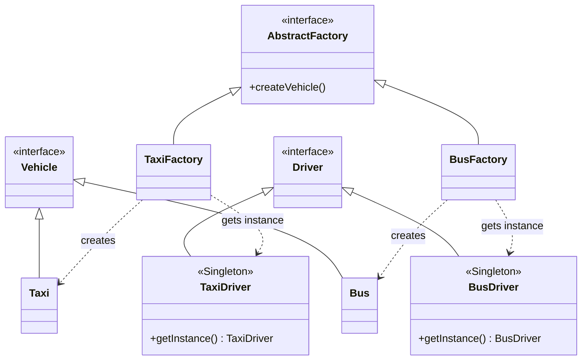

# Лабораторная работа №1: Порождающие паттерны проектирования

## Основное задание

В рамках данной лабораторной работы мне необходимо было изучить и применить на практике порождающие паттерны проектирования, в частности **Абстрактную фабрику (Abstract Factory)** и **Одиночку (Singleton)**.

**Условие задачи:**
1. Реализовать паттерн Одиночка (Singleton).
2. С помощью шаблона Абстрактная фабрика обеспечить контроль загрузки и готовности к отправлению автобусов и такси.
3. Водитель такси и автобуса имеют права разной категории. Без водителя машина не поедет.
4. Два водителя в одну машину сесть не могут.
5. Без пассажиров машины не поедут.
6. Установлен лимит загрузки машин: для автобуса — 30 человек, для такси — 4 человека.
7. Для классов водителей необходимо применить паттерн Singleton.

*Дополнительно от себя:* Я расширил предметную область и добавил параллельную реализацию фабрики по доставке пиццы (фургоны и водители-доставщики), чтобы показать универсальность выбранной архитектуры.

## Архитектура реализации

При разработке я уделил особое внимание принципам **Clean Architecture** (чистой архитектуры). Кодовая база разделена на независимые модули, что делает проект масштабируемым и легко читаемым:

- **`core/`** — содержатся базовые абстрактные классы и интерфейсы (`Vehicle`, `Driver`, `Passenger`, `PizzaBox`).
- **`drivers/`** — конкретные реализации водителей (`TaxiDriver`, `BusDriver`, `PizzaDriver`). Все они строго реализуют паттерн **Singleton**, гарантируя, что за рулем может находиться только один уникальный водитель определенной категории.
- **`vehicles/`** — конкретные реализации транспортных средств (`Taxi`, `Bus`, `PizzaVan`), инкапсулирующие логику проверки готовности к отправлению (наличие ровно одного правильного водителя и соответствие лимитам загрузки).
- **`factory/`** — реализации абстрактных фабрик (`TaxiFactory`, `BusFactory`, `PizzaFactory`), которые связывают воедино транспорт, нужного водителя и пассажиров/груз.
- **`utils/`** — вспомогательные утилиты. Сюда вынесена вся бизнес-логика симуляции (`Simulation.cpp`).

**UML-диаграмма классов (Mermaid):**
Для генерации диаграмм прямо в Markdown (без необходимости устанавливать сторонние библиотеки) отлично подходит синтаксис Mermaid. Он нативно поддерживается на GitHub, GitLab и во многих редакторах (например, Obsidian и VS Code).



**Особенности точки входа:**
Файл `main.cpp` сделан максимально лаконичным и чистым. Он не содержит бизнес-логики или сложной инициализации — вся работа делегирована классу `Simulation`, что позволяет легко расширять сценарии демонстрации.

```cpp
#include "utils/Simulation.h"

int main() {
    Simulation::runAll();
    return 0;
}
```

## Пайплайн демонстрации (Сборка и запуск)

Проект использует систему сборки `make` и настроен для работы в воспроизводимом окружении `Nix`.

### Шаг 1. Активация окружения
Если у вас установлен Nix, в корне проекта (где лежит `flake.nix`) подтяните нужные компиляторы и утилиты (запуск сразу в вашей оболочке fish):
```fish
nix develop -c fish
```
*(Либо используйте интеграцию через `direnv`, тогда окружение подтянется автоматически).*

### Шаг 2. Переход в директорию исходников
```bash
cd software-architecture/lab-1/AbstractFactory
```

### Шаг 3. Сборка проекта
Для очистки старых артефактов и новой чистой сборки выполните:
```bash
make clean
make
```

### Шаг 4. Запуск
Скомпилированный бинарный файл готов к работе:
```bash
./transport_factory
```

В выводе программы вы увидите:
1. Симуляцию распределения очереди из 20 пассажиров по такси (по 4 человека).
2. Заполнение автобуса ровно на 30 человек.
3. Дополнительную симуляцию логистики доставки пиццы.
Программа наглядно демонстрирует проверки статуса готовности (`READY TO GO`), подтверждая, что все условия лабы (наличие водителя-одиночки и пассажиров) успешно выполнены.