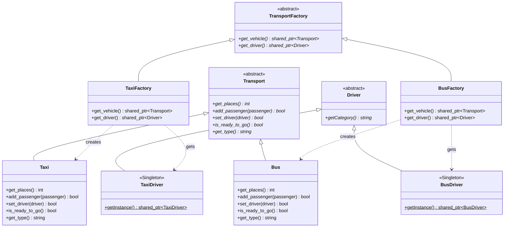
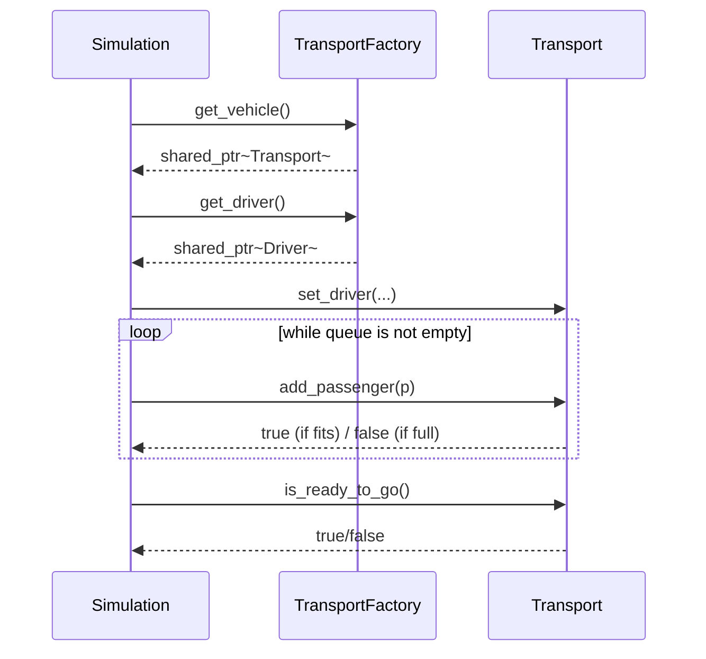

# Лабораторная работа №1: Порождающие паттерны проектирования

## Основное задание

В рамках данной лабораторной работы необходимо изучить и применить на практике порождающие паттерны проектирования, в частности **Абстрактную фабрику (Abstract Factory)** и **Одиночку (Singleton)**.

**Условие задачи:**
1. Реализовать паттерн Одиночка (Singleton).
2. С помощью шаблона Абстрактная фабрика обеспечить контроль загрузки и готовности к отправлению автобусов и такси.
3. Водитель такси и автобуса имеют права разной категории. Без водителя машина не поедет.
4. Два водителя в одну машину сесть не могут.
5. Без пассажиров машины не поедут.
6. Установлен лимит загрузки машин: для автобуса — 30 человек, для такси — 4 человека.
7. Для классов водителей необходимо применить паттерн Singleton.

*Дополнительно от себя:* Добавлена параллельная реализация абстрактной фабрики по доставке пиццы (фургоны и водители-доставщики), чтобы показать универсальность подхода.

## Архитектура реализации

Архитектура строго следует каноничному паттерну "Абстрактная фабрика" из книги GoF, где интерфейс фабрики задает создание семейства связанных объектов (в нашем случае — транспорт и подходящий ему водитель). 

- **`core/`** — содержатся базовые абстрактные классы: `Transport` (с методами `get_places()`, `add_passenger()`) и `Driver`.
- **`drivers/`** — конкретные реализации водителей. Строго реализуют **Singleton**, возвращаются фабрикой через метод `get_driver()`.
- **`vehicles/`** — конкретные виды транспорта (`Taxi`, `Bus`). Инкапсулируют внутри себя лимиты вместимости (4 и 30 мест) и логику проверки.
- **`factory/`** — паттерн абстрактная фабрика. `TransportFactory` задает контракт (`get_vehicle()`, `get_driver()`), а наследники `TaxiFactory` и `BusFactory` его реализуют.
- **`utils/Simulation.cpp`** — клиентский код. Симуляция принимает на вход только **абстрактную фабрику** и очередь пассажиров. Клиент **не знает** ни о типе транспорта, ни о его вместимости, он просто пытается посадить пассажиров, пока транспорт не ответит, что места кончились.

**UML-диаграмма классов (Mermaid):**


**UML-диаграмма взаимодействия клиента (Sequence Diagram):**


## Пайплайн демонстрации (Сборка и запуск)

```bash
cd software-architecture/lab-1/AbstractFactory
make clean
make
make run
```

В выводе программы вы увидите симуляцию распределения очереди из пассажиров по такси и автобусам, а также дополнительную симуляцию логистики доставки пиццы.

## Ответы на контрольные вопросы

**Достоинства и недостатки паттерна Singleton (Одиночка):**
- **Достоинства:**
  1. Класс сам контролирует процесс создания единственного экземпляра.
- **Недостатки:**
  1. Глобальное состояние может усложнить процесс юнит-тестирования.

**Достоинства и недостатки паттерна Abstract Factory (Абстрактная фабрика):**
- **Достоинства:**
  1. Гарантирует сочетаемость создаваемых объектов (например, Такси всегда создается только вместе с Водителем Такси).
  2. Изолирует клиентский код от конкретных классов (клиент работает только с абстракциями `TransportFactory`, `Transport` и `Driver`).
- **Недостатки:**
  1. Сложно добавить поддержку нового вида продуктов в семейство, так как это потребует изменения интерфейса самой абстрактной фабрики и всех её реализаций.