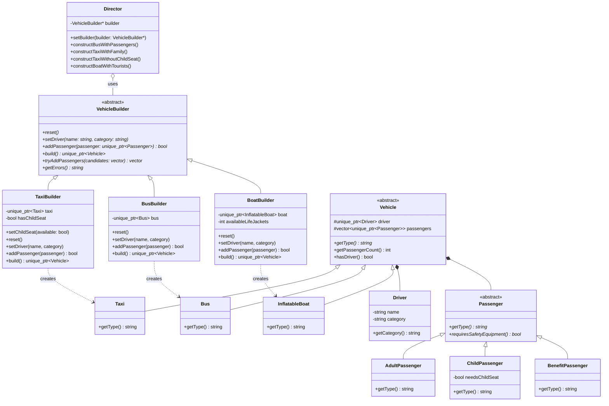

# Лабораторная работа №2: Порождающие паттерны проектирования (Строитель)

## Основное задание

В рамках данной лабораторной работы необходимо было изучить и применить на практике порождающий паттерн проектирования **Строитель (Builder)**.

**Условие задачи:**
1. Разработать UML-диаграмму классов и с помощью паттерна «Строитель» решить задачу обеспечения контроля загрузки и готовности к отправлению автобусов и такси.
2. Водитель такси и автобуса имеют права разной категории. Без водителя машина не поедет.
3. Два водителя в одну машину сесть не могут.
4. Без пассажиров машины не поедут.
5. Установлен лимит загрузки машин: для автобуса — 30 человек, для такси — 4 человека.
6. Есть разница между пассажирами:
   - Для автобуса: три категории пассажиров (взрослый, льготный, ребенок).
   - Для такси: взрослый и ребенок. Для ребенка необходимо детское кресло.

*Дополнительно:* Я расширил предметную область, добавив надувную лодку (`InflatableBoat`) со своим строителем (`BoatBuilder`), которая требует наличия спасательных жилетов для пассажиров. Это демонстрирует гибкость и расширяемость выбранной архитектуры паттерна Строитель.

## Архитектура реализации

Архитектура проекта построена с учетом принципов чистого кода, а точка входа `main.cpp` сделана максимально лаконичной: вся бизнес-логика и тестирование инкапсулированы в статическом классе `Simulation`.

В реализации паттерна Строитель участвуют следующие сущности:
- **Director (Распорядитель)**: Класс `Director` конструирует объект, пользуясь интерфейсом `VehicleBuilder`. Он определяет алгоритм (порядок) сборки (например, посадить водителя, добавить детское кресло, посадить пассажиров).
- **Builder (Строитель)**: Абстрактный интерфейс `VehicleBuilder` задает шаги для создания частей транспортного средства.
- **ConcreteBuilders (Конкретные строители)**: Классы `TaxiBuilder`, `BusBuilder` и `BoatBuilder` реализуют шаги интерфейса для конкретных типов транспорта, следят за бизнес-правилами (наличие кресел, жилетов, проверка категории прав водителя) и собирают конечный продукт.
- **Product (Продукт)**: Конкретные транспортные средства (`Taxi`, `Bus`, `InflatableBoat`), реализующие интерфейс `Vehicle`.

*Примечание касаемо разделения кода:* В данной архитектуре мы используем подход header-only (реализация в заголовочных файлах `.h`) для строителей и сущностей. Это допустимая и часто применяемая практика в современном C++, которая позволяет упростить сборку небольших классов, при этом логика симуляции (`Simulation`) строго вынесена в раздельные `.h` и `.cpp` файлы.

**UML-диаграмма классов (Mermaid):**



**Особенности точки входа:**
Файл `main.cpp` содержит только вызовы симуляций:

```cpp
#include "Simulation.h"
#include <iostream>

int main() {
    std::cout << "=== СИСТЕМА КОНТРОЛЯ ТРАНСПОРТА (BUILDER) ===\n\n";

    std::cout << "--- 1. Создание Такси (с детским креслом) ---\n";
    Simulation::runTaxiDemo();

    std::cout << "\n--- 2. Создание Надувной Лодки (со спасательными жилетами) ---\n";
    Simulation::runBoatDemo();

    std::cout << "\n--- 3. Создание Автобуса (через Builder) ---\n";
    Simulation::runBusDemo();

    std::cout << "\n=== РАБОТА ЗАВЕРШЕНА ===\n";

    return 0;
}
```

## Пайплайн демонстрации (Сборка и запуск)

Проект использует систему сборки `make`.

### Шаг 1. Сборка проекта
Для компиляции исходного кода перейдите в корень лабораторной работы (`lab-2`):
```bash
cd software-architecture/lab-2
```
Выполните чистую сборку:
```bash
make clean
make
```

### Шаг 2. Запуск
Скомпилированный бинарный файл готов к работе. Вы можете запустить его напрямую:
```bash
./transport_system
```
Или воспользоваться командой:
```bash
make run
```

В выводе программы вы увидите разделенные симуляции работы Директора по сборке такси с детским креслом, надувной лодки с туристами и попытку сборки пустого автобуса, что наглядно продемонстрирует проверки соблюдения бизнес-логики (максимальная вместимость и обязательное наличие водителя и пассажиров).