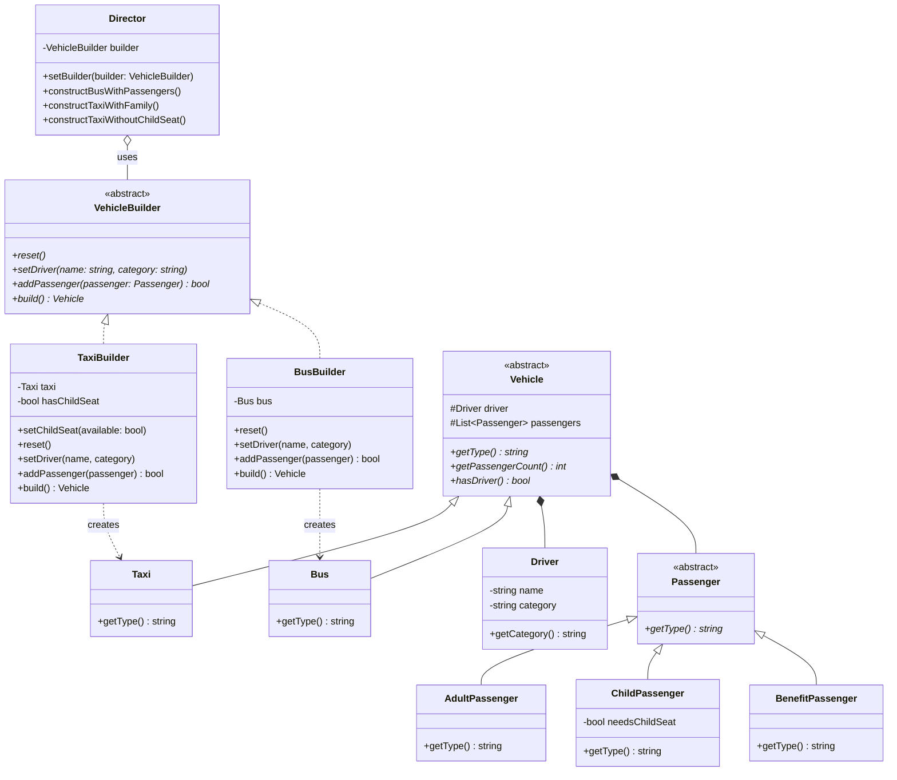
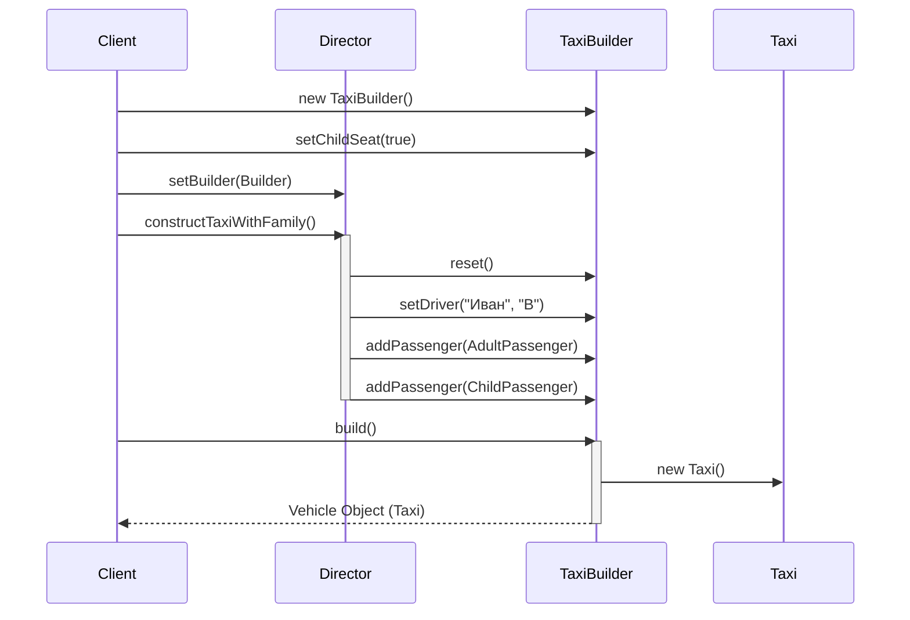

# Отчет по лабораторной работе №2
**«Реализация одного из порождающих паттернов проектирования»**

**Цель работы:** Применение паттерна проектирования Builder (строитель).

---

## 1. Теоретический материал

**Порождающие паттерны проектирования** абстрагируют процесс инстанцирования объектов. Они позволяют сделать код независимым от способа создания, композиции и представления используемых в его работе объектов.

**Паттерн Builder (Строитель)**
- **Назначение:** Отделяет конструирование сложного объекта от его представления, так что в результате одного и того же процесса конструирования могут получаться разные представления.
- **Применимость:** 
  - алгоритм создания сложного объекта не должен зависеть от того, из каких частей состоит объект и как они стыкуются между собой;
  - процесс конструирования должен обеспечивать различные представления конструируемого объекта.
- **Участники:**
  - `Director` (распорядитель) — конструирует объект, пользуясь интерфейсом `Builder`;
  - `Builder` (строитель) — задает абстрактный интерфейс для создания частей объекта `Product`;
  - `ConcreteBuilder` (конкретный строитель) — конструирует и собирает вместе части продукта посредством реализации интерфейса `Builder`;
  - `Product` (продукт) — представляет сложный конструируемый объект.

---

## 2. Задание на выполнение лабораторной работы

Разработать UML-диаграммы (диаграмму классов и диаграмму последовательности) и с помощью паттерна «Строитель» решить следующую задачу:

Обеспечить контроль загрузки и готовности к отправлению автобусов и такси.
- Водитель такси и автобуса имеют права разной категории. 
- Без водителя машина не поедет. Два водителя в одну машину сесть не могут. 
- Без пассажиров машины не поедут. 
- Лимит загрузки машин: для автобуса — 30 чел., для такси — 4 чел.
- Разница между пассажирами автобуса и такси:
  - Для автобуса: три категории пассажиров (взрослый, льготный, ребенок) — разная стоимость билета.
  - Для такси: взрослый и ребенок. Необходимо детское кресло.

*(В реализацию также включена надувная лодка для демонстрации гибкости паттерна).*

---

## 3. Архитектура и UML-диаграммы

### UML-диаграмма классов паттерна

Архитектура системы четко разделяет процесс сборки транспортного средства и его представление. `Director` управляет порядком сборки, вызывая методы стандартизированного интерфейса `VehicleBuilder`, в то время как конкретные классы `TaxiBuilder` и `BusBuilder` отвечают за создание и валидацию частей своего транспорта (проверка лимитов, категорий прав, наличия кресел).



### UML-диаграмма последовательности (Sequence Diagram)

Диаграмма иллюстрирует взаимоотношения строителя и распорядителя с клиентом при сборке такси для семьи с ребенком:



---

## 4. Сборка и запуск проекта

Проект использует систему сборки `make` и написан на C++. 
Точка входа (`main.cpp`) делегирует управление классу `Simulation`, который содержит сценарии демонстрации паттерна (клиентский код).

### Компиляция
В корне директории лабораторной работы выполните:
```bash
make clean
make
```

### Запуск
```bash
./transport_system
```
Или:
```bash
make run
```
Вывод программы покажет процесс пошаговой инициализации объектов и валидацию бизнес-правил, заложенных в конкретных `Builder` (например, отказ в посадке при превышении лимита или отсутствии нужной категории прав у водителя).

---

## 5. Ответы на контрольные вопросы

**1. В чем заключается разница между паттерном проектирования «Абстрактная фабрика» и «Строитель»?**
- **Строитель (Builder)** делает акцент на *пошаговом* конструировании сложного объекта под управлением распорядителя (Director). Он позволяет создавать разные представления одного и того же объекта (например, такси с детским креслом или без). Продукт возвращается клиенту только на самом последнем шаге сборки (метод `build()`). Интерфейс строителя отражает сам *процесс* конструирования.
- **Абстрактная фабрика (Abstract Factory)** делает акцент на создании *семейств* связанных или зависимых объектов (сразу готовых к использованию). Объекты конструируются целиком за один вызов и возвращаются клиенту немедленно.

**2. Достоинства и недостатки паттернов проектирования «Абстрактная фабрика» и «Строитель».**

*Паттерн «Абстрактная фабрика»:*
- **Достоинства:** 
  - Гарантирует сочетаемость создаваемых объектов (они точно из одного семейства продуктов).
  - Изолирует клиентский код от конкретных классов (клиент работает только с абстрактными интерфейсами).
- **Недостатки:** 
  - Сложно добавлять новые типы продуктов в семейство, так как для этого потребуется менять интерфейс самой базовой абстрактной фабрики и переписывать все ее конкретные реализации.

*Паттерн «Строитель»:*
- **Достоинства:** 
  - Позволяет изменять внутреннее представление конструируемого продукта;
  - Изолирует код, реализующий конструирование и представление. Улучшает модульность.
  - Дает более тонкий контроль над процессом конструирования (шаг за шагом).
- **Недостатки:** 
  - `ConcreteBuilder` и создаваемый им продукт жестко связаны между собой, поэтому при внесении изменений в класс продукта, скорее всего, придется соответствующим образом изменять и класс `ConcreteBuilder`.
  - Увеличивает общую сложность кода за счет введения дополнительных классов при конструировании относительно простых объектов.