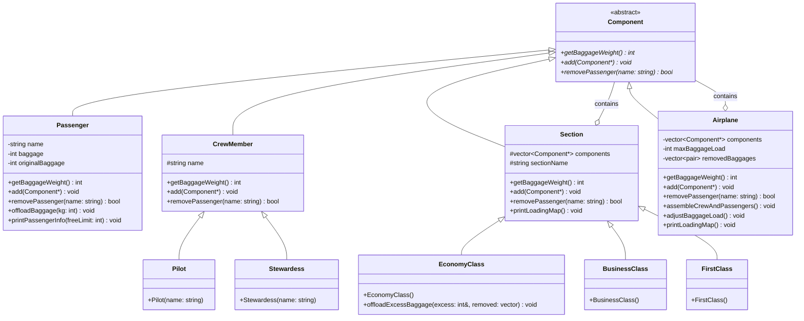

# Лабораторная работа №3: Структурные паттерны проектирования (Компоновщик)

## Основное задание

В рамках данной лабораторной работы необходимо было изучить и применить на практике структурный паттерн проектирования **Компоновщик (Composite)**.

**Условие задачи:**
1. Разработать UML-диаграмму классов и с помощью паттерна «Компоновщик» решить задачу обеспечения контроля загрузки и готовности к отправлению самолета.
2. В самолете присутствуют:
   - Пилоты (2 человека), стюардессы (6 человек).
   - Пассажиры первого (макс. 10 чел), бизнес (макс. 20 чел) и эконом (150 чел) классов.
3. Пассажиры имеют багаж (от 5 до 60 кг).
4. Бесплатно к провозу багажа допускается: 35 кг — бизнес класс, 20 кг — эконом и без ограничения — первый класс.
5. Пилоты и стюардессы не могут иметь багажа.
6. **Роли в паттерне:**
   - *Примитивный объект (Leaf)* – Пассажир, Пилот, Стюардесса.
   - *Составной объект (Composite)* – Первый, бизнес и эконом классы (секции).
7. Есть максимальная допустимая загрузка самолета багажом. При превышении — багаж снимается с рейса. Снять багаж можно **только у пассажиров эконом класса**.
8. В результате работы программы должна быть создана карта загрузки самолета с указанием перевеса багажа и информации о снятом с рейса багаже.

## Архитектура реализации

Архитектура проекта построена с учетом принципов чистого кода. Точка входа `main.cpp` сделана минималистичной, а логика инициализации симуляции вынесена в класс `Simulation`.

В реализации паттерна **Composite** участвуют следующие сущности:
- **Component (Компонент)**: Абстрактный базовый класс `Component`, объявляющий общий интерфейс для всех узлов дерева (как примитивов, так и контейнеров), включая методы расчета веса багажа `getBaggageWeight()`, добавления `add()` и удаления `removePassenger()`.
- **Leaf (Примитивы)**: Классы `Passenger` и `CrewMember` (`Pilot`, `Stewardess`), которые не имеют дочерних элементов и выполняют основную работу (например, хранят вес своего багажа).
- **Composite (Составные объекты)**: Базовый класс `Section` и его наследники (`FirstClass`, `BusinessClass`, `EconomyClass`), а также сам самолет (`Airplane`). Они содержат коллекции указателей на `Component` и делегируют вызовы своим дочерним элементам. `EconomyClass` дополнительно реализует специфичную логику снятия багажа `offloadExcessBaggage()`.

**UML-диаграмма классов (Mermaid):**



**Особенности точки входа:**
Как и в предыдущих лабораторных работах, файл `main.cpp` не содержит тяжелой бизнес-логики:

```cpp
#include "Simulation.h"

int main() {
    Simulation::runDemo();
    return 0;
}
```

## Пайплайн демонстрации (Сборка и запуск)

Проект настроен для сборки утилитой `make` с разделением исходного кода (`src/`) и заголовочных файлов (`include/`).

### Шаг 1. Сборка проекта
Для компиляции исходного кода перейдите в директорию лабораторной работы (`lab-3`):
```bash
cd software-architecture/lab-3
```
Выполните сборку:
```bash
make clean
make
```

### Шаг 2. Запуск
Скомпилированный бинарный файл готов к работе. Запустите его командой:
```bash
make run
```

### Результат работы программы
В выводе консоли будет продемонстрировано:
1. Инициализация всех секций самолёта: добавление пилотов, стюардесс и пассажиров в соответствующие классы.
2. Проверка ограничений на провоз багажа для каждой из секций.
3. Процесс автоматического снятия излишков багажа у пассажиров эконом-класса при превышении общего лимита на рейс (3500 кг в рамках демонстрации).
4. Вывод итоговой **карты загрузки самолета**, включающей перечень пассажиров, вес их багажа и список снятого груза с указанием килограммов.
5. Демонстрация работы рекурсивного метода `removePassenger` (поиск и удаление пассажира по имени через интерфейс компонента) с обновлением итогового веса.