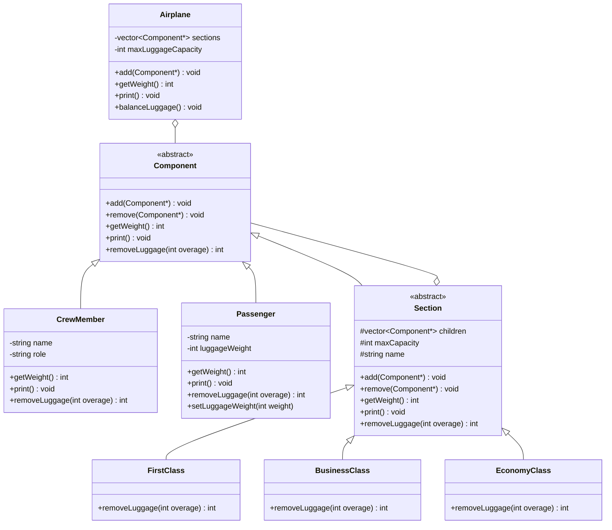
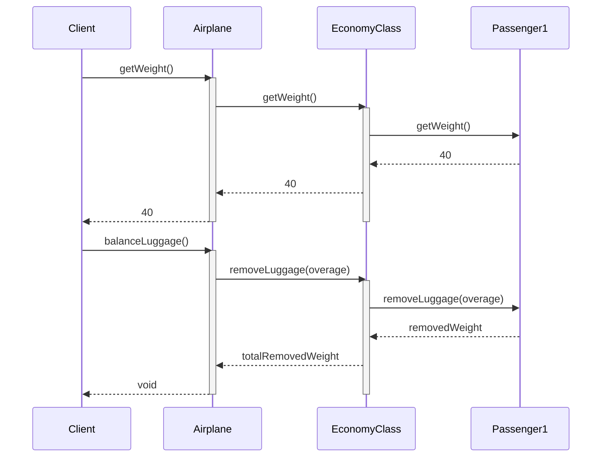

# Отчет по лабораторной работе №3
**«Реализация одного из структурных паттернов проектирования»**

**Цель работы:** Применение паттерна проектирования Composite (компоновщик).

---

## 1. Теоретический материал

В структурных паттернах рассматривается вопрос о том, как из классов и объектов образуются более крупные структуры. 
Вместо композиции интерфейсов или реализаций структурные паттерны уровня объекта компонуют объекты для получения новой функциональности. Дополнительная гибкость в этом случае связана с возможностью изменить композицию объектов во время выполнения.

**Паттерн Composite (Компоновщик)**
- **Назначение:** Компонует объекты в древовидные структуры для представления иерархий «часть-целое». Позволяет клиентам единообразно трактовать индивидуальные и составные объекты.
- **Применимость:**
  - Необходимо объединять группы схожих объектов и управлять ими.
  - Объекты могут быть как примитивными (элементарными), так и составными (сложными). Составной объект может включать в себя коллекции других объектов, образуя сложные древовидные структуры.
  - Код клиента работает с примитивными и составными объектами единообразно.
- **Участники:**
  - `Component` (компонент) — объявляет интерфейс для компонуемых объектов;
  - `Primitive` / `Leaf` (примитив) — представляет листовые узлы композиции и не имеет потомков;
  - `Composite` (составной объект) — определяет поведение компонентов, у которых есть потомки; хранит компоненты-потомки;
  - `Client` (клиент) — манипулирует объектами композиции через интерфейс `Component`.

---

## 2. Задание на выполнение лабораторной работы

Разработать UML-диаграммы (диаграмму классов и диаграмму последовательности) и с помощью паттерна Composite решить следующую задачу:

Обеспечить контроль загрузки и готовности к отправлению самолета.
- В самолете присутствуют: пилоты (2), стюардессы (6), пассажиры первого (макс. 10 чел), бизнес (макс. 20 чел) и эконом (150 чел) классов. 
- Пассажиры имеют багаж (от 5 до 60 кг). 
- Бесплатно к провозу багажа допускается: 35 кг — бизнес класс, 20 кг — эконом и без ограничения — первый класс.
- Примитивный объект – пассажир, пилот, стюардесса. 
- Составной объект – Первый, бизнес и эконом классы.
- Пилоты и стюардессы не могут иметь багажа.
- Есть максимальная допустимая загрузка самолета багажом. При превышении – багаж снимается с рейса. Снять багаж можно только у пассажиров эконом класса.
- В результате работы программы должна быть создана карта загрузки самолета с указанием перевеса багажа и информации о снятом с рейса багаже.

---

## 3. Архитектура и UML-диаграммы

### UML-диаграмма классов паттерна

Архитектура системы строится вокруг интерфейса `Component`, который реализуют как одиночные пассажиры и члены экипажа (`Primitive`), так и классы обслуживания (`Composite`), которые содержат списки пассажиров. Сам самолет (`Airplane`) также может рассматриваться как составной объект, содержащий экипаж и секции (классы).



### UML-диаграмма последовательности (Sequence Diagram)



---

## 4. Сборка и запуск проекта

Проект использует систему сборки `make` и написан на C++. 

### Компиляция
В корне директории лабораторной работы (`lab-3`) выполните:
```bash
make clean
make
```

### Запуск
```bash
./airplane_control
```

При запуске программы выводится полная карта загрузки самолета. Демонстрируется распределение пассажиров по классам, расчет общего веса багажа и процесс автоматического снятия лишнего багажа у пассажиров эконом-класса при превышении общего лимита загрузки самолета. Также демонстрируется удаление узла (пассажира) из иерархии.

---

## 5. Ответы на контрольные вопросы

**1. Объясните целесообразность применения паттерна для решения задачи лабораторной работы.**
В задаче требуется управлять как отдельными людьми (пассажирами, пилотами, стюардессами), так и группами людей (классами обслуживания: Первый, Бизнес, Эконом). Паттерн *Composite* позволяет клиенту (в данном случае классу Airplane или самому методу main) обращаться к ним единообразно через общий интерфейс (например, для подсчета общего веса багажа или его вывода). Без этого паттерна пришлось бы писать разные циклы и проверки типа для каждого списка объектов, что усложнило бы код и поддержку. Применение паттерна делает архитектуру древовидной, масштабируемой и интуитивно понятной.

**2. Каковы паттерны родственны паттерну Composite?**
- **Цепочка обязанностей (Chain of Responsibility):** Отношение «компонент-родитель», часто используемое в паттерне Компоновщик, может применяться в Цепочке обязанностей (запрос передается от потомка к родителю).
- **Декоратор (Decorator):** Часто применяется совместно с компоновщиком. Когда декораторы и компоновщики используются вместе, у них обычно бывает общий родительский класс.
- **Приспособленец (Flyweight):** Позволяет разделять компоненты (например, примитивные листья дерева), чтобы сэкономить память, но ссылаться на своих родителей они уже не могут.
- **Итератор (Iterator):** Может использоваться для удобного обхода сложных древовидных структур объектов Компоновщика.
- **Посетитель (Visitor):** Локализует операции и поведение, которые в противном случае пришлось бы распределять между классами `Composite` и `Leaf`.