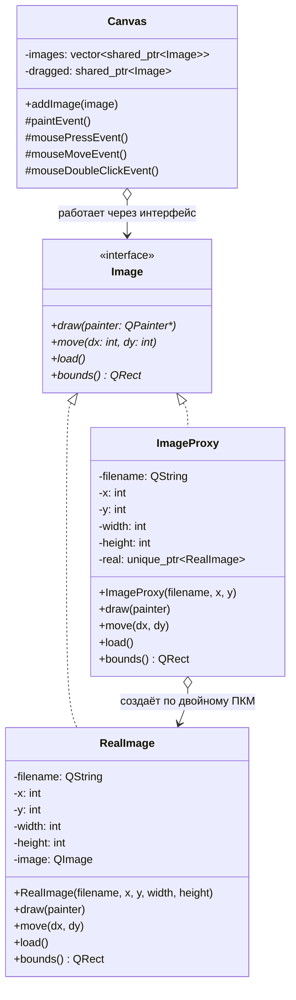
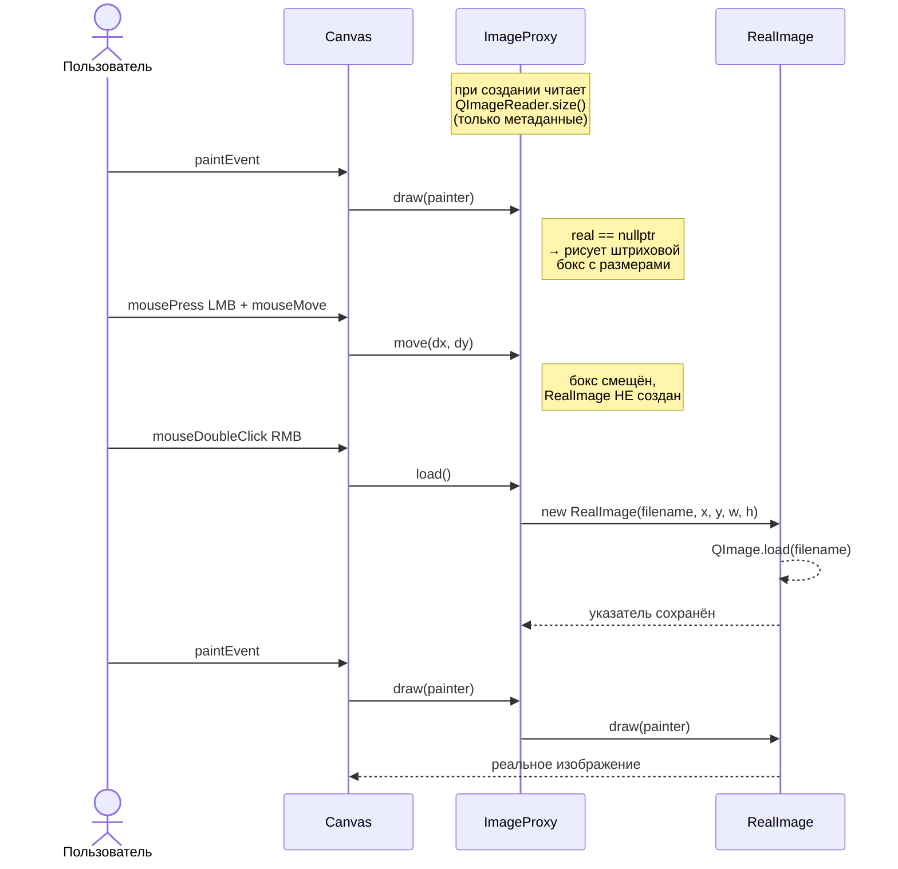
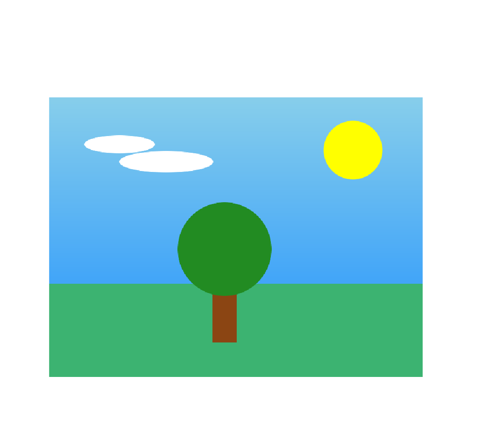

# Отчёт по лабораторной работе №4

**«Реализация одного из структурных паттернов проектирования»**

**Цель работы:** Применение паттерна проектирования **Proxy** (заместитель, суррогат).

---

## 1. Теоретический материал

**Структурные паттерны** рассматривают вопрос о том, как из классов и объектов образуются более крупные структуры. Структурные паттерны уровня объекта компонуют объекты для получения новой функциональности.

**Паттерн Proxy (Заместитель).** Назначение: предоставляет суррогат другого объекта и управляет доступом к нему. Заместитель имеет интерфейс, идентичный интерфейсу реального объекта, поэтому может использоваться вместо него прозрачно для клиента.

В методичке выделяется четыре вида заместителя:
- **виртуальный** — заместитель «тяжёлых» объектов, создание которых дорого; реальный объект создаётся по требованию (lazy initialization);
- **удалённый** — локальный представитель объекта в другом адресном пространстве;
- **защищающий** — контролирует доступ к реальному объекту;
- **«умная» ссылка** — выполняет дополнительные действия при доступе (подсчёт ссылок и т. п.).

В этой работе реализован **виртуальный заместитель**: бокс с размерами изображения занимает место на холсте и позволяет себя перемещать, но пиксели изображения с диска не читаются, пока пользователь явно их не запросит.

**Участники паттерна:**
- **Subject** — общий интерфейс реального объекта и заместителя;
- **RealSubject** — реальный объект;
- **Proxy** — заместитель; хранит ссылку на реальный субъект, контролирует его создание, реализует тот же интерфейс Subject и при необходимости делегирует запросы;
- **Client** — пользуется реальным объектом через интерфейс Subject и не отличает Proxy от RealSubject.

---

## 2. Задание на выполнение лабораторной работы

Разработать UML-диаграммы (диаграмму классов и диаграмму последовательности) и с помощью паттерна «Proxy» решить следующую задачу:

> Создать простейшую модель фрагмента графического редактора, позволяющую нарисовать на экране монитора бокс, имеющий размеры реального изображения, хранящегося на диске под именем `TestImage`. Используя паттерн «Proxy», обеспечить свободное перемещение бокса с помощью мыши по экрану. При двойном нажатии на правую клавишу мыши обеспечить загрузку реального изображения в нарисованный бокс.

---

## 3. Архитектура и UML-диаграммы

Реализация написана на **C++17** с использованием **Qt6 Widgets** для GUI. Каждый из четырёх классов соответствует одному из участников паттерна — никаких прослоек поверх не вводится.

| Файл(ы) | Класс | Тип | Роль из методички | Что делает |
| --- | --- | --- | --- | --- |
| `include/Image.h` | `Image` | **абстрактный класс** (все методы чисто виртуальные) | **Subject** | Объявляет общий интерфейс реального объекта и заместителя: `draw()`, `move()`, `load()`, `bounds()`. |
| `include/RealImage.h` + `src/RealImage.cpp` | `RealImage` *(наследует от `Image`)* | конкретный класс | **RealSubject** | Реально читает пиксели файла через `QImage::load()` в конструкторе (это «тяжёлая» операция) и рисует их на холсте. |
| `include/ImageProxy.h` + `src/ImageProxy.cpp` | `ImageProxy` *(наследует от `Image`)* | конкретный класс | **Proxy (виртуальный)** | Хранит имя файла, координаты бокса и `std::unique_ptr<RealImage>`, изначально `nullptr`. До `load()` рисует штриховую рамку с размерами; размеры читает из метаданных PNG через `QImageReader::size()` без загрузки пикселей. После `load()` делегирует `draw()` и `move()` реальному объекту. |
| `include/Canvas.h` + `src/Canvas.cpp` | `Canvas` *(наследует от `QWidget`)* | конкретный класс | **Client** | Виджет холста. Работает с изображениями **только через интерфейс `Image`** — не различает Proxy и RealSubject. Обрабатывает ЛКМ-перетаскивание и двойной ПКМ-«щелчок-загрузить». |
| `src/main.cpp` | — | функция | сборка приложения | Создаёт `QApplication`, `Canvas`, единственный `ImageProxy` для `TestImage.png`. |

**Короткая защитная формулировка:** «`Image` — абстрактный класс (Subject). Его реализуют два конкретных класса: `RealImage` (RealSubject, реально работает с диском) и `ImageProxy` (виртуальный Proxy, держит указатель на RealImage и создаёт его лениво). Клиент `Canvas` оперирует только указателями на `Image` и поэтому одинаково работает и с боксом, и с реальным изображением.»

### 3.1. UML-диаграмма классов



### 3.2. UML-диаграмма последовательности

Демонстрирует сценарий: пользователь видит бокс, перетаскивает его, затем делает двойной правый клик и видит реальное изображение.



---

## 4. Сборка и запуск

Проект использует **CMake** (под капотом) и тонкий **Makefile** для удобства команд. В корне репозитория предполагается включённый `direnv` с `use flake` (`flake.nix` уже подкладывает `qt6.qtbase`, `qt6.qtimageformats`, `cmake`, `gcc` в `PATH`).

```bash
cd software-architecture/lab-4
make            # cmake configure + build
make run        # запуск проекта
make clean      # удалить build/
```

Файл-ассет: `assets/TestImage.png` (640×480, сгенерирован через ImageMagick).

### Управление

- **Левая кнопка мыши, удержание + перемещение** — перетаскивание бокса.
- **Двойной щелчок правой кнопкой мыши** — загрузка реального изображения в текущий бокс.

### Что должно происходить

1. При старте на белом холсте появляется штриховая рамка с размерами `640×480` и подсказкой «двойной ПКМ — загрузить». В консоли — строка `[ImageProxy] Создан заместитель 640x480 для …/TestImage.png`. **Реальное изображение в память НЕ загружено** — `QImage` ещё не создан.
2. При перетаскивании рамки ЛКМ — бокс свободно двигается, в консоль ничего не пишется (запрос идёт только к Proxy).
3. После двойного ПКМ по боксу в консоли появляются строки:

   ```
   [ImageProxy] Двойной ПКМ — создаю RealImage
   [RealImage] Загрузка пикселей с диска: …/TestImage.png
   ```

   и в боксе отрисовывается реальное изображение. Дальнейшие перетаскивания продолжают работать — координаты в `ImageProxy` и `RealImage` синхронизированы.

---

## 5. Демонстрация работы

При запуске без двойного ПКМ (например, в режиме `QT_QPA_PLATFORM=offscreen`) в логе видно, что метаданные прочитаны, а пиксели — нет:

```
$ QT_QPA_PLATFORM=offscreen ./build/proxy_image_editor
[ImageProxy] Создан заместитель 640x480 для …/assets/TestImage.png
```

После двойного щелчка ПКМ по боксу в реальном GUI-сеансе в лог добавляются:

```
[ImageProxy] Двойной ПКМ — создаю RealImage
[RealImage] Загрузка пикселей с диска: …/assets/TestImage.png
```

Это и есть наблюдаемое подтверждение ленивой инициализации: сообщение от `RealImage` появляется ровно один раз и ровно тогда, когда пользователь явно запросил загрузку.

Скриншот окна после загрузки реального изображения:



---

## 6. Ответы на контрольные вопросы

**1. Чем похожи и чем отличаются паттерны Proxy, Adapter и Decorator?**

| | Интерфейс | Назначение |
| --- | --- | --- |
| **Adapter** | *другой* интерфейс над уже существующим объектом | привести несовместимый интерфейс к ожидаемому клиентом |
| **Proxy** | *тот же* интерфейс, что у реального объекта | контролировать доступ к реальному объекту (виртуальный/защитный/удалённый/«умный») |
| **Decorator** | *расширенный* (того же типа) интерфейс | динамически добавить объекту новые обязанности |

Все три добавляют дополнительный уровень косвенности между клиентом и реальным объектом и хранят ссылку на объект, которому делегируют запросы. Разница — в *роли*:

- **Adapter** решает задачу совместимости интерфейсов.
- **Proxy** решает задачу контроля доступа: в нашем случае — отложенная загрузка «тяжёлого» изображения; `ImageProxy` и `RealImage` имеют идентичный интерфейс `Image`, и `Canvas` работает с любым из них прозрачно.
- **Decorator** расширяет поведение объекта, не меняя его идентичности.

Структурно Proxy и Decorator особенно похожи — оба содержат внутри ссылку на объект того же интерфейса и пересылают вызовы. Их различают по цели: Decorator стремится *добавить* функциональность, Proxy — *ограничить* или *отложить* её.
