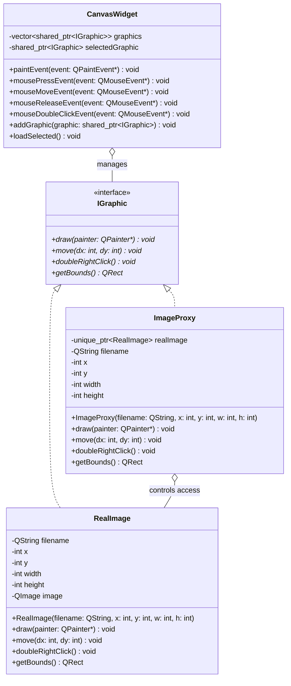
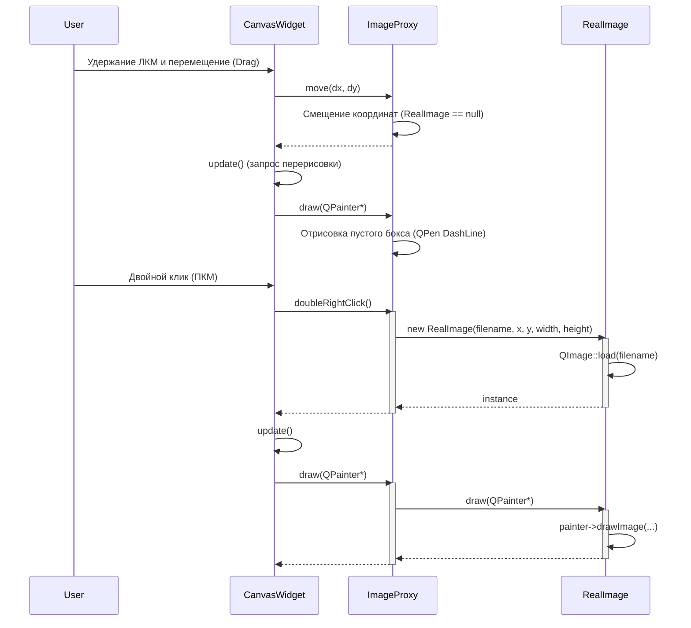

# Лабораторная работа №4: Структурные паттерны проектирования (Заместитель / Proxy)

## Основное задание

В рамках данной лабораторной работы необходимо было изучить и применить на практике структурный паттерн проектирования **Заместитель (Proxy)**, в частности его разновидность — *виртуальный заместитель (Virtual Proxy)*.

**Условие задачи:**
1. Разработать UML-диаграммы (диаграмму классов и диаграмму последовательности).
2. Создать простейшую модель фрагмента графического редактора **с графическим интерфейсом пользователя (GUI)**.
3. Позволить нарисовать на экране монитора бокс, имеющий размеры реального изображения, хранящегося на диске.
4. Используя паттерн «Proxy», обеспечить свободное перемещение бокса с помощью «мыши» по экрану без загрузки самого тяжелого изображения в память.
5. При двойном нажатии на правую клавишу «мыши» обеспечить загрузку реального изображения в нарисованный бокс.

## Архитектура реализации (Qt6)

Проект реализован на C++ с использованием современного фреймворка **Qt6** для графического интерфейса. Архитектура построена на основе классической схемы паттерна Proxy:

- **Subject (Субъект)**: Базовый интерфейс `IGraphic`, определяющий общие методы (`draw`, `move`, `doubleRightClick`, `getBounds`) для реального объекта и его заместителя.
- **RealSubject (Реальный субъект)**: Класс `RealImage`, представляющий тяжелое изображение (`QImage`), загрузка которого с диска требует затрат ресурсов.
- **Proxy (Заместитель)**: Класс `ImageProxy`. Хранит имя файла и размеры рамки (бокса). Перехватывает вызовы к `IGraphic`. До двойного правого клика он симулирует присутствие объекта: рисует пустую штриховую рамку и обрабатывает перемещение. После двойного клика — загружает `RealImage` и делегирует все отрисовки ему.
- **Client (Клиент)**: `CanvasWidget` — виджет холста, обрабатывающий события мыши (Drag & Drop, двойной клик) и вызывающий методы у полиморфных объектов `IGraphic`.

**UML-диаграмма классов (Mermaid):**



**UML-диаграмма последовательности (Sequence Diagram):**

Ниже показан процесс ленивой инициализации тяжелого изображения через пользовательский интерфейс.



## Пайплайн демонстрации (Сборка и запуск)

Проект использует `CMake` в связке с `Qt6`. В корне репозитория предусмотрен файл `flake.nix` для мгновенного развертывания локального окружения. Тестовые изображения уже включены в проект (`assets/TestImage.xpm`, `assets/Nature.xpm`) и подхватываются автоматически, поэтому сообщение `Image Not Found` не появляется при штатном запуске. При необходимости можно использовать и другие форматы (например, `jpg`/`png`), если в окружении установлен плагин `qtimageformats` — тогда достаточно положить файл в `assets/` и изменить путь в `main.cpp`.

### Шаг 1. Активация окружения (если используется Nix)
```bash
nix develop -c fish
```

### Шаг 2. Сборка проекта
Для компиляции используйте абсолютные пути (это исключает ошибки с `cd`):
```bash
cd /home/ivan/repos/uni/software-architecture/lab-4
rm -rf build
mkdir -p build
cd /home/ivan/repos/uni/software-architecture/lab-4/build
cmake ..
cmake --build . -j
```

### Шаг 3. Запуск
Запустите собранное приложение:
```bash
./proxy_app
```

### Результат работы программы
Откроется графическое окно со светлым фоном:
1. Изначально на холсте отображаются только штриховые рамки заданных размеров с подписью файла (Proxy). Картинки не загружены.
2. Вы можете захватить любой бокс левой кнопкой мыши и свободно **перемещать его по экрану**.
3. Загрузка реального изображения:
   - **двойной клик ПКМ** по боксу (основной способ);
   - **Space/Enter** по выбранному боксу (резервный способ для тачпада);
   - кнопка **Load selected image** в верхней панели.
4. Прокси загружает изображения из папки `assets/` (`TestImage.xpm`, `Nature.xpm`) и отрисовывает их. Если хотите использовать свои картинки, положите их в `assets/` и замените имена в `main.cpp`. Форматы `jpg/png` поддерживаются при наличии `qtimageformats` в окружении.

## Ответы на контрольные вопросы

**1. Чем похожи и чем отличаются паттерны Proxy, Adapter и Decorator?**

*   **Чем похожи:**
    Все три паттерна относятся к классу *структурных* паттернов. Они базируются на композиции (оборачивают другой объект в класс-обертку) и вводят дополнительный уровень косвенности (индирекции) между клиентом и внутренним объектом. Во всех случаях клиент общается с оберткой, которая перехватывает запросы и что-то с ними делает, прежде чем (и если) передать дальше.
*   **Чем отличаются (Назначение и Интерфейс):**
    *   **Proxy (Заместитель):** Предоставляет *абсолютно тот же самый интерфейс*, что и реальный объект. Его главная цель — **контроль доступа** (отложенная загрузка тяжелых объектов, кэширование, защита, логирование). Заместитель сам управляет жизненным циклом реального субъекта.
    *   **Adapter (Адаптер):** Предоставляет *совершенно другой интерфейс* к оборачиваемому объекту. Его главная цель — **совместимость**. Он нужен, чтобы заставить работать вместе классы с несовместимыми интерфейсами (например, адаптировать старый класс под новый интерфейс API).
    *   **Decorator (Декоратор):** Предоставляет *тот же или слегка расширенный интерфейс*. Его главная цель — **динамическое добавление новых обязанностей** или поведения объекту в рантайме без использования наследования. В отличие от Proxy, декоратор обычно не управляет созданием объекта, а получает его готовым извне (через конструктор).
