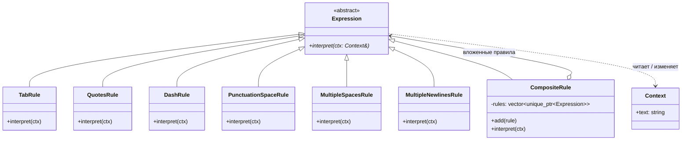
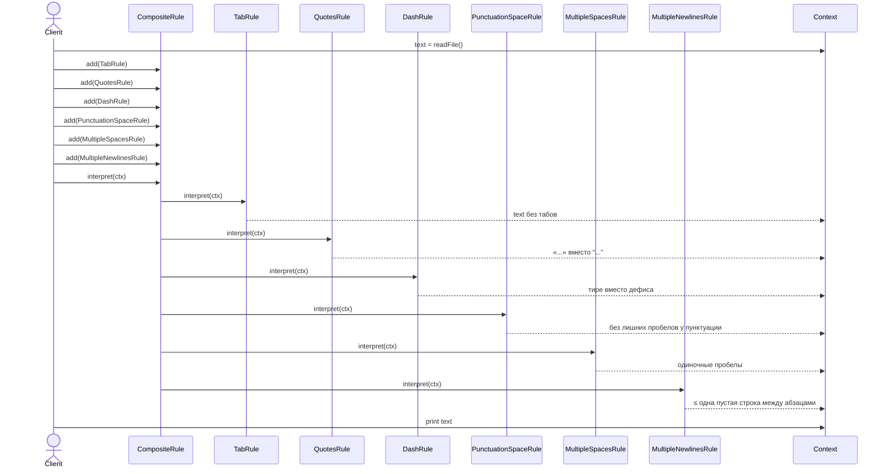

# Отчёт по лабораторной работе №5

**«Реализация одного из паттернов поведения»**

**Цель работы:** Применение паттерна проектирования **Interpreter** (интерпретатор).

---

## 1. Теоретический материал

**Паттерны поведения** рассматривают вопросы о связях между объектами и распределении обязанностей между ними.

**Паттерн Interpreter.** Назначение: для заданного языка определяет представление его грамматики, а также интерпретатор предложений этого языка. Отображает проблемную область в язык, язык — в грамматику, а грамматику — в иерархии объектно-ориентированного проектирования.

Идея паттерна: каждая продукция (правило) грамматики представляется собственным классом-наследником общего абстрактного `AbstractExpression`. Терминальные правила (`TerminalExpression`) реализуют операцию `interpret(Context)` напрямую, а нетерминальные (`NonterminalExpression`) — рекурсивно вызывают `interpret()` у своих вложенных правил. Все правила работают через один и тот же общий объект `Context`, в котором хранится глобальное состояние интерпретации.

**Участники паттерна (из методички):**
- **AbstractExpression** — абстрактный узел грамматики с операцией `interpret(Context&)`;
- **TerminalExpression** — терминальное правило, реализующее `interpret()` без обращения к другим правилам;
- **NonterminalExpression** — нетерминальное правило, обходящее свои подвыражения (реализуется как Composite);
- **Context** — глобальная для интерпретатора информация (текущее состояние разбираемого «предложения»);
- **Client** — конфигурирует дерево выражений и инициирует разбор.

---

## 2. Задание на выполнение лабораторной работы

Разработать UML-диаграммы (диаграмму классов и диаграмму последовательности) и с помощью паттерна «Interpreter» решить следующую задачу:

> Создать простейший интерпретатор текстового редактора, позволяющий исправлять стандартные ошибки, допускаемые при подготовке обычных текстов.
>
> Типичные структурные ошибки:
> 1. Множественные пробелы;
> 2. Использование дефиса вместо тире;
> 3. Использование в качестве кавычек символов `""`, тогда как стандартом является использование `«»`;
> 4. Неправильное использование табуляторов;
> 5. Наличие «лишнего» пробела после открывающей скобки, перед закрывающей скобкой, перед запятой, перед точкой;
> 6. Наличие множественных символов перевода строки.
>
> Разработать грамматику и иерархию классов. Используя паттерн «Interpreter», провести синтаксический анализ текста и устранить перечисленные ошибки.

---

## 3. Грамматика корректора

Каждой ошибке из задания соответствует одна продукция грамматики и один класс-терминал. Грамматика записана в виде «найти → заменить»:

```
text                 ::= rule*
rule                 ::= tab_rule
                       | quotes_rule
                       | dash_rule
                       | punctuation_space_rule
                       | multiple_spaces_rule
                       | multiple_newlines_rule

tab_rule             ::= '\t'+                       → ' '
quotes_rule          ::= '"' (¬'"')* '"'             → '«' … '»'
dash_rule            ::= ' - '                       → ' — '
punctuation_space_rule
                     ::= '(' \s+                     → '('
                       | \s+ ')'                     → ')'
                       | \s+ ','                     → ','
                       | \s+ '.'                     → '.'
multiple_spaces_rule ::= ' '{2,}                     → ' '
multiple_newlines_rule
                     ::= '\n'{3,}                    → '\n\n'
```

Реализация каждой продукции — один наследник `Expression`, реализующий метод `interpret(Context&)` через `std::regex_replace`.

---

## 4. Архитектура и UML-диаграммы

| Файл(ы) | Класс | Тип | Роль из методички | Что делает |
| --- | --- | --- | --- | --- |
| `include/Expression.h` | `Expression` | **абстрактный класс** (чисто виртуальный `interpret`) | **AbstractExpression** | Общий интерфейс всех правил грамматики корректора. |
| `include/Context.h` | `Context` | **структура** (`struct`) | **Context** | Глобальное состояние интерпретатора — единственное поле `std::string text`, изменяемое правилами. |
| `include/Rules.h` + `src/Rules.cpp` | `TabRule`, `QuotesRule`, `DashRule`, `PunctuationSpaceRule`, `MultipleSpacesRule`, `MultipleNewlinesRule` *(все наследуют от `Expression`)* | конкретные классы (6 шт.) | **TerminalExpression × 6** | По одному классу на каждую ошибку из задания. Каждое правило в `interpret()` применяет `std::regex_replace` к `ctx.text`. |
| `include/Rules.h` + `src/Rules.cpp` | `CompositeRule` *(наследует от `Expression`)* | конкретный класс | **NonterminalExpression** | Содержит `vector<unique_ptr<Expression>>` и в `interpret()` вызывает все вложенные правила по очереди. По методичке нетерминальное правило — Composite. |
| `src/main.cpp` | `main()` | функция | **Client** | Читает файл, конфигурирует `CompositeRule` всеми шестью правилами, вызывает `interpret()`, печатает результат до и после. |

**Короткая защитная формулировка:** «`Expression` — абстрактный класс (AbstractExpression). От него наследуются 6 конкретных терминальных правил (по одному на тип ошибки) и `CompositeRule` — нетерминальное правило, реализованное как Composite. Клиент `main` конструирует дерево из одного CompositeRule с 6 терминалами в нём и запускает интерпретацию через единственный `interpret(Context&)`. `Context` — структура, хранящая корректируемый текст, передаётся по ссылке во все правила.»

### 4.1. UML-диаграмма классов



### 4.2. UML-диаграмма последовательности

Демонстрирует разбор одного входного текста: `Client` собирает дерево, передаёт `Context`, `CompositeRule` обходит правила по очереди.



---

## 5. Сборка и запуск

В корне репозитория предполагается активный `direnv` с `use flake` (g++ из `flake.nix`).

```bash
cd software-architecture/lab-5
make            # компиляция
make run        # запуск с assets/input.txt
./text_corrector path/to/file.txt   # запуск на произвольном файле
make clean      # очистка
```

Файл-ассет: `assets/input.txt` — короткий пример, содержащий все шесть типов ошибок одновременно.

### Порядок применения правил (важен)

Клиент в `main.cpp` добавляет правила в строго определённом порядке:

1. **`TabRule`** — первым, чтобы все табы стали обычными пробелами и дальнейшие правила работали единообразно.
2. **`QuotesRule`** — до правил пробелов и тире, чтобы случайный пробел или дефис внутри кавычек не повредил уже корректным цитатам.
3. **`DashRule`** — пока в тексте ещё есть нормированные одиночные пробелы вокруг дефиса.
4. **`PunctuationSpaceRule`** — до правила множественных пробелов: иначе ` ,` уже превратится в ` ,` с одним пробелом, но он всё равно «лишний».
5. **`MultipleSpacesRule`** — последним из «пробельных», когда все остальные правила могли добавить или оставить лишние пробелы.
6. **`MultipleNewlinesRule`** — финальным проходом приводит абзацы к виду «одна пустая строка между ними».

---

## 6. Результат выполнения программы

```
$ make run
=== Исходный текст ===
Это  пример  текста  с  множественными пробелами.
Это - тест с дефисом вместо тире.
Использование "кавычек" неверного типа.
Тут	есть	табуляции.
Лишние пробелы вокруг пунктуации: ( foo ), bar , baz .


Множественные переводы строк выше.

=== Откорректированный текст ===
Это пример текста с множественными пробелами.
Это — тест с дефисом вместо тире.
Использование «кавычек» неверного типа.
Тут есть табуляции.
Лишние пробелы вокруг пунктуации: (foo), bar, baz.

Множественные переводы строк выше.
```

В откорректированном тексте все шесть типов ошибок устранены:

| № | Ошибка | До | После |
| --- | --- | --- | --- |
| 1 | Множественные пробелы | `Это  пример  текста` | `Это пример текста` |
| 2 | Дефис вместо тире | `Это - тест` | `Это — тест` |
| 3 | Неверные кавычки | `"кавычек"` | `«кавычек»` |
| 4 | Табуляторы | `Тут\tесть\tтабуляции` | `Тут есть табуляции` |
| 5 | Лишние пробелы у пунктуации | `( foo ), bar , baz .` | `(foo), bar, baz.` |
| 6 | Множественные переводы строк | три пустые строки подряд | одна пустая строка |

---

## 7. Ответы на контрольные вопросы

**1. С помощью каких ещё паттернов проектирования можно решить поставленную задачу?**

- **Chain of Responsibility (Цепочка обязанностей).** Каждая ошибка обрабатывается отдельным обработчиком; они выстроены в цепочку, текст последовательно проходит через каждый. По сути — то же самое поведение, что и у нашего `CompositeRule`, но с обязательной семантикой «передал дальше». Хорошо ложится на задачу, когда не все правила должны срабатывать на каждом тексте.
- **Strategy (Стратегия).** Каждое преобразование — отдельная стратегия с интерфейсом `apply(text)`. Клиент выбирает стратегии по требованию (например, по конфигу) и применяет их по очереди. Подходит, если набор правил динамически конфигурируется без построения дерева грамматики.
- **Command (Команда).** Каждое исправление — команда `Execute()`. Команды складываются в очередь и выполняются. Дополнительный бонус — возможность отменить исправление (`Undo`).
- **Visitor (Посетитель).** Если предварительно построить из текста синтаксическое дерево (абзацы → предложения → токены), посетитель может пройти по дереву и применить нужные преобразования к каждому типу узла. Решение более тяжёлое, но даёт точечный контроль (например, тире только вне кавычек).
- **Template Method (Шаблонный метод).** Базовый класс задаёт скелет алгоритма коррекции (`загрузить → применить правила → сохранить`), подклассы переопределяют шаги. Не отменяет Interpreter, а скорее дополняет его.

Из перечисленного наиболее естественной альтернативой Interpreter для данной задачи является именно **Chain of Responsibility** — обработчиков ровно столько, сколько типов ошибок, и порядок применения важен. Strategy и Command подходят, когда нужны соответственно динамическая конфигурация набора правил или отмена. Visitor оправдан, если задача расширяется до полноценного синтаксического анализа документа.
