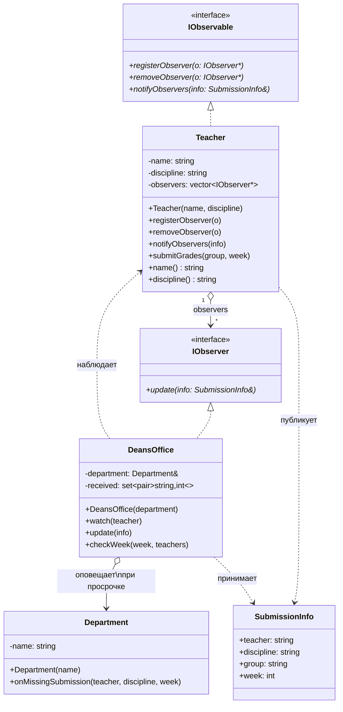
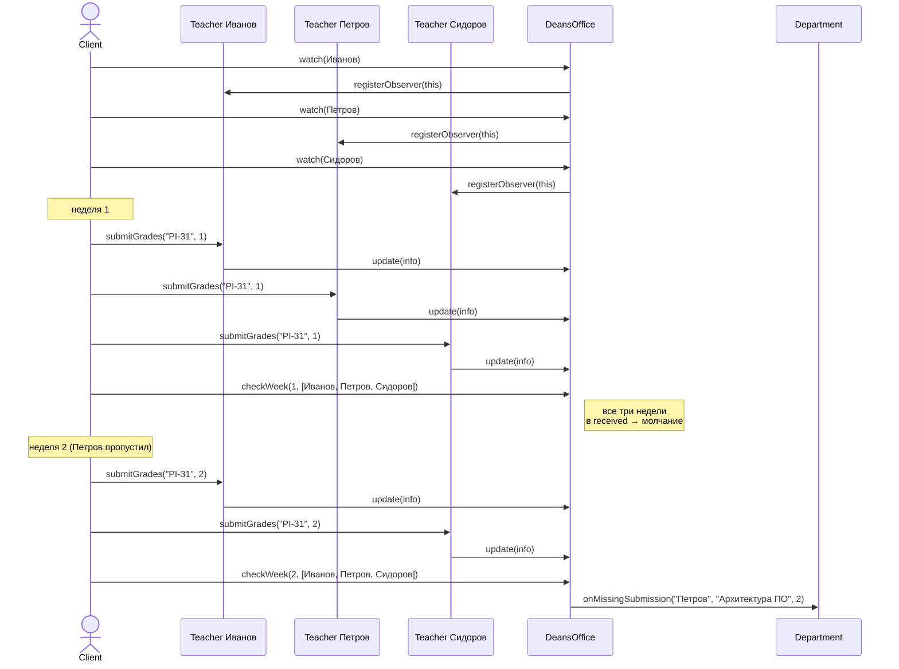

# Отчёт по лабораторной работе №6

**«Реализация одного из паттернов поведения»**

**Цель работы:** Применение паттерна проектирования **Observer** (наблюдатель).

---

## 1. Теоретический материал

**Паттерны поведения** рассматривают вопросы о связях между объектами и распределении обязанностей между ними.

**Паттерн Observer (Наблюдатель).** Назначение: определяет зависимость «один-ко-многим» между объектами так, что при изменении состояния одного объекта (Subject) все зависящие от него объекты (Observer) уведомляются и обновляются автоматически. Паттерн инкапсулирует главный (независимый) компонент в абстракцию Subject, а изменяемые (зависимые) компоненты — в иерархию Observer. Связь между ними получается слабой, число подписчиков может конфигурироваться во время выполнения.

**Участники паттерна:**
- **Subject (наблюдаемый)** — располагает информацией о своих наблюдателях; предоставляет интерфейс для присоединения и отделения наблюдателей; рассылает уведомления.
- **Observer (наблюдатель)** — определяет интерфейс обновления для объектов, которые должны быть уведомлены об изменении субъекта.
- **ConcreteSubject (конкретный субъект)** — сохраняет состояние, представляющее интерес для конкретного наблюдателя; рассылает уведомления при изменении.
- **ConcreteObserver (конкретный наблюдатель)** — хранит ссылку на ConcreteSubject; реализует интерфейс обновления, чтобы поддерживать согласованность с субъектом.

---

## 2. Задание на выполнение лабораторной работы

Разработать UML-диаграммы (диаграмму классов и диаграмму последовательности) и с помощью паттерна «Observer» решить следующую задачу:

> Деканат отслеживает текущую успеваемость в группах факультета по одной из дисциплин. Преподаватели раз в неделю создают текущую успеваемость и размещают её в базе данных. Если преподаватель вовремя не создал текущую успеваемость — деканат оповещает об этом кафедру.

---

## 3. Архитектура и UML-диаграммы

Сопоставление участников паттерна с сущностями задачи:

| Класс | Роль из методички | Что делает |
| --- | --- | --- |
| `IObservable` | Subject | Интерфейс наблюдаемого: `registerObserver`, `removeObserver`, `notifyObservers`. |
| `IObserver` | Observer | Интерфейс наблюдателя: `update(SubmissionInfo&)`. |
| `Teacher` | ConcreteSubject | Преподаватель. Раз в неделю вызывает `submitGrades()` — это и есть «изменение состояния» субъекта, после которого рассылаются уведомления. |
| `DeansOffice` | ConcreteObserver | Деканат. Подписывается на всех преподавателей, в `update()` запоминает, кто отчитался, в `checkWeek()` сверяет список и оповещает кафедру. |
| `SubmissionInfo` | (данные уведомления, аналог `StockInfo` из примера методички) | Преподаватель, дисциплина, группа, номер недели. |
| `Department` | (получатель оповещения от деканата) | Кафедра. Метод `onMissingSubmission()` принимает оповещение. Не является участником паттерна Observer, присутствует потому что фигурирует в условии задачи. |

### 3.1. UML-диаграмма классов



### 3.2. UML-диаграмма последовательности

Сценарий двух недель: на первой все преподаватели подают успеваемость, на второй один пропускает срок.



---

## 4. Сборка и запуск

В корне репозитория предполагается активный `direnv` с `use flake` (g++ из `flake.nix`).

```bash
cd software-architecture/lab-6
make            # компиляция
make run        # запуск демонстрации
make clean      # очистка
```

Программа консольная, ассеты не нужны: сценарий зашит в `src/main.cpp` (три недели, разные комбинации подавших и пропустивших преподавателей).

---

## 5. Результат выполнения программы

```
$ make run
--- Неделя 1: все преподаватели подали успеваемость ---
[Teacher] Иванов И.И. разместил успеваемость по «Архитектура ПО» для группы PI-31 на неделе 1
[DeansOffice] получено уведомление: Иванов И.И. (неделя 1, группа PI-31)
[Teacher] Петров П.П. разместил успеваемость по «Архитектура ПО» для группы PI-31 на неделе 1
[DeansOffice] получено уведомление: Петров П.П. (неделя 1, группа PI-31)
[Teacher] Сидоров С.С. разместил успеваемость по «Архитектура ПО» для группы PI-31 на неделе 1
[DeansOffice] получено уведомление: Сидоров С.С. (неделя 1, группа PI-31)
[DeansOffice] проверка по итогам недели 1...

--- Неделя 2: Петров не подал успеваемость ---
[Teacher] Иванов И.И. разместил успеваемость по «Архитектура ПО» для группы PI-31 на неделе 2
[DeansOffice] получено уведомление: Иванов И.И. (неделя 2, группа PI-31)
[Teacher] Сидоров С.С. разместил успеваемость по «Архитектура ПО» для группы PI-31 на неделе 2
[DeansOffice] получено уведомление: Сидоров С.С. (неделя 2, группа PI-31)
[DeansOffice] проверка по итогам недели 2...
[Department:Программная инженерия] получено оповещение: преподаватель Петров П.П. не разместил успеваемость по «Архитектура ПО» на неделе 2

--- Неделя 3: Иванов и Петров не подали успеваемость ---
[Teacher] Сидоров С.С. разместил успеваемость по «Архитектура ПО» для группы PI-31 на неделе 3
[DeansOffice] получено уведомление: Сидоров С.С. (неделя 3, группа PI-31)
[DeansOffice] проверка по итогам недели 3...
[Department:Программная инженерия] получено оповещение: преподаватель Иванов И.И. не разместил успеваемость по «Архитектура ПО» на неделе 3
[Department:Программная инженерия] получено оповещение: преподаватель Петров П.П. не разместил успеваемость по «Архитектура ПО» на неделе 3
```

В выводе наблюдаемое подтверждение паттерна:

1. **Слабая связанность.** `Teacher::submitGrades()` не вызывает деканат напрямую — вместо этого вызывает `notifyObservers()`, который проходит по всем зарегистрированным `IObserver*`. Преподаватель не знает ни про `DeansOffice`, ни про `Department`.
2. **Один-ко-многим.** Если завести второго наблюдателя (например, журнал событий или учебный отдел) и вызвать `teacher.registerObserver(...)`, он начнёт получать уведомления без каких-либо изменений в `Teacher`.
3. **Эскалация по условию.** Оповещение кафедры (`Department`) происходит только тогда, когда `DeansOffice::checkWeek()` обнаруживает пропуск — это уже не часть паттерна, а бизнес-логика наблюдателя.

---

## 6. Ответы на контрольные вопросы

**1. С помощью каких ещё паттернов проектирования можно решить поставленную задачу?**

- **Mediator (Посредник).** Деканат становится «посредником», через которого общаются все преподаватели и кафедра: преподаватели вызывают у него методы, посредник сам решает, кому что переслать. Подходит, когда связи между объектами разветвлённые и хочется централизовать логику; в нашей задаче подписчиков мало, и слабая связанность Observer удобнее.
- **Publish/Subscribe (Издатель-Подписчик), он же расширенный Observer.** Между преподавателем и деканатом ставится канал/брокер с темами («архитектура ПО / неделя N»). Подписчиков можно добавлять и удалять без изменения издателя. Удобно, когда в системе много источников событий и подписчиков, но для трёх преподавателей это переусложнение.
- **Chain of Responsibility (Цепочка обязанностей).** Уведомление от преподавателя передаётся по цепочке деканат → учебный отдел → кафедра, каждый обработчик решает, обрабатывать или передавать дальше. Хорошо ложится, если эскалация многоуровневая.
- **Command (Команда).** Каждое размещение успеваемости — команда `SubmitGradesCommand`, складываемая в журнал. Деканат периодически проходит по журналу и, не найдя команды от какого-то преподавателя за неделю, оповещает кафедру. Полезно, если нужны откат (`Undo`), логирование или отложенное выполнение.
- **State (Состояние).** Каждый преподаватель имеет состояние `WaitingForSubmission` / `Submitted`; смена состояния — повод для деканата проверить общую картину. Подходит, если состояний больше двух (например, ещё «оценки на проверке», «оценки утверждены»).

Из перечисленного наиболее естественной альтернативой Observer для данной задачи остаётся **Mediator** — он сохраняет ту же асинхронную семантику, но переносит логику взаимодействий в посредника. Pub/Sub оправдан, если число преподавателей и заинтересованных сторон существенно вырастет.
