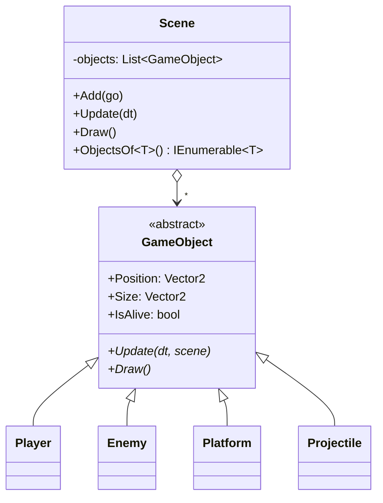
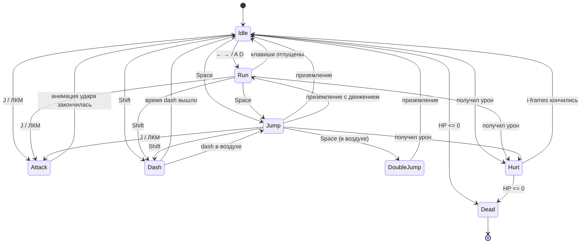
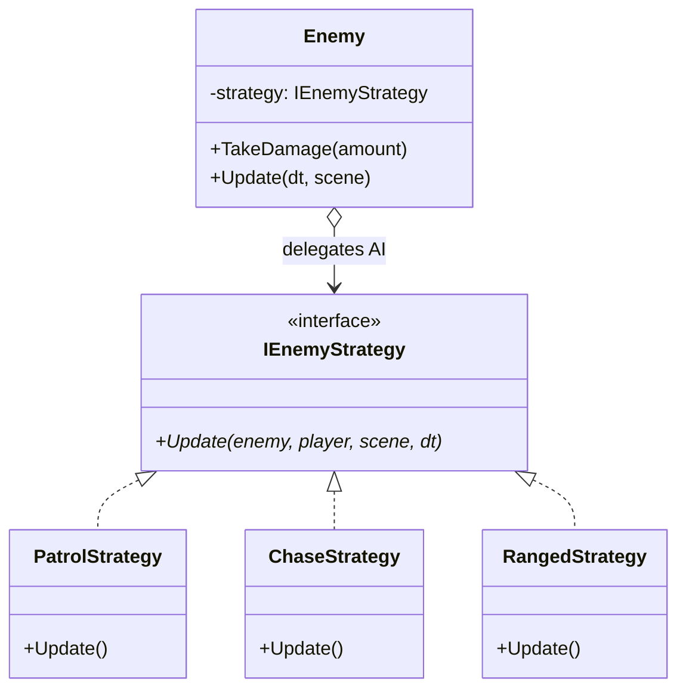
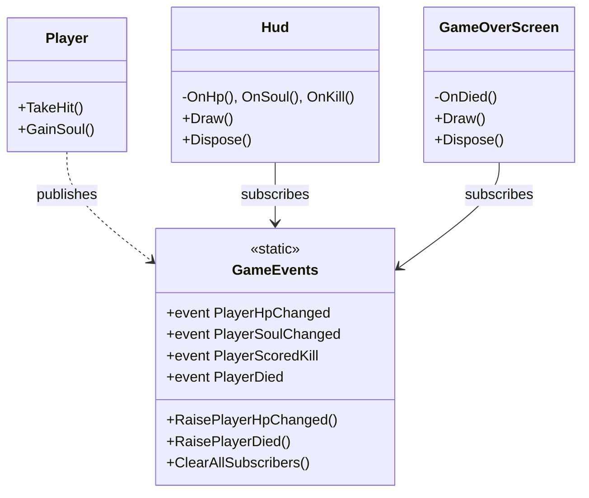
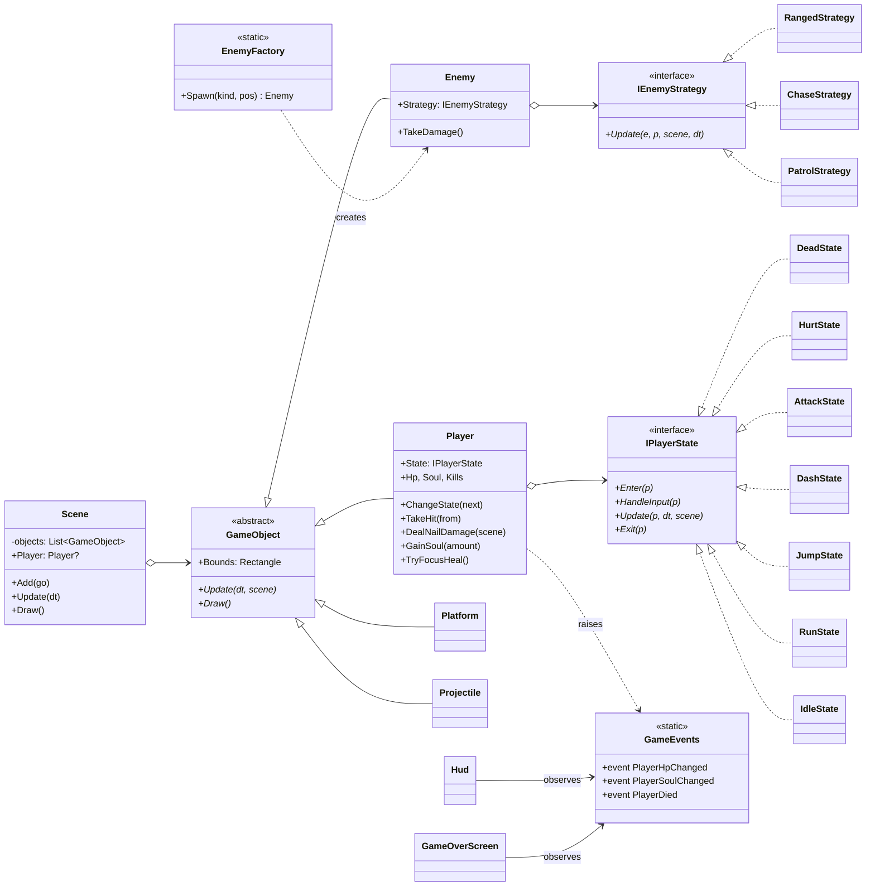

# Отчёт по лабораторной работе №7-8

**«Самостоятельная работа по реализации компьютерной игры с применением паттернов проектирования»**

**Цель работы:** Применение паттернов проектирования в комплексе при разработке полноценной игры.

**Тип игры по классификации методички:** «бродилка» (2D action-platformer / Metroidvania в стиле *Hollow Knight*).

---

## 1. Общая идея

`HollowDemo` — короткая (1-2 минуты прохождения) демонстрационная сцена, в которой:

- управляемый игрок-Рыцарь умеет бегать, прыгать (включая двойной прыжок), делать `dash`, бить «гвоздём», получать урон, лечиться за накопленные «души»;
- по уровню расставлены **три типа врагов** с разным поведением: наземный патруль (`Husk`), летающий преследователь (`Fly`) и неподвижный стрелок (`Archer`);
- HUD сверху показывает HP, душу, счётчик убитых; при смерти появляется экран `YOU DIED` с возможностью рестарта.

Сцена устроена так, что **все пять выбранных паттернов наблюдаемо работают одновременно**: за один проход по экрану виден State (смена состояний игрока: Idle ↔ Run ↔ Jump ↔ DoubleJump ↔ Dash ↔ Attack ↔ Hurt), Strategy (три разных AI у врагов), Factory (три типа врагов из одного метода `Spawn`), Observer (HUD и Game-Over обновляются от событий) и Composite (Scene хранит всё через единый `GameObject`).

---

## 2. Стек

- **C# / .NET 8**, `Raylib-cs 7.0.1` — тонкие биндинги к нативной библиотеке `raylib 5.5`. Вся графика, ввод и аудио — функции `Raylib.*`, никакого редактора уровней / Content Pipeline; вся логика и сцена видны в коде.
- **NixOS / `flake.nix`**. В корневой `flake.nix` подложены `dotnet-sdk`, `raylib`, `pkg-config`; в `shellHook` добавлен `LD_LIBRARY_PATH=${pkgs.raylib}/lib` — это нужно, потому что NuGet-пакет `Raylib-cs` тащит свой `libraylib.so`, собранный не под NixOS. После сборки `Makefile` удаляет этот файл, чтобы runtime подхватил системный из nixpkgs. `Makefile` сам резолвит путь к raylib через `pkg-config`, c fallback на `nix develop` для запуска без активного direnv.
- **Камера.** `Camera2D` с зумом 2.5×, плавно следующая за игроком через `Vector2.Lerp(target, playerCenter, 5*dt)`. Камера ограничена `WorldBounds`, чтобы не показывать за-уровневую пустоту. Под `Camera2D` рисуется только мир (через `BeginMode2D/EndMode2D`); HUD и Game-Over — поверх в screen-space.
- **Parallax-фон.** 4 слоя пиксельных PNG (`background_far/stars/mid/near`), смещаются с разными коэффициентами 0.05 / 0.10 / 0.25 / 0.50 относительно камеры — создают глубину «как в HK».
- **Спрайты.** 11 PNG в `assets/` + `font.ttf` (DejaVu Sans для кириллицы). Спрайты сгенерированы локально через `ImageMagick` в стиле pixel-art Hollow Knight: тёмный плащ, белая маска с двумя рогами; враги — husk-зомби, vengefly, стрелок. Тайл платформы — два слоя (`tile.png` — верхняя травяная плитка, `tile_dirt.png` — земля для нижних рядов).

---

## 3. Применённые паттерны проектирования

Сделан **обоснованный набор пяти паттернов** (один порождающий, один структурный, три поведенческих), каждый из которых нагружен реальной работой минимум на 3-7 инстансов — это не «паттерны ради паттерна».

| Паттерн | Группа GoF | Где живёт | Сколько реальных инстансов |
| --- | --- | --- | --- |
| **Composite** | структурный | `src/Game/GameObject.cs`, `src/Game/Scene.cs` | 5 конкретных листьев (`Player`, `Enemy`, `Platform`, `Projectile`, при желании `SoulPickup`); сцена держит всю иерархию через один интерфейс |
| **State** | поведенческий | `src/Player/IPlayerState.cs`, `src/Player/PlayerStates.cs` | 7 состояний игрока (`Idle`, `Run`, `Jump`/`DoubleJump`, `Dash`, `Attack`, `Hurt`, `Dead`) |
| **Strategy** | поведенческий | `src/Enemies/IEnemyStrategy.cs`, `src/Enemies/EnemyStrategies.cs` | 3 стратегии AI: `PatrolStrategy`, `ChaseStrategy`, `RangedStrategy` |
| **Factory Method** | порождающий | `src/Enemies/EnemyFactory.cs` | 1 фабрика, спавнящая 3 разных типа врагов; вызывается в нескольких местах в `Program.cs` |
| **Observer** | поведенческий | `src/Events/GameEvents.cs`, `src/UI/Hud.cs`, `src/UI/GameOverScreen.cs` | 4 события (`PlayerHpChanged`, `PlayerSoulChanged`, `PlayerScoredKill`, `PlayerDied`) и 2 подписчика (`Hud`, `GameOverScreen`) |

Ниже — детальный разбор каждого.

### 3.1. Composite

**Зачем:** в игре есть сущности разной природы (игрок, враги, статичные платформы, летящие снаряды), но цикл «обновить → нарисовать» у них одинаковый. Без Composite пришлось бы вести три-четыре отдельных списка и дублировать код в главном цикле.

**Реализация.** `GameObject` — абстрактный базовый класс с операциями `Update(dt, scene)` и `Draw()`. `Scene` хранит `List<GameObject>` и единообразно их обновляет / рисует. Конкретные листья — `Player`, `Enemy`, `Platform`, `Projectile`. Сам класс `Scene` тоже играет роль «клиента» (он перебирает иерархию через интерфейс `GameObject`) и одновременно «составного объекта» (он и есть точка композиции).



### 3.2. State (поведение игрока)

**Зачем:** у игрока 7+ состояний, и поведение клавиш `←`/`→`/`Space`/`Shift`/`J`/`K` сильно зависит от текущего: в `Idle` нажатие `Space` уходит в `Jump`, в `Jump` оно же выполняет double jump, в `Dash` ввод вообще игнорируется. Без State это превратилось бы в гигантский `switch` внутри `Player.Update()`.

**Реализация.** `IPlayerState` — общий интерфейс (`Enter`, `HandleInput`, `Update`, `Exit`); 7 конкретных классов в `PlayerStates.cs`. `Player.State` — текущий узел; `Player.ChangeState(next)` корректно вызывает `Exit/Enter`. Решения о переходе (`ChangeState(new RunState())` и т. д.) принимаются внутри состояний — это классический *State machine inside the state*, который рекомендуется в книге GoF.



### 3.3. Strategy (AI врагов)

**Зачем:** Husk, Fly и Archer отличаются **только манерой движения и атаки** — внутренности (HP, спрайт, физика, реакция на урон) у всех одинаковые. Если бы каждый тип был отдельным наследником `Enemy`, мы бы получили дублирование кода. С Strategy `Enemy` остаётся **одним конкретным классом**, а различия живут в трёх маленьких реализациях `IEnemyStrategy`.

**Реализация:**
- `PatrolStrategy` — наземный, проверяет «есть ли пол под носом» (raycast 4 пикселя вперёд) и разворачивается на краю платформы;
- `ChaseStrategy` — летающий, отключает гравитацию, медленно (60 px/c, втрое медленнее игрока) подплывает по прямой к игроку. Намеренно медленный, чтобы игрок успевал ударить гвоздём первым;
- `RangedStrategy` — стрелок, стоит на месте, раз в 1.8 сек спавнит `Projectile` в направлении игрока через `scene.Add(new Projectile(...))`.



### 3.4. Factory Method (создание врагов)

**Зачем:** в `Program.BuildLevel()` есть 6 спавнов врагов в разных позициях с тремя разными типами. Без фабрики каждый такой `new Enemy("Husk", pos, new Vector2(32,32), TexHusk, new PatrolStrategy(), hp:2, damage:1, useGravity:true)` пришлось бы писать руками — это 6 повторяющихся строк, готовая площадка для ошибки. Фабрика прячет всю эту склейку: клиент знает только `enum EnemyKind`.

**Реализация:** статический `EnemyFactory.Spawn(EnemyKind kind, Vector2 pos)` со `switch` на трёх ветках, возвращающий `Enemy` с правильной текстурой, размером, стратегией, HP и физикой. Если завтра появится 4-й тип врага — добавляется одна ветка в фабрику, **во всех остальных местах кода ничего не меняется**.

### 3.5. Observer (UI и события)

**Зачем:** игроку и врагам не должно быть дела до того, кто и как отображает их HP, души или счётчик убитых. UI развешивается отдельно (`Hud`, `GameOverScreen`), а в будущем легко доcтавить `AudioManager` — без правок `Player.cs`.

**Реализация:** статический `GameEvents` хранит набор `event Action<...>` (это `Subject`). `Player.GainSoul()`, `Player.TakeHit()`, `DeadState.Enter()` поднимают события. `Hud` и `GameOverScreen` — `IObserver`-аналоги: подписываются `+=` в конструкторе, в `IDisposable.Dispose()` снимаются `-=`. При рестарте `GameEvents.ClearAllSubscribers()` чистит шину, чтобы не было «висящих» подписок на старый HUD.



---

## 4. Архитектура: общая UML-диаграмма классов



---

## 5. UML-диаграмма последовательности

Сценарий: игрок подбегает к Husk-врагу, бьёт гвоздём, тот умирает; HUD получает уведомление о новом kill.

```mermaid
sequenceDiagram
    actor User as Пользователь
    participant Loop as Program (main loop)
    participant Scene
    participant Player
    participant State as RunState → AttackState
    participant Enemy
    participant Husk as PatrolStrategy
    participant Events as GameEvents
    participant Hud

    Loop->>Scene: Update(dt)
    Scene->>Player: Update(dt, scene)
    Player->>State: HandleInput()
    User-->>Player: D (бег)
    State-->>Player: ChangeState(RunState)
    User-->>Player: J (атака)
    State-->>Player: ChangeState(AttackState)
    Player->>Player: DealNailDamage(scene)
    Player->>Enemy: TakeDamage(1)
    Enemy-->>Events: RaiseEnemyDied(id)
    Player->>Events: RaisePlayerScoredKill(1)
    Events->>Hud: OnKill(total)
    Loop->>Scene: Draw()
    Scene->>Player: Draw()
    Scene->>Enemy: Draw()
    Loop->>Hud: Draw()
```

---

## 6. Сборка и запуск

В корне репозитория предполагается активный `direnv` с `use flake` — `flake.nix` подкладывает `dotnet-sdk` (.NET 8), `raylib`, `pkg-config`. Если direnv не активирован — выполнить `nix develop` из корня вручную.

```bash
cd software-architecture/lab-7-8
make            # dotnet restore + build + удаление bundled libraylib.so
make run        # запуск игры (LD_LIBRARY_PATH=$(pkg-config --variable=libdir raylib))
make clean      # удалить bin/ и obj/
```

### Управление

| Клавиша | Действие |
| --- | --- |
| `A` / `←` | бежать влево |
| `D` / `→` | бежать вправо |
| `Space` | прыжок; второе нажатие в воздухе — двойной прыжок |
| `Shift` | dash (неуязвимое короткое перемещение в направлении взгляда) |
| `J` / ЛКМ | атака гвоздём |
| `K` | focus heal — потратить 33 души и восстановить 1 HP |
| `R` | рестарт (только когда показан `YOU DIED`) |
| `Esc` | выход |

### Геймплейный цикл

- Игрок стартует у левого края, ~5 HP, 0 душ.
- Каждое попадание гвоздём по врагу даёт **+11 души** (`Player.SoulPerHit`); полная полоска — 99.
- При нажатии `K` тратится 33 души, восстанавливается 1 HP. Это и есть «focus heal» из HK.
- Контакт с врагом или попадание снаряда стрелка — `-1 HP` (плюс кратковременная неуязвимость и нокбэк). Проверка коллизии идёт **по узкому хитбоксу** (`Player.HitBox`, `Enemy.HitBox`), а не по полному 32×48/32×32 спрайту — иначе урон срабатывал бы на прозрачных пикселях вокруг силуэта.
- Падение в провал между левым и правым полом (`Position.Y > scene.DeathY = 900`) — мгновенная смерть.
- На 0 HP — переход в `DeadState`, поднимается событие `PlayerDied`, экран темнеет, `R` — рестарт.

Демо-сценарий проходится за 1-2 минуты; уровень намеренно компактный, но в нём есть все три типа врагов на разной высоте, что заставляет использовать и double jump, и dash, и atak.

---

## 7. Структура проекта

```
software-architecture/lab-7-8/
├── HollowDemo.csproj        — .NET 8, Raylib-cs 7.0.1
├── Makefile                 — build/run/clean, удаление bundled libraylib.so + резолв пути к raylib через pkg-config
├── README.md                — этот отчёт
├── assets/                  — спрайты, тайлы, parallax-фон (4 слоя), font.ttf (DejaVu Sans для кириллицы)
└── src/
    ├── Program.cs            ← Client: создаёт Scene, Hud, GameOverScreen
    ├── Game/
    │   ├── GameObject.cs     ← Composite: абстрактная база
    │   ├── Scene.cs          ← Composite: контейнер + клиент
    │   └── Platform.cs       ← Composite: лист
    ├── Player/
    │   ├── Player.cs         ← ConcreteSubject (Observer) + контекст State
    │   ├── IPlayerState.cs   ← State: интерфейс
    │   └── PlayerStates.cs   ← State: 7 конкретных состояний
    ├── Enemies/
    │   ├── Enemy.cs          ← Composite: лист, единый класс для всех типов
    │   ├── IEnemyStrategy.cs ← Strategy: интерфейс
    │   ├── EnemyStrategies.cs← Strategy: 3 конкретные стратегии AI
    │   ├── EnemyFactory.cs   ← Factory Method
    │   └── Projectile.cs     ← Composite: лист
    ├── Events/
    │   └── GameEvents.cs     ← Observer: Subject (event bus)
    └── UI/
        ├── Hud.cs            ← Observer: подписчик HP / Soul / Kills
        └── GameOverScreen.cs ← Observer: подписчик PlayerDied
```

---

## 8. Источники

**Спрайты и фон** в `assets/*.png` сгенерированы локально утилитой `ImageMagick` (команды вида `magick -size NxM xc:none -fill ... -draw ... out.png`) — это работа автора, можно считать Public Domain. Стилистика — pixel art в духе *Hollow Knight* (тёмный плащ, белая маска, тёмные пещерные тона). Перед финализацией рассматривались альтернативы из CC0 ассетов:

- [Mini Knight, OpenGameArt](https://opengameart.org/content/mini-knight) (CC0, автор Master484) — отвергнут из-за стилистики «средневековый рыцарь NES», не сочетается с HK-эстетикой;
- [The Knight, OpenGameArt](https://opengameart.org/content/the-knight-free-sprite) (CC0, GameArt2D) — отвергнут как cartoon-vector;
- [ak-2045/hollow-knight-animated-sprite-sheet](https://github.com/ak-2045/hollow-knight-animated-sprite-sheet) — это рип ассетов из самой игры Hollow Knight под «fair use», академически некорректно, не использовался.

**Шрифт** `assets/font.ttf` — это [DejaVu Sans](https://dejavu-fonts.github.io/) (Public Domain), скопирован из nixpkgs (`dejavu-fonts-minimal`). Нужен потому что встроенный шрифт raylib не содержит глифов кириллицы — без него `DrawText` показывает `?` в местах русских букв.

`flake.nix` использует `nixpkgs/nixos-unstable`. Запуск проверен на NixOS 7.0.3 c Mesa 26.0.6 на AMD Radeon.

---

## 9. Кто есть кто в коде (короткая защитная формулировка)

«Игра построена вокруг **Composite**: всё в сцене — `GameObject`. Игрок — `ConcreteSubject` паттерна **Observer** и одновременно контекст **State**: его поведение делегируется текущему `IPlayerState`-у (7 конкретных состояний). Враги — один класс `Enemy`, поведение делегируется одной из трёх стратегий `IEnemyStrategy` (**Strategy**); создание трёх типов врагов идёт через `EnemyFactory.Spawn(EnemyKind, position)` (**Factory Method**). UI — `Hud` и `GameOverScreen` — это `ConcreteObserver`-ы, подписанные на события статической шины `GameEvents` (Subject паттерна Observer); сами они ничего не знают о Player и Enemy.»
