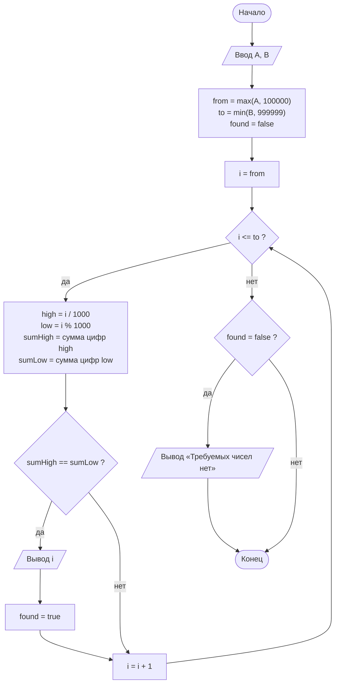
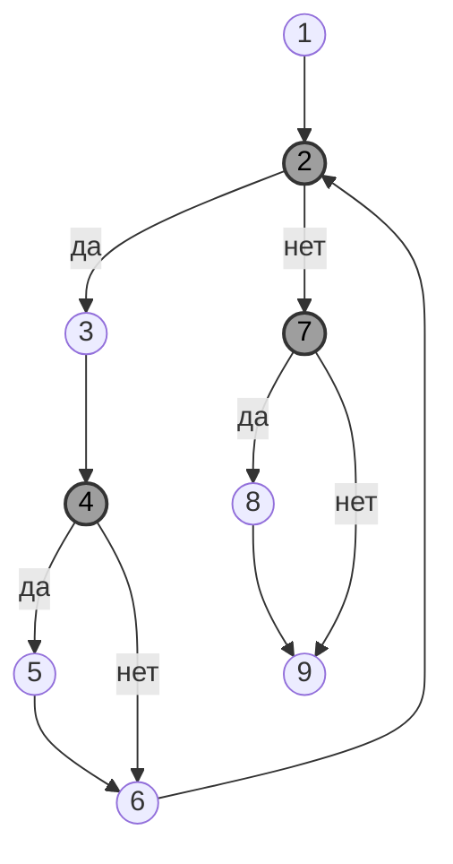

# Лабораторная работа №4. Метрика Маккейба

**Дисциплина:** Управление качеством программного обеспечения
**Студент:** Алешин Иван Кириллович
**Вариант:** 1 (компьютер №1), задача 7 — на максимальный балл

Методичка: [`УКПО_ЛР4.pdf`](./УКПО_ЛР4.pdf) (практическое занятие 2 «Оценка
структурной сложности программ»). Оформление отчёта повторяет пример 2.2
«Расчёт значений функции». Теория и ответы на вопросы — в [`THEORY.md`](./THEORY.md).

## Задание

Общее для раздела: разработать программу, составить блок-схему алгоритма,
по ней построить управляющий граф (граф потока управления), выделить маршруты
по критериям, определить цикломатическое число, сформировать матрицы
смежности и достижимости, сделать выводы.

**Задача 7.** Вывести на экран все натуральные шестизначные числа из диапазона
от A до B, у которых совпадают сумма трёх младших и трёх старших цифр. При
отсутствии чисел с указанными свойствами сформировать сообщение «Требуемых
чисел нет». Границы диапазона A и B вводятся с клавиатуры.

**Требование варианта (нечётный номер, максимальный балл):** рассчитать
критерий 1, критерий 2 и метрику Маккейба. Расчёт второго критерия не
заканчивается на цикломатическом числе Z — нужно ещё посчитать S2.

Критерий 3 вариантом не требуется, поэтому здесь он не считается (что это
такое — см. `THEORY.md`).

## Как запустить

Программа на C# (.NET 8), проект — [`Lab4.csproj`](./Lab4.csproj), исходник —
[`Program.cs`](./Program.cs).

Тулчейн берётся из flake репозитория: в корне лежит `.envrc` со строкой
`use flake`, а `dotnet-sdk` (8-я версия) уже прописан во `flake.nix`.
Ничего ставить отдельно не нужно.

```bash
# один раз, в корне репозитория
direnv allow

# дальше — из папки лабы
cd software-quality/lab-4
dotnet run
```

Программа спросит `A =` и `B =`. Чтобы не вводить руками, можно подать ввод
через конвейер (каждое число — отдельной строкой):

```bash
printf '100000\n101000\n' | dotnet run      # 100001, 100010, 100100
printf '1\n99999\n' | dotnet run            # Требуемых чисел нет
```

Если direnv не настроен, то же самое через `nix develop` из папки лабы:

```bash
nix develop -c dotnet run
```

Каталоги сборки `bin/` и `obj/` лежат под `.gitignore` (общие правила в
корневом `.gitignore`), в репозиторий не попадают.

## Текст программы

Полный файл с комментариями — [`Program.cs`](./Program.cs). В комментариях
там отмечено, какие строки к какой вершине графа относятся. Ниже тот же текст
без комментариев, с номерами строк — на эти номера ссылается таблица вершин.

| № | Строка программы |
| ---: | --- |
| 1 | `using System;` |
| 2 | `class Program` |
| 3 | `{` |
| 4 | `static void Main()` |
| 5 | `{` |
| 6 | `int a, b, from, to, i, high, low, sumHigh, sumLow;` |
| 7 | `bool found;` |
| 8 | `Console.Write("A = ");` |
| 9 | `a = int.Parse(Console.ReadLine());` |
| 10 | `Console.Write("B = ");` |
| 11 | `b = int.Parse(Console.ReadLine());` |
| 12 | `from = Math.Max(a, 100000);` |
| 13 | `to = Math.Min(b, 999999);` |
| 14 | `found = false;` |
| 15 | `for (i = from; i <= to; i++)` |
| 16 | `{` |
| 17 | `high = i / 1000;` |
| 18 | `low = i % 1000;` |
| 19 | `sumHigh = high / 100 + high / 10 % 10 + high % 10;` |
| 20 | `sumLow = low / 100 + low / 10 % 10 + low % 10;` |
| 21 | `if (sumHigh == sumLow)` |
| 22 | `{` |
| 23 | `Console.WriteLine(i);` |
| 24 | `found = true;` |
| 25 | `}` |
| 26 | `}` |
| 27 | `if (!found)` |
| 28 | `Console.WriteLine("Требуемых чисел нет");` |
| 29 | `}` |
| 30 | `}` |

Пара замечаний по решению:

- Шестизначные числа — это отрезок [100000, 999999]. Вместо двух отдельных
  `if` для «подрезки» диапазона пользователя берётся `Math.Max(a, 100000)` и
  `Math.Min(b, 999999)`. Это обычные вызовы функций, ветвлений в программе они
  не добавляют, поэтому в граф попадают как часть линейного участка.
- Число делится на две тройки цифр: `i / 1000` — старшие три цифры,
  `i % 1000` — младшие три. Сумма цифр трёхзначного `x` — это
  `x / 100 + x / 10 % 10 + x % 10`.
- Если A > B или диапазон вообще не задевает шестизначные числа, получается
  `from > to`, цикл не выполняется ни разу, `found` остаётся `false` и
  выводится сообщение. Отдельной проверки на это не нужно.

## Результаты работы программы

Ввод подаётся через `printf ... | dotnet run`, поэтому ответы на `A =` и
`B =` печатаются в одной строке с приглашением.

**1. Диапазон, в котором есть подходящие числа** (A = 100000, B = 101000):

```text
A = B = 100001
100010
100100
```

Проверка: у 100001 старшие цифры 1+0+0 = 1, младшие 0+0+1 = 1. Следующее
подходящее после 100100 — 101002 (1+0+1 = 0+0+2), оно уже за границей B.

**2. Диапазон вообще без шестизначных чисел** (A = 1, B = 99999):

```text
A = B = Требуемых чисел нет
```

**3. A > B** (A = 200000, B = 100000):

```text
A = B = Требуемых чисел нет
```

**4. Верхняя граница за пределами шестизначных** (A = 999990, B = 2000000):

```text
A = B = 999999
```

Цикл идёт только до 999999; из 999990..999999 подходит только 999999
(27 = 27), у остальных старшая сумма 27, а младшая меньше.

**5. Середина диапазона** (A = 123000, B = 123500) — 25 чисел:

```text
A = B = 123006
123015
123024
123033
123042
123051
123060
123105
123114
123123
123132
123141
123150
123204
123213
123222
123231
123240
123303
123312
123321
123330
123402
123411
123420
```

У всех старшая тройка 123, сумма 6, и у младшей тройки тоже сумма 6.
Результаты сверены с независимым перебором на Python (там же посчитано, что на
всём отрезке [100000, 999999] таких чисел 50412).

## Блок-схема алгоритма

Цикл `for` на блок-схеме разложен на те же части, что и в графе: начальное
присваивание `i = from`, проверку `i <= to`, тело и приращение `i++`.



## Управляющий граф

### Вершины графа

Правила построения (из методички): учитываются только исполняемые операторы
(описания переменных, строки 6–7, в граф не входят); подряд идущие операторы
без ветвлений сливаются в одну вершину; цикл `for` раскладывается на
начальное присваивание, проверку условия, тело и приращение счётчика.
Начальное присваивание `i = from` — линейный оператор, поэтому оно
объединено с предшествующим участком, так же как в примере с суммой
факториалов (рис. 2.23 методички: `N = 4; S = 0; i = 1;` — одна вершина).
Приращение `i++` отдельной вершиной оставлено потому, что в него сходятся две
ветки `if` (дуги 4→6 и 5→6).

| Вершина | Строки | Что делает | Тип |
| :---: | :---: | --- | --- |
| 1 | 8–14, 15 (`i = from`) | ввод A и B, вычисление `from`, `to`, `found = false`, начальное присваивание счётчика | линейный участок |
| **2** | 15 (`i <= to`) | проверка условия продолжения цикла | **ветвление** |
| 3 | 17–20 | вычисление `high`, `low`, `sumHigh`, `sumLow` | линейный участок (тело цикла) |
| **4** | 21 | `sumHigh == sumLow` | **ветвление** |
| 5 | 23–24 | вывод `i`, `found = true` | линейный участок |
| 6 | 15 (`i++`) | приращение счётчика цикла | линейный участок |
| **7** | 27 | `!found` | **ветвление** |
| 8 | 28 | вывод «Требуемых чисел нет» | линейный участок |
| 9 | 29 | конец программы | конечная вершина |

Вершина 9 — точка слияния после `if (!found)`: в неё сходятся ветка «да»
(через вывод сообщения) и ветка «нет». Это тот же приём, что и с фиктивной
вершиной после `switch` в методичке (рис. 2.10): без неё у графа было бы два
конца.

### Граф потока управления

Вершины ветвления (2, 4, 7) залиты серым, как тонированные вершины на
рис. 2.29 методички.



Список дуг:

| № | Дуга | Смысл |
| :---: | :---: | --- |
| 1 | 1 → 2 | после инициализации — первая проверка условия цикла |
| 2 | 2 → 3 | `i <= to` истинно, входим в тело |
| 3 | 2 → 7 | `i <= to` ложно, выход из цикла |
| 4 | 3 → 4 | суммы посчитаны, сравниваем |
| 5 | 4 → 5 | суммы равны |
| 6 | 4 → 6 | суммы не равны |
| 7 | 5 → 6 | после вывода — к приращению |
| 8 | 6 → 2 | возврат к проверке условия цикла |
| 9 | 7 → 8 | `found == false`, чисел не нашлось |
| 10 | 7 → 9 | `found == true`, сообщение не нужно |
| 11 | 8 → 9 | после сообщения — конец |

Итого **n = 9** вершин, **m = 11** дуг, вершин ветвления **n_в = 3**
(2, 4, 7). Граф корректный: висячих и тупиковых вершин нет, из вершины 1
достижима любая вершина, из любой вершины достижима 9.

## Оценка по первому критерию

Критерий 1: нужен минимальный набор маршрутов, который проходит через каждую
вершину ветвления по каждой её дуге (каждая дуга графа — хотя бы один раз).
Сложность S1 = Σ p_i, где p_i — число вершин ветвления в i-м маршруте (с
учётом повторных прохождений, без учёта последней вершины маршрута — у нас
это вершина 9, она и так не ветвление).

Вершины ветвления в маршрутах подчёркнуты.

- m1: 1–<u>**2**</u>–3–<u>**4**</u>–5–6–<u>**2**</u>–3–<u>**4**</u>–6–<u>**2**</u>–<u>**7**</u>–9;  p1 = 6
- m2: 1–<u>**2**</u>–<u>**7**</u>–8–9;  p2 = 2

В m1 вершина 2 встречается три раза, 4 — два раза, 7 — один: 3 + 2 + 1 = 6.

Проверка покрытия дуг:

| Дуга | 1→2 | 2→3 | 2→7 | 3→4 | 4→5 | 4→6 | 5→6 | 6→2 | 7→8 | 7→9 | 8→9 |
| --- | :---: | :---: | :---: | :---: | :---: | :---: | :---: | :---: | :---: | :---: | :---: |
| m1 | + | + | + | + | + | + | + | + |   | + |   |
| m2 | + |   | + |   |   |   |   |   | + |   | + |

Все 11 дуг покрыты. Одним маршрутом обойтись нельзя: дуги 7→8 и 7→9
взаимоисключающие, а конечная вершина достигается ровно один раз, поэтому
маршрутов минимум два.

Оба маршрута реально выполнимы, для каждого есть входные данные:

| Маршрут | A | B | Что происходит | Вывод |
| --- | ---: | ---: | --- | --- |
| m1 | 100001 | 100002 | 100001 подходит (1 = 1), 100002 нет (1 ≠ 2), выход из цикла, `found = true` | `100001` |
| m2 | 1 | 99999 | `from = 100000 > to = 99999`, цикл не выполняется, `found = false` | `Требуемых чисел нет` |

Сложность по первому критерию:

**S1 = p1 + p2 = 6 + 2 = 8.**

## Оценка по второму критерию

Критерий 2: однократная проверка каждого линейно независимого цикла и каждого
линейно независимого ациклического маршрута. Их количество равно
цикломатическому числу. Программа структурированная (у цикла один вход и один
выход, `break`/`goto` нет), поэтому

**Z = n_в + 1 = 3 + 1 = 4.**

Для проверки: Z = m − n + 2 = 11 − 9 + 2 = 4, совпадает.

Значит, выделяем 4 маршрута:

**Ациклические маршруты** (от начальной вершины до конечной, без повторов):

- m1: 1–<u>**2**</u>–<u>**7**</u>–8–9;  p1 = 2
- m2: 1–<u>**2**</u>–<u>**7**</u>–9;  p2 = 2

**Циклические маршруты** (записаны, как в методичке, без повтора начальной
вершины цикла):

- m3: <u>**2**</u>–3–<u>**4**</u>–5–6;  p3 = 2 (цикл через ветку «суммы равны»)
- m4: <u>**2**</u>–3–<u>**4**</u>–6;  p4 = 2 (цикл через ветку «суммы не равны»)

Каждый маршрут отличается от остальных хотя бы одной дугой: m1 и m2 — дугами
7→8 / 7→9, m3 и m4 — дугами 4→5, 5→6 / 4→6. В сумме они покрывают все 11 дуг
графа.

Сложность по второму критерию:

**S2 = p1 + p2 + p3 + p4 = 2 + 2 + 2 + 2 = 8.**

Про выполнимость. m1, m3 и m4 выполнимы вместе с «обвязкой» до конечной
вершины. А вот ациклический m2 (цикл не выполнился ни разу, но `found == true`)
**сам по себе невыполним**: `found` становится `true` только внутри цикла, в
вершине 5. Структурно маршрут независимый (это единственный путь через дугу
7→9 без циклов), но проверяется он только в сочетании с циклом m3 — фактически
тест проходит 1–2–(m3)–2–7–9. Для базиса маршрутов это обычная ситуация:
базис строится по структуре графа и не учитывает связи между данными, поэтому
часть базисных путей реализуется только в комбинации с другими.

Тестовые данные под маршруты второго критерия:

| Маршрут | A | B | Фактический путь | Вывод |
| --- | ---: | ---: | --- | --- |
| m1 | 1 | 5 | 1–2–7–8–9 | `Требуемых чисел нет` |
| m2 + m3 | 100001 | 100001 | 1–2–3–4–5–6–2–7–9 | `100001` |
| m4 | 100002 | 100002 | 1–2–3–4–6–2–7–8–9 | `Требуемых чисел нет` |

## Матрица смежности

Размер 9×9 (по числу вершин). Правило заполнения, как в табл. 2.3 методички:
**номер столбца — вершина, из которой выходит дуга, номер строки — вершина, в
которую дуга входит**. Например, дуга 1→2 даёт единицу в столбце 1, строке 2.
Пустая клетка — дуги нет.

| куда \ откуда | 1 | 2 | 3 | 4 | 5 | 6 | 7 | 8 | 9 |
| :---: | :---: | :---: | :---: | :---: | :---: | :---: | :---: | :---: | :---: |
| **1** |   |   |   |   |   |   |   |   |   |
| **2** | 1 |   |   |   |   | 1 |   |   |   |
| **3** |   | 1 |   |   |   |   |   |   |   |
| **4** |   |   | 1 |   |   |   |   |   |   |
| **5** |   |   |   | 1 |   |   |   |   |   |
| **6** |   |   |   | 1 | 1 |   |   |   |   |
| **7** |   | 1 |   |   |   |   |   |   |   |
| **8** |   |   |   |   |   |   | 1 |   |   |
| **9** |   |   |   |   |   |   | 1 | 1 |   |

Как читать: в столбце вершины ветвления две единицы (столбцы 2, 4, 7 — у них
по два выхода), в столбцах линейных вершин — одна, столбец 9 пустой (конечная
вершина). Строка 1 пустая — в начальную вершину ничего не входит. Всего единиц
11, это число дуг m.

## Матрица достижимости

Тот же размер 9×9. **Столбец — вершина, из которой идём, строка — вершина,
которую можно достичь** по любому пути (ациклическому или циклическому).
Считается как транзитивное замыкание матрицы смежности (методичка предлагает
возводить матрицу смежности в степени; результат тот же).

| достижима \ из | 1 | 2 | 3 | 4 | 5 | 6 | 7 | 8 | 9 |
| :---: | :---: | :---: | :---: | :---: | :---: | :---: | :---: | :---: | :---: |
| **1** |   |   |   |   |   |   |   |   |   |
| **2** | 1 | **[1]** | 1 | 1 | 1 | 1 |   |   |   |
| **3** | 1 | 1 | **[1]** | 1 | 1 | 1 |   |   |   |
| **4** | 1 | 1 | 1 | **[1]** | 1 | 1 |   |   |   |
| **5** | 1 | 1 | 1 | 1 | **[1]** | 1 |   |   |   |
| **6** | 1 | 1 | 1 | 1 | 1 | **[1]** |   |   |   |
| **7** | 1 | 1 | 1 | 1 | 1 | 1 |   |   |   |
| **8** | 1 | 1 | 1 | 1 | 1 | 1 | 1 |   |   |
| **9** | 1 | 1 | 1 | 1 | 1 | 1 | 1 | 1 |   |

Что видно из матрицы:

- **Диагональные единицы** (выделены `[1]`) стоят у вершин 2, 3, 4, 5, 6.
  Единица на диагонали значит, что из вершины можно вернуться в неё же, то
  есть вершина лежит на цикле. Это ровно вершины циклических маршрутов m3 и
  m4 (цикл `for` вместе с `if` внутри). У вершин 1, 7, 8, 9 диагональ пустая —
  они в цикл не входят.
- Строки 2–7 **одинаковые**: каждая из этих вершин достижима из одного и того
  же набора {1, …, 6}. Среди них у 2–6 есть диагональная единица — это вершины
  одного цикла (друг из друга они достижимы в обе стороны). Вершина 7 имеет
  такую же строку, но без диагонали: в неё попадают из тех же вершин, но
  сама она в цикл не входит — это выход из цикла, дальше идёт ациклический
  участок. Методичка формулирует это так: идентичные строки определяют
  вершины, входящие в ациклические маршруты. У нас в этой группе вершины 2
  и 7 из ациклических m1 и m2 и вершины 3–6 цикла, который замыкается на 2.
- Столбец 1 заполнен со 2-й по 9-ю строку: из начальной вершины достижимо всё.
  Строка 9 заполнена в столбцах 1–8: конечная вершина достижима из любой. Это
  и есть проверка корректности графа — нет недостижимых и тупиковых вершин.
- Столбцы 7 и 8 содержат единицы только ниже себя: после выхода из цикла
  управление назад не возвращается, это ациклический «хвост» 7–8–9.

## Метрика Маккейба

Цикломатическое число Маккейба:

**M = m − n + 2 = 11 − 9 + 2 = 4.**

Здесь m = 11 — число дуг, n = 9 — число вершин, двойка — это 2p при p = 1
(граф связный, для полносвязности достаточно одной фиктивной дуги 9 → 1).

Значение совпадает с Z = n_в + 1 = 4, как и должно быть для
структурированной программы. В полносвязном графе (с фиктивной дугой 9 → 1)
четыре независимых контура, то есть четыре линейно независимых маршрута из
начальной вершины в конечную.

## Итоговые результаты

| Показатель | Значение |
| --- | :---: |
| Число вершин n | 9 |
| Число дуг m | 11 |
| Число вершин ветвления n_в | 3 |
| Критерий 1: число маршрутов | 2 |
| Критерий 1: S1 | **8** |
| Критерий 2: цикломатическое число Z = n_в + 1 | **4** |
| Критерий 2: S2 | **8** |
| Метрика Маккейба M = m − n + 2 | **4** |

## Выводы

1. Для программы поиска шестизначных чисел с равными суммами старших и
   младших цифр построен управляющий граф из 9 вершин и 11 дуг, в нём три
   вершины ветвления: условие цикла `for`, сравнение сумм и проверка флага
   `found`.
2. По первому критерию достаточно двух маршрутов, чтобы пройти каждую дугу
   хотя бы раз; S1 = 8. Оба маршрута реально выполнимы, под каждый подобраны
   входные данные.
3. По второму критерию Z = 4: два ациклических маршрута и два цикла;
   S2 = 8. Один из ациклических маршрутов (1–2–7–9) невыполним без захода в
   цикл, на практике он проверяется вместе с циклом m3, поэтому реальных
   тестов по второму критерию получается три.
4. Цикломатическое число Маккейба M = 4, совпадает с Z, посчитанным через
   вершины ветвления. Это значит, что для тестирования по основному маршруту
   Маккейба нужно проверить 4 линейно независимых маршрута (по методичке —
   4 теста; как показано выше, из-за связи по данным два из них проходятся
   одним прогоном).
5. M = 4 < 10, то есть программа по Маккейбу несложная и дробить её на
   подпрограммы не нужно. Небольшая сложность получилась в том числе за счёт
   того, что обрезка диапазона сделана через `Math.Max`/`Math.Min`, а не
   отдельными `if` — иначе добавились бы две вершины ветвления и M было бы 6.
6. Матрица достижимости подтверждает структуру графа: диагональные единицы у
   вершин 2–6 выделяют единственный цикл, а заполненные столбец 1 и строка 9
   показывают, что граф корректный (все вершины достижимы из начала и из всех
   достижим конец).
7. По результатам расчёта по первому (S1 = 8) и второму (S2 = 8) критериям и
   метрике Маккейба (M = 4) программа имеет невысокую алгоритмическую
   сложность: в ней 3 оператора условия (два `if` и проверка цикла `for`), и
   для их проверки по критериям 1 и 2 нужно от 2 до 4 тестовых вариантов
   исходных данных.
