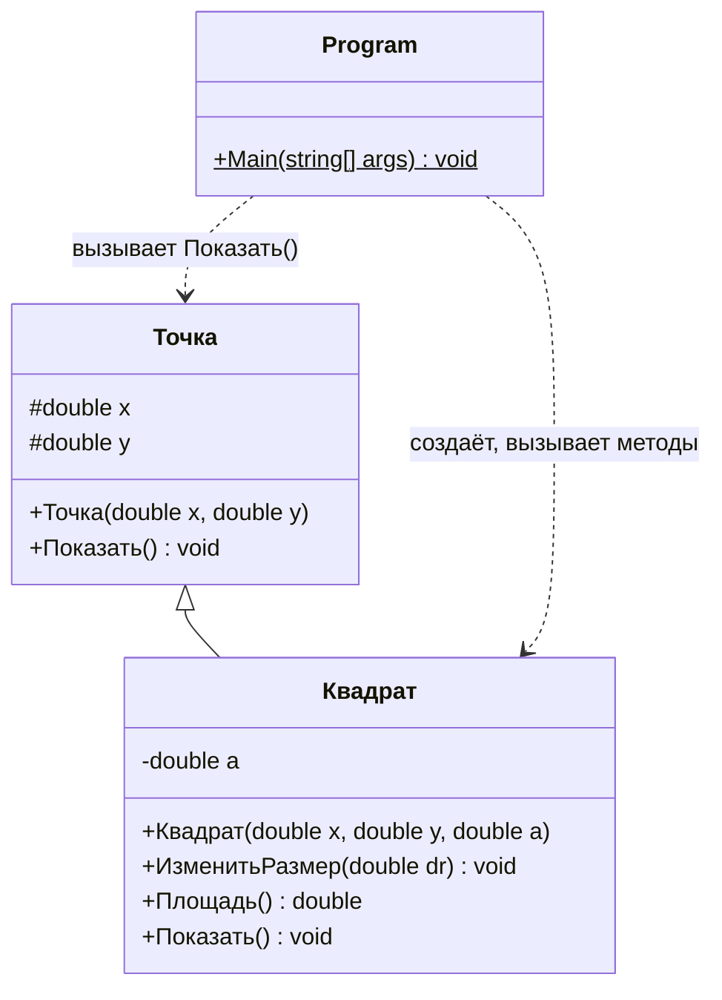

# Лабораторная работа №6. Метрики Чидамбера и Кемерера

**Дисциплина:** Управление качеством программного обеспечения
**Студент:** Алешин Иван Кириллович
**Вариант:** 1 (компьютер №1), задание на максимальный балл: (1 − 1) % 10 + 1 = **задача 1** из раздела 4.2.4 «Задачи для самостоятельного решения»
**Язык:** C# (.NET 8)

Методичка: [`УКПО_ЛР6.pdf`](./УКПО_ЛР6.pdf) (практическое занятие 4, раздел 4.2
«Метрики Чидамбера и Кемерера»). Отчёт оформлен по образцу примера 4.2.3
«Геометрия окружности и прямоугольника» — у него та же структура классов (базовый
класс «Точка», наследник, основной класс), а в спорных местах подсчёта я сверялся
ещё с примером 4.2.2 «Платёж за электроэнергию». Теория и ответы на вопросы — в
[`THEORY.md`](./THEORY.md).

## Задание

Общее для раздела: разработать программу, реализующую решение по приведённому
условию, а затем оценить характеристики разработанной программы на основе
применения объектно-ориентированных метрик Чидамбера и Кемерера.

**Задача 1.** Определить понятие «Точка». Состояние объекта определяется
следующими полями:

- координата по оси абсцисс (вещественное число);
- координата по оси ординат (вещественное число).

Базируясь на понятии «Точка», определить понятие «Квадрат».

Квадрат определить через точку, соответствующую его левому верхнему углу и размер
стороны квадрата.

Изменить размер стороны квадрата на заданную величину DR и вычислить площадь
квадрата после изменения его размера.

## Как запустить

Программа на C# (.NET 8), проект — [`Lab6.csproj`](./Lab6.csproj), исходник —
[`Program.cs`](./Program.cs).

Тулчейн берётся из flake репозитория: в корне лежит `.envrc` со строкой
`use flake`, а `dotnet-sdk` (8-я версия) уже прописан во `flake.nix`.
Ничего ставить отдельно не нужно.

```bash
# один раз, в корне репозитория
direnv allow

# дальше — из папки лабы
cd software-quality/lab-6
dotnet run
```

Программа по очереди спрашивает координаты X и Y левого верхнего угла, сторону
квадрата и величину DR. Чтобы не вводить руками, ввод можно подать через конвейер,
каждое число отдельной строкой. `printf '%s\n'` удобнее обычного `printf`, потому
что отрицательные числа он не путает с ключами:

```bash
printf '%s\n' 1 2 3 1.5 | dotnet run       # сторона 3 -> 4.5, площадь 20.25
printf '%s\n' 0 0 5 -2 | dotnet run        # сторона 5 -> 3, площадь 9
printf '%s\n' -1.5 4 2 -2 | dotnet run     # сторона стала бы 0 -> сообщение об ошибке
```

Если direnv не настроен, то же самое через `nix develop` из папки лабы:

```bash
nix develop -c dotnet run
```

Вещественные числа вводятся **через точку** (`1.5`). В `Lab6.csproj` по сравнению с
проектами прошлых лаб добавлена одна строка — `<InvariantGlobalization>true</InvariantGlobalization>`:
с ней `double.Parse` и вывод `{0:f2}` не зависят от языковых настроек системы (на
машине с русской локалью без неё `1.5` не распарсилось бы, а ждалось бы `1,5`).
На подсчёт метрик это не влияет — текст программы тот же.

Каталоги сборки `bin/` и `obj/` лежат под `.gitignore` (общие правила в
корневом `.gitignore`), в репозиторий не попадают.

## Реализация программы

Классы взяты ровно те, что названы в условии, плюс основной класс с `Main`, как в
примерах методички:

- `Точка` — базовый класс, закрытые от внешнего мира (`protected`) поля `x`, `y` —
  координаты по осям абсцисс и ординат; конструктор и метод вывода `Показать()`;
- `Квадрат` — наследник `Точки` («базируясь на понятии „Точка“»): координаты левого
  верхнего угла — унаследованные поля, собственное поле одно — сторона `a`. Методы:
  конструктор, `ИзменитьРазмер(dr)` (прибавляет DR к стороне; DR может быть
  отрицательным), `Площадь()` и свой `Показать()`. Метод вывода в `Точке` не
  виртуальный, в `Квадрате` он скрыт через `new` — так же, как у `Окружности` и
  `Прямоугольника` в примере 4.2.3;
- `Program` — основной класс: ввод исходных данных, создание квадрата, изменение
  стороны на DR, вывод площади.

Сторона проверяется в `Main` одним условием: если она не положительна до изменения
или станет не положительной после, квадрата не существует, и программа выводит
сообщение вместо площади. Отдельного класса или метода под это не заводил.

В строке 56 листинга (рис. 1 ниже) квадрат выводится через ссылку типа `Точка`: из-за того, что метод
не виртуальный, вызывается `Точка.Показать()` и печатается только левый верхний
угол — та точка, через которую квадрат определён.

Полный исходный текст с комментариями — в [`Program.cs`](./Program.cs).
Комментарии и пустые строки на метрики не влияют, поэтому ниже листинг приведён
без них; все номера строк в отчёте относятся к нему (рис. 1).

| Номер строки | Строка программы |
| :---: | --- |
| 1 | `using System;` |
| 2 | `namespace Lab6` |
| 3 | `{` |
| 4 | `    class Точка` |
| 5 | `    {` |
| 6 | `        protected double x, y;` |
| 7 | `        public Точка(double x, double y)` |
| 8 | `        {` |
| 9 | `            this.x = x; this.y = y;` |
| 10 | `        }` |
| 11 | `        public void Показать()` |
| 12 | `        {` |
| 13 | `            Console.WriteLine("Точка ({0:f2}; {1:f2})", x, y);` |
| 14 | `        }` |
| 15 | `    }` |
| 16 | `    class Квадрат : Точка` |
| 17 | `    {` |
| 18 | `        private double a;` |
| 19 | `        public Квадрат(double x, double y, double a) : base(x, y)` |
| 20 | `        {` |
| 21 | `            this.a = a;` |
| 22 | `        }` |
| 23 | `        public void ИзменитьРазмер(double dr)` |
| 24 | `        {` |
| 25 | `            a = a + dr;` |
| 26 | `        }` |
| 27 | `        public double Площадь()` |
| 28 | `        {` |
| 29 | `            return a * a;` |
| 30 | `        }` |
| 31 | `        public new void Показать()` |
| 32 | `        {` |
| 33 | `            Console.WriteLine("Квадрат: угол ({0:f2}; {1:f2}) сторона={2:f2} площадь={3:f2}", x, y, a, Площадь());` |
| 34 | `        }` |
| 35 | `    }` |
| 36 | `    class Program` |
| 37 | `    {` |
| 38 | `        static void Main(string[] args)` |
| 39 | `        {` |
| 40 | `            double x, y, a, dr;` |
| 41 | `            Console.Write("X левого верхнего угла: ");` |
| 42 | `            x = double.Parse(Console.ReadLine());` |
| 43 | `            Console.Write("Y левого верхнего угла: ");` |
| 44 | `            y = double.Parse(Console.ReadLine());` |
| 45 | `            Console.Write("Сторона квадрата: ");` |
| 46 | `            a = double.Parse(Console.ReadLine());` |
| 47 | `            Console.Write("Изменение стороны DR: ");` |
| 48 | `            dr = double.Parse(Console.ReadLine());` |
| 49 | `            Console.WriteLine();` |
| 50 | `            if (a <= 0 \|\| a + dr <= 0)` |
| 51 | `            {` |
| 52 | `                Console.WriteLine("Сторона квадрата должна быть больше нуля до и после изменения");` |
| 53 | `                return;` |
| 54 | `            }` |
| 55 | `            Квадрат квадрат = new Квадрат(x, y, a);` |
| 56 | `            ((Точка)квадрат).Показать();` |
| 57 | `            квадрат.Показать();` |
| 58 | `            квадрат.ИзменитьРазмер(dr);` |
| 59 | `            квадрат.Показать();` |
| 60 | `            Console.WriteLine("Площадь квадрата после изменения стороны на DR = {0:f2}: {1:f2}", dr, квадрат.Площадь());` |
| 61 | `        }` |
| 62 | `    }` |
| 63 | `}` |

*Рис. 1. Программа «Точка и квадрат» (без комментариев)*

## Результаты работы программы

Ввод подаётся через `printf '%s\n' ... | dotnet run`, поэтому все четыре
приглашения печатаются в одной строке (ответы на них не отображаются). Пустая
строка после приглашений — это `Console.WriteLine()` из строки 49.

**1. Квадрат увеличивается** (X = 1, Y = 2, сторона 3, DR = 1.5):

```text
X левого верхнего угла: Y левого верхнего угла: Сторона квадрата: Изменение стороны DR: 
Точка (1.00; 2.00)
Квадрат: угол (1.00; 2.00) сторона=3.00 площадь=9.00
Квадрат: угол (1.00; 2.00) сторона=4.50 площадь=20.25
Площадь квадрата после изменения стороны на DR = 1.50: 20.25
```

Проверка: 3 + 1,5 = 4,5; 4,5² = 20,25.

**2. Квадрат уменьшается** (X = 0, Y = 0, сторона 5, DR = −2):

```text
X левого верхнего угла: Y левого верхнего угла: Сторона квадрата: Изменение стороны DR: 
Точка (0.00; 0.00)
Квадрат: угол (0.00; 0.00) сторона=5.00 площадь=25.00
Квадрат: угол (0.00; 0.00) сторона=3.00 площадь=9.00
Площадь квадрата после изменения стороны на DR = -2.00: 9.00
```

**3. Дробные значения и отрицательная координата** (X = 2.5, Y = −3, сторона 0.5, DR = 0.25):

```text
X левого верхнего угла: Y левого верхнего угла: Сторона квадрата: Изменение стороны DR: 
Точка (2.50; -3.00)
Квадрат: угол (2.50; -3.00) сторона=0.50 площадь=0.25
Квадрат: угол (2.50; -3.00) сторона=0.75 площадь=0.56
Площадь квадрата после изменения стороны на DR = 0.25: 0.56
```

0,75² = 0,5625, при выводе с двумя знаками получается 0.56.

**4. После изменения сторона стала бы нулевой** (X = −1.5, Y = 4, сторона 2, DR = −2):

```text
X левого верхнего угла: Y левого верхнего угла: Сторона квадрата: Изменение стороны DR: 
Сторона квадрата должна быть больше нуля до и после изменения
```

**5. Отрицательная сторона на входе** (X = 0, Y = 0, сторона −1, DR = 5):

```text
X левого верхнего угла: Y левого верхнего угла: Сторона квадрата: Изменение стороны DR: 
Сторона квадрата должна быть больше нуля до и после изменения
```

Здесь −1 + 5 = 4 > 0, но исходного квадрата со стороной −1 не существует, поэтому
условие проверяет обе стороны, а не только новую.

## Диаграмма классов

Метрики Чидамбера и Кемерера считаются по структуре классов, поэтому удобно
сначала посмотреть на неё целиком. `#` — `protected`, `-` — `private`,
`+` — `public`, `$` — статический метод. Сплошная стрелка с треугольником —
наследование, пунктирные — использование (вызовы методов из `Main`).



Внешние библиотечные классы (`Console`, `double`) на диаграмму не вынесены, но в
метрике CBO они учитываются — как и в примерах методички.

## Оценка характеристик программы

Рассмотрим текст программы для оценки её качества с помощью метрик С. Чидамбера и
К. Кемерера. Программа содержит три класса:

- `class Точка` — базовый класс, определяющий понятие точки на координатной
  плоскости;
- `class Квадрат` — производный от `Точка` класс, определяющий квадрат через точку
  левого верхнего угла и размер стороны;
- `class Program` — основной класс, в котором вводятся исходные данные, создаётся
  квадрат, изменяется его размер и выводится площадь.

**Что считается методом.** Как в обоих примерах методички, методами класса
считаются все функции, объявленные в теле класса, **включая конструкторы**
(у класса `Электро` методичка насчитала 4 метода, из них 2 конструктора). Поля
методами не считаются. Свойств (`get`/`set`) в программе нет.

### Взвешенные методы на класс WMC

Сложность метода — простейший вариант из методички: количество строк исходного
кода метода. Как и в примерах, считаются все строки от заголовка метода до
закрывающей фигурной скобки включительно (у `public Точка(double x, double y)` в
примере 4.2.3 это строки 6–9, то есть 4 строки; у `Main` — строки 42–72, 31 строка).

| Класс | Метод | Строки | L |
| --- | --- | :---: | :---: |
| Точка | `public Точка(double x, double y)` | 7–10 | 4 |
| Точка | `public void Показать()` | 11–14 | 4 |
| Квадрат | `public Квадрат(double x, double y, double a) : base(x, y)` | 19–22 | 4 |
| Квадрат | `public void ИзменитьРазмер(double dr)` | 23–26 | 4 |
| Квадрат | `public double Площадь()` | 27–30 | 4 |
| Квадрат | `public new void Показать()` | 31–34 | 4 |
| Program | `static void Main(string[] args)` | 38–61 | 24 |

Класс `Точка` содержит два метода по 4 строки:

WMC (Точка) = L[0] + L[1] = 4 + 4 = **8**.

Класс `Квадрат` содержит четыре метода по 4 строки:

WMC (Квадрат) = L[0] + L[1] + L[2] + L[3] = 4 + 4 + 4 + 4 = **16**.

Класс `Program` содержит один метод `Main`, 24 строки:

WMC (Program) = L[0] = **24**.

Наиболее сложным по метрике WMC является основной класс `Program`: в нём
сосредоточены весь ввод, проверка исходных данных и вывод. `Квадрат` вдвое
сложнее `Точки` за счёт двух дополнительных методов, но каждый его метод короткий
(одна строка тела).

*Для сравнения:* если весом метода взять не число строк, а цикломатическую сложность
(методичка это допускает), то у всех методов `Точки` и `Квадрата` она равна 1
(ветвлений нет), а у `Main` — 3 (оператор `if` с условием из двух частей,
соединённых `||`). Тогда WMC (Точка) = 2, WMC (Квадрат) = 4, WMC (Program) = 3 —
то есть WMC превращается просто в число методов, и `Program` уже не выглядит
самым сложным. Это хорошо показывает, что значение WMC полностью определяется
выбранной мерой сложности метода. В итоговую таблицу идут значения по числу строк,
как в методичке.

### Количество методов на класс NM

Методичка допускает два варианта учёта: только собственные методы класса или
собственные вместе с унаследованными. Главное — применять выбранный вариант
единообразно. Как и в примерах (в примере 4.2.3 у наследника `Окружность`
насчитано 2 метода, то есть только свои), считаются **только методы, определённые
в самом классе**:

- NM (Точка) = 2;
- NM (Квадрат) = 4;
- NM (Program) = 1.

По метрике NM самым сложным является класс `Квадрат` — у него больше всего методов.

При втором варианте учёта к методам `Квадрата` добавился бы унаследованный
`Точка.Показать()`: он скрыт через `new`, но остаётся доступным через ссылку
базового типа (что и используется в строке 56). Конструктор `Точки` не
наследуется. Тогда NM (Квадрат) = 5, остальные значения не меняются.

### Глубина дерева наследования DIT и количество потомков NOC

В программе реализован принцип наследования: один базовый класс (`Точка`) и один
производный (`Квадрат`). `Program` в иерархию не входит.

| Класс | Предки (в программе) | DIT | Непосредственные потомки | NOC |
| --- | --- | :---: | --- | :---: |
| Точка | — | 0 | Квадрат | 1 |
| Квадрат | Точка | 1 | — | 0 |
| Program | — | 0 | — | 0 |

Глубина дерева наследования программы **DIT = 1** — у самого глубокого класса
(`Квадрат`) один класс-предок. Количество потомков **NOC (Точка) = 1**, у
остальных классов потомков нет.

Как и в методичке, неявный общий предок всех классов C# — `System.Object` — не
учитывается. Если его считать, у каждого класса DIT увеличится на единицу:
Точка — 1, Квадрат — 2, Program — 1; соотношение между классами не меняется.

Дерево неглубокое: наследник добавляет к точке только одно поле и три метода,
поэтому усложнение производного класса невелико.

### Связность между классами объектов CBO

Методичка определяет CBO как количество классов, с которыми связан данный класс,
но в обоих примерах считает фактически **количество обращений к методам (и
свойствам) других классов**: у `Запрос` 12 обращений к трём классам — CBO = 12, у
`Program` в примере 4.2.3 — 16. Чтобы результаты были сравнимы с примерами,
считаю так же. Правила, взятые из примеров:

- вызовы собственных методов класса не считаются (у `Электро` вызов `Сумма()`
  внутри `Инфо()` в CBO не попал, CBO (Электро) = 1);
- `Console.ReadLine()` и `double.Parse(...)` в одной строке — два обращения к
  двум разным классам (в примере: `int.Parse(Console.ReadLine())` дало одно
  обращение к `Console` и одно к `Parse` класса `int`);
- создание объекта через `new` — обращение к конструктору другого класса;
- вызов конструктора базового класса `: base(x, y)` не считается (в примере 4.2.3
  у `Окружности` и `Прямоугольника` он есть, но CBO = 2 и 1 — только `Console` и
  `Math`).

**Класс Точка.** Одно обращение к методу `WriteLine` класса `Console`
(строка 13). Следовательно, CBO (Точка) = **1**.

**Класс Квадрат.** Одно обращение к методу `WriteLine` класса `Console`
(строка 33). Вызов `Площадь()` в той же строке — собственный метод класса, вызов
`base(x, y)` в строке 19 по правилам примера не учитывается. Следовательно,
CBO (Квадрат) = **1**.

**Класс Program.** Обращения к методам других классов в `Main`:

| Класс | Метод | Строки | Обращений |
| --- | --- | --- | :---: |
| `Console` | `Write` | 41, 43, 45, 47 | 4 |
| `Console` | `ReadLine` | 42, 44, 46, 48 | 4 |
| `Console` | `WriteLine` | 49, 52, 60 | 3 |
| `double` | `Parse` | 42, 44, 46, 48 | 4 |
| `Квадрат` | конструктор `Квадрат(...)` | 55 | 1 |
| `Квадрат` | `Показать` | 57, 59 | 2 |
| `Квадрат` | `ИзменитьРазмер` | 58 | 1 |
| `Квадрат` | `Площадь` | 60 | 1 |
| `Точка` | `Показать` (через ссылку типа `Точка`) | 56 | 1 |
| | | **Итого** | **21** |

Итого 11 обращений к классу `Console`, 4 — к `double`, 5 — к `Квадрат` и 1 — к
`Точка`. Таким образом, CBO (Program) = **21**.

*Для сравнения*, по буквальному определению (число различных связанных классов):
CBO (Точка) = 1 (`Console`), CBO (Квадрат) = 1 (`Console`; 2, если считать связь с
базовым классом `Точка` через `base(x, y)` и унаследованные поля), CBO (Program) = 4
(`Console`, `double`, `Квадрат`, `Точка`). Вывод от этого не меняется: самый
связанный класс — `Program`.

Наименее чувствительны к модификации классы `Точка` и `Квадрат` — каждый связан
только с консолью, и то лишь в методе вывода. Вся связность программы
сосредоточена в основном классе `Program`: он обращается и к библиотечным классам,
и к обоим классам предметной области. Изменение интерфейса `Квадрата` (например,
переименование `ИзменитьРазмер`) затронет только `Main`.

### Количество откликов на класс RFC

RFC определяется числом методов, которые могут быть вызваны в ответ на сообщение,
полученное объектом класса:

RFC = R + M,

где R — методы, вызываемые методами рассматриваемого класса, M — общее количество
методов класса (M = NM).

Как считать R, методичка показывает двумя способами: в примере 4.2.3 R просто
равно CBO, а в примере 4.2.2 в R у класса `Электро` вошёл ещё и вызов собственного
метода `Сумма()` из `Инфо()` (R = 2: `string.Format` и `Сумма`). В нашей программе
ровно такая же ситуация у `Квадрата` — `Показать()` вызывает `Площадь()`, — поэтому
для него беру правило примера 4.2.2. Для остальных классов оба способа дают одно и
то же.

**Класс Точка.** R = 1 (`Console.WriteLine`, строка 13), M = 2 (NM (Точка) = 2):

RFC (Точка) = R + M = 1 + 2 = **3**.

**Класс Квадрат.** R = 2 (`Console.WriteLine` и собственный `Площадь()`, строка 33),
M = 4 (NM (Квадрат) = 4):

RFC (Квадрат) = R + M = 2 + 4 = **6**.

**Класс Program.** R = 21 — все обращения к методам других классов из таблицы
выше (CBO (Program) = 21), M = 1 (NM (Program) = 1):

RFC (Program) = R + M = 21 + 1 = **22**.

*Для сравнения*, в исходном определении Чидамбера и Кемерера RFC — это мощность
**множества** методов RS = {M} ∪ {R}, где каждый метод считается один раз, сколько
бы раз он ни вызывался:

- Точка: {Точка(), Показать()} ∪ {Console.WriteLine} → RFC = 3 (совпадает);
- Квадрат: 4 своих метода ∪ {Console.WriteLine} → RFC = 5 (`Площадь()` уже
  входит в M, повторно не считается); если добавить вызов конструктора
  `Точка(x, y)` через `base`, получится 6;
- Program: {Main} ∪ {Console.Write, Console.ReadLine, Console.WriteLine,
  double.Parse, Квадрат(), Квадрат.Показать, Квадрат.ИзменитьРазмер,
  Квадрат.Площадь, Точка.Показать} → RFC = 1 + 9 = 10 (перегрузки `WriteLine`
  считаю одним методом).

Наибольшее значение RFC у класса `Program`: в ответ на запуск программы может быть
вызвано больше всего методов, поэтому тестировать и отлаживать `Main` сложнее
всего. `Точка` и `Квадрат` имеют низкие значения RFC — их методы вызывают максимум
по одному-два других метода.

### Отсутствие сцепления в методах LCOM

Числовое значение метрики определяется разностью между количеством пар методов,
которые не используют одни и те же переменные класса (P), и количеством пар
методов, которые используют одни и те же переменные (Q):

LCOM = P − Q, а при отрицательном результате LCOM = 0.

Для `Квадрата` к переменным класса отнесены и собственное поле `a`, и
унаследованные поля `x`, `y` — `Показать()` обращается к ним напрямую. На результат
это не влияет: поле `a` используют все четыре метода.

Какие методы к каким переменным обращаются:

| Класс | Метод | Строки | Переменные класса |
| --- | --- | :---: | --- |
| Точка | `Точка(double x, double y)` | 7–10 | `x`, `y` |
| Точка | `Показать()` | 11–14 | `x`, `y` |
| Квадрат | `Квадрат(double x, double y, double a)` | 19–22 | `a` |
| Квадрат | `ИзменитьРазмер(double dr)` | 23–26 | `a` |
| Квадрат | `Площадь()` | 27–30 | `a` |
| Квадрат | `Показать()` | 31–34 | `x`, `y`, `a` |
| Program | `Main(string[] args)` | 38–61 | — (полей у класса нет) |

(`x`, `y` в конструкторе `Квадрата` — это параметры, они передаются в конструктор
`Точки`; сам конструктор `Квадрата` из полей записывает только `a`.)

**Класс Точка.** Два метода дают одну пару: конструктор и `Показать()`
обращаются к переменным `x` и `y`. Пар без общих переменных нет:

LCOM = 0 − 1 = −1.

При отрицательном результате значение LCOM (Точка) = **0**.

**Класс Квадрат.** Четыре метода дают 4·3/2 = 6 пар:

- `Квадрат(...)` и `ИзменитьРазмер(dr)` обращаются к переменной `a`;
- `Квадрат(...)` и `Площадь()` обращаются к переменной `a`;
- `Квадрат(...)` и `Показать()` обращаются к переменной `a`;
- `ИзменитьРазмер(dr)` и `Площадь()` обращаются к переменной `a`;
- `ИзменитьРазмер(dr)` и `Показать()` обращаются к переменной `a`;
- `Площадь()` и `Показать()` обращаются к переменной `a`.

Пар методов, не использующих общих переменных, нет, пар с общими переменными — 6:

LCOM = 0 − 6 = −6, следовательно, LCOM (Квадрат) = **0**.

**Класс Program.** В классе определён всего один метод, пар методов нет, поэтому
LCOM (Program) = **0**.

Во всех классах методы работают с общими данными: у `Точки` — с координатами, у
`Квадрата` — со стороной. Связность методов внутри классов высокая, данные и
методы упакованы в классы правильно, делить классы не нужно.

## Итоговые результаты

| Метрика | Точка | Квадрат | Program |
| --- | :---: | :---: | :---: |
| WMC (по числу строк) | 8 | 16 | **24** |
| NM | 2 | **4** | 1 |
| DIT | 0 | **1** | 0 |
| NOC | **1** | 0 | 0 |
| CBO (число обращений) | 1 | 1 | **21** |
| RFC = R + M | 3 | 6 | **22** |
| LCOM | 0 | 0 | 0 |

Максимум по каждой строке выделен. Значения посчитаны так же, как в примерах
методички; что получилось бы при других вариантах подсчёта, показано в
соответствующих разделах выше и сведено в следующий раздел.

## Спорные места подсчёта

Методичка в нескольких местах допускает разное толкование, а её примеры местами
противоречат определениям. Везде, где был выбор, я брал вариант, по которому
посчитаны примеры 4.2.2 и 4.2.3:

1. **CBO** — считаю число обращений к методам других классов, а не число классов,
   хотя определение говорит о классах. Иначе значения несравнимы с примерами
   (CBO (Запрос) = 12 у методички при трёх связанных классах). Число различных
   классов приведено рядом для сравнения.
2. **`base(x, y)`** — не учитываю ни в CBO, ни в RFC, как в примере 4.2.3.
3. **RFC у `Квадрата`** — вызов собственного `Площадь()` включён в R, как вызов
   `Сумма()` у `Электро` в примере 4.2.2 (RFC = 6). По исходному определению CK
   через множество методов было бы 5.
4. **NM и WMC** — учитываются только собственные методы класса, включая
   конструкторы; унаследованные — нет.
5. **DIT** — `System.Object` не учитывается, как в методичке (у наследника DIT = 1).
6. **Строки метода для WMC** — от заголовка до закрывающей скобки включительно,
   комментарии и пустые строки не считаются (листинг приведён без них).

## Выводы

1. Разработана программа на C#, в которой по условию задачи определены понятия
   «Точка» (базовый класс с координатами) и «Квадрат» (наследник, определённый
   через точку левого верхнего угла и сторону). Программа изменяет сторону квадрата
   на заданную величину DR и вычисляет площадь после изменения; некорректная
   сторона (не положительная до или после изменения) отсекается проверкой.
2. По метрике WMC наиболее сложным является основной класс `Program`
   (WMC = 24): весь ввод-вывод и проверка данных сосредоточены в `Main`. Классы
   предметной области простые: WMC (Точка) = 8, WMC (Квадрат) = 16, каждый их метод
   занимает одну строку тела.
3. По метрике NM больше всего методов у класса `Квадрат` (4), но это нормальное
   значение: конструктор, изменение размера, площадь и вывод — минимальный набор
   операций, который требует условие.
4. Дерево наследования неглубокое: DIT = 1, NOC (Точка) = 1. Производный класс
   добавляет к базовому одно поле и три метода, усложнение невелико. Повторное
   использование через наследование минимальное — у `Точки` только один потомок.
5. По метрикам CBO и RFC связность классов `Точка` и `Квадрат` с остальной
   программой низкая (CBO = 1 — только вывод на консоль; RFC = 3 и 6), поэтому
   они слабо чувствительны к изменениям и легко тестируются отдельно. Основная
   связность и наибольшее число откликов у класса `Program` (CBO = 21, RFC = 22),
   так что при модификации и тестировании программы больше всего внимания
   потребует метод `Main`.
6. LCOM = 0 у всех классов: методы каждого класса работают с общими полями
   (у `Квадрата` — все четыре метода со стороной `a`), связность методов высокая,
   инкапсуляция соблюдена, делить классы не требуется.
7. В целом сложность классов предметной области невысокая, связность методов
   внутри классов высокая, чувствительность программы к модификации классов
   невелика и сосредоточена в основном классе. Оценки близки к примеру 4.2.3
   методички, построенному по той же схеме «точка — фигура-наследник — Program»,
   и, как там, качество программы можно считать соответствующим среднему уровню.
