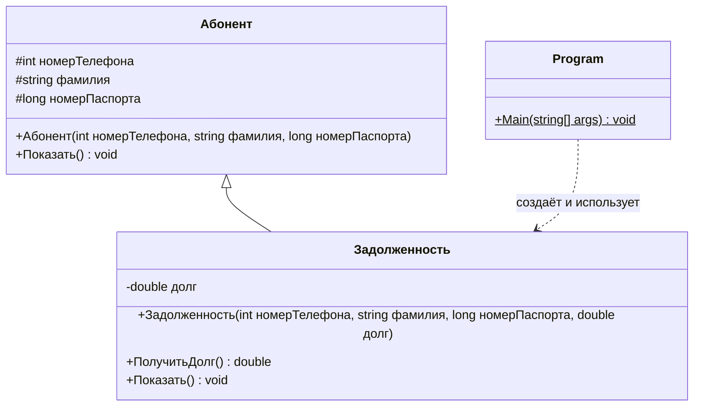

# Лабораторная работа №7. Метрики Лоренца и Кидда

**Дисциплина:** Управление качеством программного обеспечения
**Студент:** Алешин Иван Кириллович
**Вариант:** 1 (компьютер №1), задача 5 — на максимальный балл

Методичка: [`УКПО_ЛР7.pdf`](./УКПО_ЛР7.pdf) (практическое занятие 4, раздел 4.3
«Метрики Лоренца и Кидда»). Отчёт оформлен по образцу примеров 4.3.2 «Платеж за
электроэнергию» и 4.3.3 «Геометрия окружности и прямоугольника». Второй пример
ближе к моей задаче (там тоже базовый класс и наследник с переопределённым
методом вывода), поэтому спорные места при подсчёте я решал так, как они решены
в нём. Теория и ответы на вопросы — в [`THEORY.md`](./THEORY.md).

## Задание

Общее для раздела: разработать программу, реализующую решение по приведённому
условию, а затем оценить характеристики разработанной программы на основе
объектно-ориентированных метрик Лоренца и Кидда.

**Задача 5.** Определить понятие «Абонент телефонной сети». Состояние объекта
определяется полями:

- номер телефона (семизначное целое число);
- фамилия (строка до 20 символов);
- номер паспорта (длинное целое число).

Базируясь на указанном понятии, определить понятие «Задолженность», дополнительно
определив понятие «Абонент телефонной сети» полем «Долг по оплате»
(вещественное число). Определить и вывести данные абонента, имеющего
максимальный долг по оплате среди всех абонентов.

## Как запустить

Программа на C# (.NET 8), проект — [`Lab7.csproj`](./Lab7.csproj), исходник —
[`Program.cs`](./Program.cs).

Тулчейн берётся из flake репозитория: в корне лежит `.envrc` со строкой
`use flake`, а `dotnet-sdk` (8-я версия) уже прописан во `flake.nix`.
Ничего ставить отдельно не нужно.

```bash
# один раз, в корне репозитория
direnv allow

# дальше — из папки лабы
cd software-quality/lab-7
dotnet run
```

Ввода с клавиатуры нет: таблица абонентов задана в коде (как массив фигур в
примере «Геометрия»), поэтому при каждом запуске вывод одинаковый.

Если direnv не настроен, то же самое через `nix develop` из папки лабы:

```bash
nix develop -c dotnet run
```

Каталоги сборки `bin/` и `obj/` лежат под `.gitignore` (общие правила в
корневом `.gitignore`), в репозиторий не попадают.

## Реализация программы

### Классы

Классов ровно столько, сколько понятий в условии, плюс основной класс с `Main`
(как `Program` в примере «Геометрия»):

- `class Абонент` — понятие «Абонент телефонной сети»: три закрытых
  (`protected`) поля из условия, конструктор и метод вывода `Показать()`;
- `class Задолженность : Абонент` — понятие «Задолженность»: наследник
  абонента с дополнительным полем `долг`. Метод вывода переопределён
  (`public new void Показать()`), он печатает данные абонента методом базового
  класса и затем долг. Метод `ПолучитьДолг()` нужен потому, что поле закрытое, а
  долги сравниваются в `Main`;
- `class Program` — основной класс: формирует таблицу абонентов в виде массива,
  выводит всех абонентов и ищет абонента с максимальным долгом.

Типы полей взяты из условия: семизначный номер телефона — `int`, номер
паспорта — `long`, долг — `double`, фамилия — `string`. Ограничение «до 20
символов» в коде отдельно не проверяется: фамилии задаются в самой программе и
заведомо короче; проверка длины добавила бы в конструктор ветвление, которого
в примерах методички нет.

Метод вывода в базовом классе, как и в примере «Геометрия», не виртуальный и не
абстрактный, а в наследнике скрыт через `new`. Вызываемый метод определяется
типом ссылки; массив в `Main` имеет тип `Задолженность[]`, поэтому всегда
вызывается версия наследника.

### Диаграмма классов



### Текст программы

Полный файл с комментариями — [`Program.cs`](./Program.cs). Ниже тот же текст
без комментариев, с номерами строк (рис. 1) — на эти номера ссылаются все
таблицы и расчёты ниже.

| Номер строки | Строка программы |
| ---: | --- |
| 1 | `using System;` |
| 2 | `namespace Lab7` |
| 3 | `{` |
| 4 | `class Абонент` |
| 5 | `{` |
| 6 | `protected int номерТелефона;` |
| 7 | `protected string фамилия;` |
| 8 | `protected long номерПаспорта;` |
| 9 | `public Абонент(int номерТелефона, string фамилия, long номерПаспорта)` |
| 10 | `{` |
| 11 | `this.номерТелефона = номерТелефона;` |
| 12 | `this.фамилия = фамилия;` |
| 13 | `this.номерПаспорта = номерПаспорта;` |
| 14 | `}` |
| 15 | `public void Показать()` |
| 16 | `{` |
| 17 | `Console.WriteLine("Телефон: {0}, фамилия: {1}, паспорт: {2}", номерТелефона, фамилия, номерПаспорта);` |
| 18 | `}` |
| 19 | `}` |
| 20 | `class Задолженность : Абонент` |
| 21 | `{` |
| 22 | `private double долг;` |
| 23 | `public Задолженность(int номерТелефона, string фамилия, long номерПаспорта, double долг) : base(номерТелефона, фамилия, номерПаспорта)` |
| 24 | `{` |
| 25 | `this.долг = долг;` |
| 26 | `}` |
| 27 | `public double ПолучитьДолг()` |
| 28 | `{` |
| 29 | `return долг;` |
| 30 | `}` |
| 31 | `public new void Показать()` |
| 32 | `{` |
| 33 | `base.Показать();` |
| 34 | `Console.WriteLine("Долг по оплате: {0:f2}", долг);` |
| 35 | `}` |
| 36 | `}` |
| 37 | `class Program` |
| 38 | `{` |
| 39 | `static void Main(string[] args)` |
| 40 | `{` |
| 41 | `Задолженность[] абоненты = new Задолженность[5];` |
| 42 | `абоненты[0] = new Задолженность(2345671, "Иванов", 4510123456, 350.50);` |
| 43 | `абоненты[1] = new Задолженность(3456782, "Петров", 4511234567, 1520.75);` |
| 44 | `абоненты[2] = new Задолженность(4567893, "Сидорова", 4512345678, 0.0);` |
| 45 | `абоненты[3] = new Задолженность(5678904, "Кузнецов", 4513456789, 980.00);` |
| 46 | `абоненты[4] = new Задолженность(6789015, "Смирнова", 4514567890, 1210.30);` |
| 47 | `Console.WriteLine("Все абоненты:");` |
| 48 | `for (int i = 0; i < абоненты.Length; i++) абоненты[i].Показать();` |
| 49 | `Задолженность должник = абоненты[0];` |
| 50 | `for (int i = 1; i < абоненты.Length; i++)` |
| 51 | `if (абоненты[i].ПолучитьДолг() > должник.ПолучитьДолг()) должник = абоненты[i];` |
| 52 | `Console.WriteLine();` |
| 53 | `Console.WriteLine("Абонент с максимальным долгом по оплате:");` |
| 54 | `должник.Показать();` |
| 55 | `}` |
| 56 | `}` |
| 57 | `}` |

Рис. 1. Реализация программы «Задолженность абонентов телефонной сети»

Максимум ищется обычным проходом по массиву: первый абонент берётся за
текущего «должника», остальные сравниваются с ним (строки 49–51). Сравнение
строгое, поэтому при нескольких одинаковых максимальных долгах выводится тот
абонент, который стоит в таблице раньше.

### Результат выполнения программы

```text
Все абоненты:
Телефон: 2345671, фамилия: Иванов, паспорт: 4510123456
Долг по оплате: 350.50
Телефон: 3456782, фамилия: Петров, паспорт: 4511234567
Долг по оплате: 1520.75
Телефон: 4567893, фамилия: Сидорова, паспорт: 4512345678
Долг по оплате: 0.00
Телефон: 5678904, фамилия: Кузнецов, паспорт: 4513456789
Долг по оплате: 980.00
Телефон: 6789015, фамилия: Смирнова, паспорт: 4514567890
Долг по оплате: 1210.30

Абонент с максимальным долгом по оплате:
Телефон: 3456782, фамилия: Петров, паспорт: 4511234567
Долг по оплате: 1520.75
```

Проверка: долги 350,50; 1520,75; 0,00; 980,00; 1210,30 — наибольший 1520,75 у
Петрова, его программа и вывела. Каждая запись выводится в две строки: первую
печатает метод `Показать()` базового класса `Абонент` (вызов `base.Показать()`),
вторую — добавленная в наследнике строка с долгом.

## Оценка характеристик программы

Проанализируем текст программы для оценки её качества с помощью метрик Лоренца
и Кидда, которые позволяют оценить меру сложности объектно-ориентированной
программы на основе анализа организационной структуры классов.

Исходный код программы включает три класса (см. рис. 1):

- `class Абонент` — базовый класс, определяющий понятие «Абонент телефонной
  сети» (строки 4–19);
- `class Задолженность` — производный класс от `class Абонент`, определяющий
  понятие «Задолженность» — абонент с долгом по оплате (строки 20–36);
- `class Program` — основной класс, в котором формируется таблица абонентов и
  ищется абонент с максимальным долгом (строки 37–56).

Согласно теории Лоренца и Кидда для оценки качества объектно-ориентированных
программ определяются следующие метрики:

- размер класса CS (Class Size);
- количество операций, переопределяемых подклассом NOO (Number of Operations
  Overridden by a Subclass);
- количество операций, добавленных подклассом NOA (Number of Operations Added
  by a Subclass);
- индекс специализации SI (Specialization Index);
- средний размер операции AOS (Average Operation Size);
- сложность операции OC (Operation Complexity);
- среднее количество параметров на операцию ANP (Average Number of Parameters
  per operation);
- количество описаний сценариев NSS (Number of Scenario Scripts);
- количество ключевых классов NKC (Number of Key Classes);
- количество подсистем NSUB (Number of Subsystem).

### Размер класса CS

Метрика размера класса CS рассчитывается на основании общего количества
операций и количества свойств:

CS = C<sub>Σ</sub> + S<sub>Σ</sub>,

где C<sub>Σ</sub> — количество инкапсулированных классом методов (конструктор
считается методом, как в обоих примерах методички); S<sub>Σ</sub> — количество
инкапсулируемых классом свойств (полей класса).

**Класс `Абонент`** включает три инкапсулированных поля (строки 6–8):

- `protected int номерТелефона;`
- `protected string фамилия;`
- `protected long номерПаспорта;`

В состав класса входят два метода: конструктор
`public Абонент(int номерТелефона, string фамилия, long номерПаспорта)` и
`public void Показать()`. Таким образом, C<sub>Σ</sub> = 2, S<sub>Σ</sub> = 3,

CS(Абонент) = C<sub>Σ</sub> + S<sub>Σ</sub> = 2 + 3 = 5.

**Класс `Задолженность`** включает одно собственное поле
`private double долг;` (строка 22). В состав класса входят три метода:
конструктор `public Задолженность(int номерТелефона, string фамилия, long
номерПаспорта, double долг) : base(номерТелефона, фамилия, номерПаспорта)`,
`public double ПолучитьДолг()` и `public new void Показать()`. Таким образом,
C<sub>Σ</sub> = 3, S<sub>Σ</sub> = 1,

CS(Задолженность) = C<sub>Σ</sub> + S<sub>Σ</sub> = 3 + 1 = 4.

**Класс `Program`** содержит только один метод `static void Main(string[]
args)`, полей нет: C<sub>Σ</sub> = 1, S<sub>Σ</sub> = 0,

CS(Program) = 1 + 0 = 1.

Значения метрики у всех классов находятся в установленных пределах (CS ≤ 20),
сложность классов незначительная, разбиение классов на более мелкие не
требуется.

> Замечание. В теоретической части методички сказано, что при подсчёте CS
> учитываются и наследуемые операции и свойства. В примере «Геометрия» у
> наследника `Окружность` при этом посчитано только собственное поле `r`
> (S<sub>Σ</sub> = 1), унаследованные `x`, `y` не учтены. Я считаю так же,
> как в примере. Если добавить три унаследованных поля абонента, получится
> CS(Задолженность) = 3 + 4 = 7 — вывод не меняется, до 20 далеко.

### Количество переопределяемых операций NOO

В программе реализован принцип наследования: базовым классом является
`Абонент`, производным — `Задолженность`. Класс `Задолженность` содержит один
переопределяемый метод с тем же именем, что и в базовом классе:
`public new void Показать()` (строка 31). Конструктор к переопределённым не
относится — у базового и производного классов это разные конструкторы.
Следовательно,

NOO(Задолженность) = 1.

Для классов `Абонент` и `Program` метрика не определяется: они не являются
подклассами (в смысле иерархии, построенной в программе).

Значение не превышает рекомендуемого (не более 3). Иерархия классов устойчивая,
тестирование и модификация классов будут несложными.

### Количество добавленных операций NOA

NOA = N<sub>Σ</sub>, где N<sub>Σ</sub> — количество новых методов класса,
добавленных относительно суперкласса.

В классе `Задолженность` три метода, из них `Показать()` переопределён, а
новыми относительно класса `Абонент` являются конструктор `Задолженность(...)`
и метод `ПолучитьДолг()`:

NOA(Задолженность) = 3 − 1 = 2.

(Конструктор считается добавленной операцией так же, как в примере
«Геометрия», где NOA(Окружность) = 1 — это как раз конструктор, а метод
`Показать()` там переопределён.)

Значение в пределах рекомендуемого (NOA ≤ 4). Уровень трудозатрат по
тестированию и внесению изменений будет невысоким.

### Индекс специализации SI

SI = (NOO · u) / M<sub>общ</sub>,

где u — номер уровня в иерархии, на котором находится подкласс;
M<sub>общ</sub> — общее количество методов класса.

Производный класс `Задолженность` находится на втором уровне иерархии, на
первом расположен базовый класс `Абонент` (u = 2, нумерация уровней — как в
примере «Геометрия»). Методов в классе три. Следовательно,

SI(Задолженность) = (NOO · u) / M<sub>общ</sub> = (1 · 2) / 3 = 0,67.

Индекс специализации производного класса высокий (больше 0,15). По
Лоренцу и Кидду это означает высокую вероятность нарушения абстракции базового
класса: наследник не просто расширяет абонента, а замещает его операцию вывода.
В программе замещение сделано аккуратно — новая версия `Показать()` вызывает
версию базового класса и только дописывает долг, — но метрика этого не
различает. Уменьшить SI можно, только убрав переопределение (например,
выводить долг отдельным новым методом) или увеличив общее число методов
наследника.

### Средний размер операции AOS

Средний размер операции определяется количеством сообщений, порождаемых
операциями класса. Как и в примерах методички, в качестве сообщения
рассматривается обращение к методу: к методам стандартной библиотеки, к методам
других классов программы, а также вызов конструктора через `new`. Обращения к
свойствам (`абоненты.Length`), создание массива (`new Задолженность[5]`) и
передача параметров базовому конструктору `: base(...)` сообщениями не
считаются — в примере «Геометрия» `base(x, y)` у конструктора `Окружность` в
AOS тоже не учтён.

**Класс `Абонент`** — одно обращение к методу `Console.WriteLine()` (строка 17):

AOS(Абонент) = 1.

**Класс `Задолженность`** — два обращения (строки 33–34):

- обращение к методу базового класса `base.Показать()`;
- обращение к методу `Console.WriteLine()`.

AOS(Задолженность) = 2.

**Класс `Program`** — 12 обращений к методам (строки 41–54):

| Строки | Обращения | Кол-во |
| --- | --- | :---: |
| 42–46 | конструктор `Задолженность(...)` — пять раз | 5 |
| 47, 52, 53 | `Console.WriteLine(...)` | 3 |
| 48, 54 | `Показать()` | 2 |
| 51 | `ПолучитьДолг()` — дважды в одной строке | 2 |
| | **Итого** | **12** |

AOS(Program) = 12.

У классов предметной области (`Абонент`, `Задолженность`) значения маленькие
(1 и 2), у `Program` — 12, это больше рекомендуемой границы 9. Так же, как в
примере «Геометрия» (AOS(Program) = 17), обращения сосредоточены в основном
управляющем классе: он создаёт объекты, выводит их и ищет максимум. Классы
предметной области спроектированы удачно, а превышение у `Program` —
следствие того, что вся обработка таблицы собрана в одном методе `Main`.

> Замечание. Хотя метрика называется «средний размер операции», в обоих
> примерах методички в AOS записано общее число обращений по классу, без
> деления на количество операций. Я считаю так же. Для справки, в среднем на
> одну операцию получилось бы: `Абонент` 1 / 2 = 0,5; `Задолженность`
> 2 / 3 ≈ 0,67; `Program` 12 / 1 = 12 — выводы от этого не меняются.

### Сложность операции OC

Сложность операций рассчитаем методом сложения оценок с весовыми
коэффициентами, предложенными Лоренцом и Киддом (табл. 4.1 методички).

Таблица 1. Весовые коэффициенты действий

| Действие | Вес |
| --- | :---: |
| Определение (описание) переменной-параметра | 0,3 |
| Определение (описание) временной переменной | 0,5 |
| Присваивание значения | 0,5 |
| Вложенное выражение | 0,5 |
| Сообщение без параметров | 1 |
| Арифметическая операция | 2 |
| Сообщение с параметрами | 3 |
| Вызов стандартной функции интерфейса (API) | 5 |
| Вызов пользовательской функции (простой вызов) | 7 |

Правила подсчёта, которых я придерживался. Они взяты из разобранных в
методичке таблиц; там, где примеры расходятся между собой, выбран вариант
примера «Геометрия», если его числа удаётся восстановить по тексту программы:

1. Параметры метода — каждый формальный параметр (у `Main` это `args`, как в
   табл. 4.16).
2. Временная переменная — каждое описание локальной переменной, включая
   счётчик цикла `int i` (как в табл. 4.8, метод `Вывести`). В табл. 4.16
   временная переменная указана одна, хотя в `Main` описаны `список` и три
   счётчика `i` (а три `i++` в арифметике учтены), так что правило по ней
   не восстанавливается — беру табл. 4.8, где счётчик учтён явно.
3. Присваивание — каждое `=`, в том числе инициализация при описании
   (`int i = 0` даёт одну временную переменную и одно присваивание, как в
   табл. 4.8).
4. Вызов метода учитывается дважды — по форме и по происхождению: как
   сообщение (с параметрами или без) и как вызов API либо пользовательской
   функции. Так посчитаны `Console.WriteLine(...)` в табл. 4.11
   (3 + 5 = 8) и `платеж[i].Инфо()` в табл. 4.8 (1 + 7).
5. Вызов конструктора через `new` — только вызов пользовательской функции, без
   «сообщения» (так в табл. 4.16: шесть `new` в `Main` дали только строку
   «Вызов пользовательской функции»). Передача параметров в `: base(...)` не
   считается (табл. 4.12).
6. Арифметическая операция — `+`, `-`, `*`, `/`, `++`; счётчик `i++` цикла
   `for` учитывается (табл. 4.8). Операции сравнения (`<`, `>`) в таблице весов
   нет, и в примерах они не считались — не считаю и я.
7. В столбце «Количество» — число действий. В большинстве строк программы
   действие одно, и число совпадает с количеством строк; где в одной строке два
   одинаковых действия (строка 51 — два вызова `ПолучитьДолг()`), считаются оба.

Определим количество действий для класса `Абонент`.

Таблица 2. Метод `public Абонент(int номерТелефона, string фамилия, long
номерПаспорта)` (см. рис. 1, строки 9–14)

| Действие | Вес | Количество строк |
| --- | :---: | :---: |
| Определение (описание) переменной-параметра | 0,3 | 3 |
| Определение (описание) временной переменной | 0,5 | 0 |
| Присваивание значения | 0,5 | 3 |
| Вложенное выражение | 0,5 | 0 |
| Сообщение без параметров | 1 | 0 |
| Арифметическая операция | 2 | 0 |
| Сообщение с параметрами | 3 | 0 |
| Вызов стандартной функции интерфейса (API) | 5 | 0 |
| Вызов пользовательской функции (простой вызов) | 7 | 0 |

Параметры — `номерТелефона`, `фамилия`, `номерПаспорта`; присваивания —
строки 11, 12, 13. Метрика сложности операции для данного метода:

OC = 0,3 · 3 + 0,5 · 3 = 0,9 + 1,5 = 2,4.

Таблица 3. Метод `public void Показать()` (см. рис. 1, строки 15–18)

| Действие | Вес | Количество строк |
| --- | :---: | :---: |
| Определение (описание) переменной-параметра | 0,3 | 0 |
| Определение (описание) временной переменной | 0,5 | 0 |
| Присваивание значения | 0,5 | 0 |
| Вложенное выражение | 0,5 | 0 |
| Сообщение без параметров | 1 | 0 |
| Арифметическая операция | 2 | 0 |
| Сообщение с параметрами | 3 | 1 |
| Вызов стандартной функции интерфейса (API) | 5 | 1 |
| Вызов пользовательской функции (простой вызов) | 7 | 0 |

Единственное действие — `Console.WriteLine(...)` в строке 17: сообщение с
параметрами и одновременно вызов стандартной функции. Метрика сложности
операции для данного метода:

OC = 3 · 1 + 5 · 1 = 8.

(Метод по сложности совпадает с `Показать()` класса `Точка` из примера, и
значение то же — 8.)

Определим количество действий для класса `Задолженность`.

Таблица 4. Метод `public Задолженность(int номерТелефона, string фамилия, long
номерПаспорта, double долг) : base(номерТелефона, фамилия, номерПаспорта)`
(см. рис. 1, строки 23–26)

| Действие | Вес | Количество строк |
| --- | :---: | :---: |
| Определение (описание) переменной-параметра | 0,3 | 4 |
| Определение (описание) временной переменной | 0,5 | 0 |
| Присваивание значения | 0,5 | 1 |
| Вложенное выражение | 0,5 | 0 |
| Сообщение без параметров | 1 | 0 |
| Арифметическая операция | 2 | 0 |
| Сообщение с параметрами | 3 | 0 |
| Вызов стандартной функции интерфейса (API) | 5 | 0 |
| Вызов пользовательской функции (простой вызов) | 7 | 0 |

Метрика сложности операции для данного метода:

OC = 0,3 · 4 + 0,5 · 1 = 1,2 + 0,5 = 1,7.

Таблица 5. Метод `public double ПолучитьДолг()` (см. рис. 1, строки 27–30)

| Действие | Вес | Количество строк |
| --- | :---: | :---: |
| Определение (описание) переменной-параметра | 0,3 | 0 |
| Определение (описание) временной переменной | 0,5 | 0 |
| Присваивание значения | 0,5 | 0 |
| Вложенное выражение | 0,5 | 0 |
| Сообщение без параметров | 1 | 0 |
| Арифметическая операция | 2 | 0 |
| Сообщение с параметрами | 3 | 0 |
| Вызов стандартной функции интерфейса (API) | 5 | 0 |
| Вызов пользовательской функции (простой вызов) | 7 | 0 |

Метод только возвращает значение поля (`return долг;`): ни параметров, ни
присваиваний, ни вызовов. Ни одно действие из таблицы весов в нём не
встречается, поэтому

OC = 0.

(У похожего метода `Сумма()` в первом примере OC = 2 — там в `return` есть
умножение, у нас арифметики нет.)

Таблица 6. Метод `public new void Показать()` (см. рис. 1, строки 31–35)

| Действие | Вес | Количество строк |
| --- | :---: | :---: |
| Определение (описание) переменной-параметра | 0,3 | 0 |
| Определение (описание) временной переменной | 0,5 | 0 |
| Присваивание значения | 0,5 | 0 |
| Вложенное выражение | 0,5 | 0 |
| Сообщение без параметров | 1 | 1 |
| Арифметическая операция | 2 | 0 |
| Сообщение с параметрами | 3 | 1 |
| Вызов стандартной функции интерфейса (API) | 5 | 1 |
| Вызов пользовательской функции (простой вызов) | 7 | 1 |

Строка 33 `base.Показать()` — сообщение без параметров и вызов
пользовательской функции (метода класса `Абонент`); строка 34
`Console.WriteLine(...)` — сообщение с параметрами и вызов стандартной
функции. Метрика сложности операции для данного метода:

OC = 1 · 1 + 3 · 1 + 5 · 1 + 7 · 1 = 16.

Из полученных значений видно, что все операции классов `Абонент` и
`Задолженность` имеют сложность низкого уровня, которая не превышает
критического значения (менее 65).

Определим характеристику OC для класса `Program`.

Таблица 7. Метод `static void Main(string[] args)` (см. рис. 1, строки 39–55)

| Действие | Вес | Количество строк |
| --- | :---: | :---: |
| Определение (описание) переменной-параметра | 0,3 | 1 |
| Определение (описание) временной переменной | 0,5 | 4 |
| Присваивание значения | 0,5 | 10 |
| Вложенное выражение | 0,5 | 0 |
| Сообщение без параметров | 1 | 5 |
| Арифметическая операция | 2 | 2 |
| Сообщение с параметрами | 3 | 2 |
| Вызов стандартной функции интерфейса (API) | 5 | 3 |
| Вызов пользовательской функции (простой вызов) | 7 | 9 |

Откуда взялись числа:

| Действие | Где в программе | Кол-во |
| --- | --- | :---: |
| параметр | `args` (строка 39) | 1 |
| временная переменная | `абоненты` (41), `i` (48), `должник` (49), `i` (50) | 4 |
| присваивание | строка 41; строки 42–46 (пять); `i = 0` (48); строка 49; `i = 1` (50); `должник = абоненты[i]` (51) | 10 |
| сообщение без параметров | `Показать()` (48), `ПолучитьДолг()` дважды (51), `Console.WriteLine()` (52), `Показать()` (54) | 5 |
| арифметическая операция | `i++` (48), `i++` (50) | 2 |
| сообщение с параметрами | `Console.WriteLine("...")` (47, 53) | 2 |
| вызов API | `Console.WriteLine` (47, 52, 53) | 3 |
| вызов пользовательской функции | конструктор `Задолженность(...)` (42–46, пять раз), `Показать()` (48, 54), `ПолучитьДолг()` (51, дважды) | 9 |

Метрика сложности операции для данного метода:

OC = 0,3 · 1 + 0,5 · 4 + 0,5 · 10 + 1 · 5 + 2 · 2 + 3 · 2 + 5 · 3 + 7 · 9 =
0,3 + 2 + 5 + 5 + 4 + 6 + 15 + 63 = 100,3.

Сложность операций классов `Абонент` и `Задолженность` находится в
установленных пределах (менее 65). Сложность метода `Main` основного класса
`Program` превышает эту норму (100,3 > 65) — так же, как в примере «Геометрия»
(107,3). Больше всего даёт вес вызова пользовательской функции: 63 из 100,3,
из них 35 — пять вызовов конструктора при заполнении таблицы. По рекомендации
методички часть операций основного класса (заполнение таблицы, поиск
максимума) целесообразно вынести в отдельные методы или в дополнительный класс.
В этой работе я этого не делал, чтобы состав классов точно соответствовал
условию задачи и образцу.

### Среднее количество параметров на операцию ANP

ANP = Количество_параметров / Количество_операций.

**Для класса `Абонент`** (см. рис. 1, строки 4–19): три параметра у
конструктора, у метода `Показать()` параметров нет; операций две:

ANP(Абонент) = 3 / 2 = 1,5.

**Для класса `Задолженность`** (строки 20–36): четыре параметра у
конструктора, у `ПолучитьДолг()` и `Показать()` параметров нет; операций три:

ANP(Задолженность) = 4 / 3 = 1,33.

**Для класса `Program`** (строки 37–56): один параметр `args` у метода
`Main`, операция одна:

ANP(Program) = 1 / 1 = 1.

Все классы программы имеют значения выше рекомендуемого (0,7), что усложняет
взаимодействие между объектами. В классах `Абонент` и `Задолженность` значение
поднимают конструкторы: объект по условию описывается тремя–четырьмя полями, и
все они передаются при создании. Остальные методы этих классов параметров не
имеют вовсе.

### Количество описаний сценариев NSS

Количество сценариев определим, как и в примерах, по количеству методов в
классах:

- в классе `Абонент` определены два метода — NSS = 2;
- в классе `Задолженность` — три метода, NSS = 3;
- в классе `Program` — один метод, NSS = 1.

Всего по программе NSS = 2 + 3 + 1 = 6. Количество сценариев невелико, что
определяет небольшой размер программы (57 строк без комментариев).

### Количество ключевых классов NKC

Все три класса программы непосредственно связаны с проблемной областью:
`Абонент` и `Задолженность` — понятия из условия задачи, `Program` формирует
таблицу абонентов и решает поставленную задачу — поиск абонента с
максимальным долгом. Как и в обоих примерах методички, где ключевыми названы
все классы, включая основной, получаем 3 ключевых класса из 3:

NKC = 3 / 3 = 1 (100 %).

Значение не меньше рекомендуемой нижней границы 0,2. Если не считать
`Program` ключевым (он ближе к «инфраструктуре»), получится 2 / 3 ≈ 0,67 —
граница всё равно выполняется.

### Количество подсистем NSUB

В программе можно выделить три подсистемы:

- подсистему определения объекта — абонент телефонной сети (`Абонент`);
- подсистему определения объекта — задолженность абонента (`Задолженность`);
- подсистему обработки информации по абонентам — формирование таблицы, вывод
  и поиск максимального долга (`Program`).

Таким образом, NSUB = 3, что соответствует рекомендуемому значению (не менее
трёх). При таком значении трудоёмкость проекта невысокая, а управляемость
достаточная.

## Итоговые результаты

| Метрика | Рекомендуемое значение | Абонент | Задолженность | Program |
| --- | :---: | :---: | :---: | :---: |
| CS = C<sub>Σ</sub> + S<sub>Σ</sub> | ≤ 20 | 2 + 3 = 5 | 3 + 1 = 4 | 1 + 0 = 1 |
| NOO | ≤ 3 | — | 1 | — |
| NOA | ≤ 4 | — | 2 | — |
| SI = NOO · u / M<sub>общ</sub> | ≤ 0,15 | — | 1 · 2 / 3 = **0,67** | — |
| AOS | ≤ 9 | 1 | 2 | **12** |
| OC (по методам) | ≤ 65 | конструктор 2,4; `Показать` 8 | конструктор 1,7; `ПолучитьДолг` 0; `Показать` 16 | `Main` **100,3** |
| ANP | 0,7 | **1,5** | **1,33** | **1** |
| NSS (число методов) | ≥ 1 | 2 | 3 | 1 |

По программе в целом: NKC = 3 / 3 = 1 (100 %), NSUB = 3, NSS = 6.
Жирным выделены значения, выходящие за рекомендуемые границы.

## Выводы

1. Разработана программа на C#, в которой понятие «Абонент телефонной сети»
   описано базовым классом `Абонент`, понятие «Задолженность» — производным
   классом `Задолженность` с дополнительным полем «Долг по оплате». Программа
   выводит всех абонентов и находит абонента с максимальным долгом (Петров,
   1520,75), что совпадает с ручной проверкой.
2. Размер всех классов мал: CS = 5, 4 и 1 при допустимых 20. Разбивать классы
   на более мелкие не требуется.
3. Наследование в программе одноуровневое. Наследник переопределяет одну
   операцию (NOO = 1 ≤ 3) и добавляет две (NOA = 2 ≤ 4), поэтому иерархия
   устойчивая, а тестирование и изменение наследника несложные.
4. Индекс специализации SI = 0,67 больше рекомендуемых 0,15. Причина в том,
   что при малом общем числе методов (три) один из них переопределён, а
   подкласс находится на втором уровне. Формально это признак возможного
   нарушения абстракции базового класса; фактически новая версия `Показать()`
   дополняет старую (вызывает `base.Показать()`), а не заменяет её логику.
   Снизить SI можно, отказавшись от переопределения метода вывода.
5. Средний размер операции у классов предметной области маленький (AOS = 1 и
   2), у основного класса `Program` — 12, больше границы 9: все обращения к
   другим классам собраны в `Main`. Так же распределены вызовы и в примере
   «Геометрия», это следствие того, что управляющий класс единственный.
6. Сложность операций классов `Абонент` и `Задолженность` низкая (от 0 до 16
   при допустимых 65). Сложность `Main` — 100,3, выше нормы; в основном за
   счёт девяти вызовов пользовательских функций (из них пять — конструкторы
   при заполнении таблицы). По рекомендации методички часть операций основного
   класса стоит перенести в отдельные методы или класс.
7. Среднее количество параметров на операцию во всех классах больше 0,7
   (1,5; 1,33; 1). Рост дают конструкторы, которые получают все поля объекта
   сразу; остальные методы классов параметров не имеют.
8. Количество сценариев (NSS = 6), доля ключевых классов (100 %) и число
   подсистем (NSUB = 3) показывают, что программа небольшая, все классы
   относятся к предметной области, а проект легко управляем.
