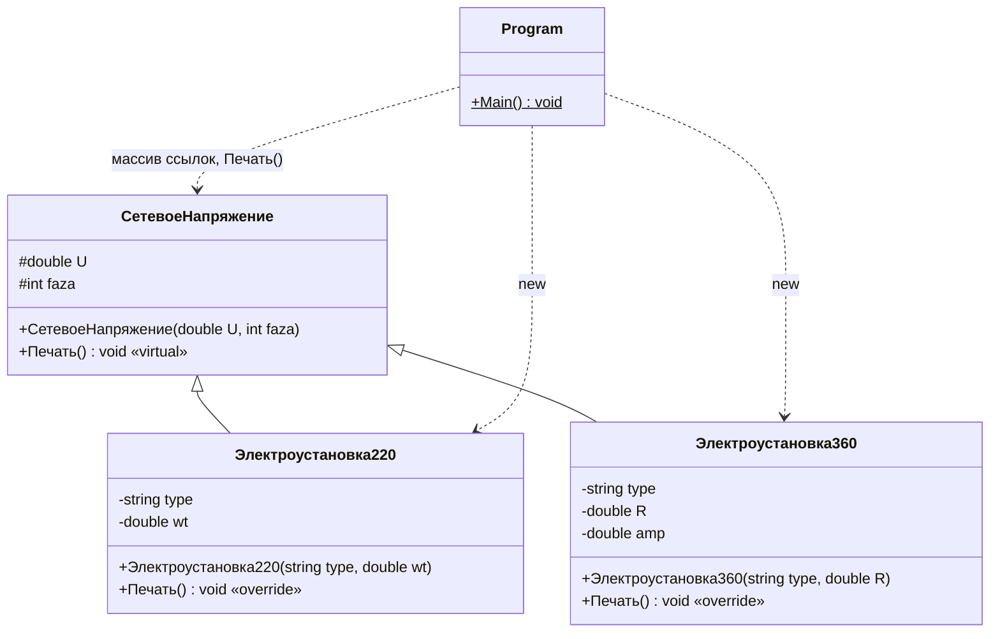

# Лабораторная работа №8. Метрики Абреу

**Дисциплина:** Управление качеством программного обеспечения
**Студент:** Алешин Иван Кириллович
**Вариант:** компьютер №1, задание (1 − 1) % 10 + 1 = **1** — на максимальный балл

Методичка: [`УКПО_ЛР8.pdf`](./УКПО_ЛР8.pdf) (п. 4.4 «Метрики Абреу»). Отчёт
оформлен по образцу примера 4.4.3 «Геометрия окружности и прямоугольника»:
там, как и в моей задаче, есть базовый класс, два наследника и основной
класс с `Main`, поэтому метрики считаются в том же порядке и теми же
словами. Теория и ответы на вопросы — в [`THEORY.md`](./THEORY.md).

## Задание

Общее для раздела 4.4.4: разработать программу, реализующую решение по
приведённому условию, а затем оценить характеристики разработанной программы
на основе применения объектно-ориентированных метрик Абреу.

**Задача 1.** Разработать приложение для вычисления результирующей информации
об объектах, описанных с помощью наследования:

- базовый объект — «Сетевое напряжение» (поля: напряжение — *U*, количество
  фаз — *faza*);
- производный объект 1 — «Электроустановка на 220 В» с полями: тип
  электроустановки — *type*, мощность — *wt*;
- производный объект 2 — «трехфазная электроустановка на 360 В» с полями: тип
  электроустановки — *type*, сопротивление — *R*, потребляемый ток — *amp*.

Для решения задачи необходимо:

а) Определить базовый класс и производные классы, используя наследование.

б) Используя виртуальный метод печати базового класса, разработать
переопределенные методы производных классов для вывода результирующей
информации из перечня:

- тип электроустановки,
- сопротивление *R = U / I*,
- потребляемый ток *I = U / R*,
- мощность *W = I · U*.

в) Создать массив для хранения ссылок на объекты, следующие в произвольном
порядке. Всю необходимую информацию вводит пользователь.

г) Создать объекты, присвоив начальные значения полям объекта с помощью
конструктора.

д) Используя массив ссылок и цикл, вывести результирующую информацию (см.
требование б).

## Как запустить

Программа на C# (.NET 8), проект — [`Lab8.csproj`](./Lab8.csproj), исходник —
[`Program.cs`](./Program.cs).

Тулчейн берётся из flake репозитория: в корне лежит `.envrc` со строкой
`use flake`, а `dotnet-sdk` (8-я версия) уже прописан во `flake.nix`.
Ничего ставить отдельно не нужно.

```bash
# один раз, в корне репозитория
direnv allow

# дальше — из папки лабы
cd software-quality/lab-8
dotnet run
```

Программа спрашивает количество установок, а потом для каждой — вид
(1 — на 220 В, 2 — трёхфазная на 360 В), тип (любая строка) и мощность или
сопротивление. Чтобы не вводить руками, ввод можно подать через конвейер,
по одному значению в строке:

```bash
printf '4\n1\nЧайник\n2000\n2\nЭлектродвигатель\n36\n1\nЛампа\n100\n2\nТЭН\n120\n' | dotnet run
```

Если direnv не настроен, то же самое через `nix develop` из папки лабы:

```bash
nix develop -c dotnet run
```

Дробные числа вводятся через точку (`12.5`). В `Lab8.csproj` для этого
включён `InvariantGlobalization`: иначе при русской локали `double.Parse`
ждал бы запятую, и одна и та же команда вела бы себя по-разному на разных
машинах.

Каталоги сборки `bin/` и `obj/` лежат под `.gitignore` (общие правила в
корневом `.gitignore`), в репозиторий не попадают.

## Реализация программы

Полный файл с комментариями — [`Program.cs`](./Program.cs). Ниже тот же текст
без комментариев и пустых строк, с номерами — на эти номера ссылается расчёт
метрик (как на рис. 4.2 методички).

| Номер строки | Строка программы |
| ---: | --- |
| 1 | `using System;` |
| 2 | `namespace Lab8` |
| 3 | `{` |
| 4 | `class СетевоеНапряжение` |
| 5 | `{` |
| 6 | `protected double U;` |
| 7 | `protected int faza;` |
| 8 | `public СетевоеНапряжение(double U, int faza)` |
| 9 | `{` |
| 10 | `this.U = U; this.faza = faza;` |
| 11 | `}` |
| 12 | `public virtual void Печать()` |
| 13 | `{` |
| 14 | `Console.WriteLine("Сеть: U = {0} В, фаз: {1}", U, faza);` |
| 15 | `}` |
| 16 | `}` |
| 17 | `class Электроустановка220 : СетевоеНапряжение` |
| 18 | `{` |
| 19 | `private string type;` |
| 20 | `private double wt;` |
| 21 | `public Электроустановка220(string type, double wt) : base(220, 1)` |
| 22 | `{` |
| 23 | `this.type = type; this.wt = wt;` |
| 24 | `}` |
| 25 | `public override void Печать()` |
| 26 | `{` |
| 27 | `double I = wt / U;` |
| 28 | `base.Печать();` |
| 29 | `Console.WriteLine("  {0}: W = {1:f2} Вт, I = W / U = {2:f3} А, R = U / I = {3:f2} Ом",` |
| 30 | `type, wt, I, U / I);` |
| 31 | `}` |
| 32 | `}` |
| 33 | `class Электроустановка360 : СетевоеНапряжение` |
| 34 | `{` |
| 35 | `private string type;` |
| 36 | `private double R, amp;` |
| 37 | `public Электроустановка360(string type, double R) : base(360, 3)` |
| 38 | `{` |
| 39 | `this.type = type; this.R = R;` |
| 40 | `amp = U / R;` |
| 41 | `}` |
| 42 | `public override void Печать()` |
| 43 | `{` |
| 44 | `base.Печать();` |
| 45 | `Console.WriteLine("  {0}: R = {1:f2} Ом, I = U / R = {2:f3} А, W = I * U = {3:f2} Вт",` |
| 46 | `type, R, amp, amp * U);` |
| 47 | `}` |
| 48 | `}` |
| 49 | `class Program` |
| 50 | `{` |
| 51 | `public static void Main()` |
| 52 | `{` |
| 53 | `int n, вид;` |
| 54 | `string type;` |
| 55 | `Console.Write("Количество электроустановок: ");` |
| 56 | `n = int.Parse(Console.ReadLine());` |
| 57 | `СетевоеНапряжение[] список = new СетевоеНапряжение[n];` |
| 58 | `for (int i = 0; i < n; i++)` |
| 59 | `{` |
| 60 | `Console.Write("Установка {0}: вид (1 - на 220 В, 2 - трехфазная на 360 В) -> ", i);` |
| 61 | `вид = int.Parse(Console.ReadLine());` |
| 62 | `Console.Write("Установка {0}: тип -> ", i);` |
| 63 | `type = Console.ReadLine();` |
| 64 | `if (вид == 1)` |
| 65 | `{` |
| 66 | `Console.Write("Установка {0}: мощность W, Вт -> ", i);` |
| 67 | `список[i] = new Электроустановка220(type, double.Parse(Console.ReadLine()));` |
| 68 | `}` |
| 69 | `else` |
| 70 | `{` |
| 71 | `Console.Write("Установка {0}: сопротивление R, Ом -> ", i);` |
| 72 | `список[i] = new Электроустановка360(type, double.Parse(Console.ReadLine()));` |
| 73 | `}` |
| 74 | `}` |
| 75 | `Console.WriteLine();` |
| 76 | `for (int i = 0; i < список.Length; i++)` |
| 77 | `список[i].Печать();` |
| 78 | `}` |
| 79 | `}` |
| 80 | `}` |

Как требования задачи легли на код:

- **а)** `СетевоеНапряжение` — базовый класс с полями `U` и `faza`
  (строки 6–7); `Электроустановка220` и `Электроустановка360` — его
  наследники (строки 17, 33). Имена полей взяты из условия: `type`, `wt` у
  первого наследника, `type`, `R`, `amp` у второго. Других классов, кроме
  этих трёх и основного `Program`, нет — ровно как в примере 4.4.3.
- **б)** `Печать()` в базовом классе объявлен `virtual` (строка 12), в
  наследниках — `override` (строки 25, 42). В отличие от примера 4.4.3, где
  методы перекрыты через `new` и «вызываемый метод определяется типом
  ссылки», здесь условие прямо требует виртуальный метод, поэтому вызов по
  ссылке базового типа уходит в метод реального объекта. Переопределённые
  методы сначала вызывают `base.Печать()` (параметры сети), потом печатают
  своё.
- Формулы из перечня. Для установки на 220 В пользователь задаёт мощность,
  из неё получается ток *I = W / U* (это та же формула *W = I · U*) и
  сопротивление *R = U / I*. Для трёхфазной установки задаётся сопротивление,
  ток *amp = U / R* считается один раз в конструкторе (строка 40) и хранится в
  поле, а мощность выводится как *W = I · U*. Так каждая из формул перечня
  используется, а поле `amp` из условия получает осмысленное значение.
- Напряжение и число фаз у наследников фиксированы названием объекта
  («на 220 В», «трехфазная на 360 В»), поэтому они передаются в конструктор
  базового класса константами: `base(220, 1)` и `base(360, 3)`. Пользователь
  их не вводит — вводить «220» для установки на 220 В было бы странно.
- **в)** Массив `список` объявлен с типом базового класса (строка 57); в
  цикле пользователь для каждого элемента сам выбирает вид установки, так
  что объекты идут в произвольном порядке.
- **г)** Объекты создаются конструкторами с параметрами (строки 67, 72).
- **д)** Вывод — один цикл по массиву ссылок (строки 76–77).

Про физику: 360 В — значение из условия (в реальной трёхфазной сети
линейное напряжение 380 В, а мощность считается как √3·U·I). Я оставил
напряжение и формулы ровно такими, как в задании, потому что лабораторная
про метрики, а не про электротехнику.

## Результаты работы программы

Ввод подаётся через `printf ... | dotnet run`, поэтому все приглашения
печатаются в одну строку (ответы пользователя в консоль не попадают, их
видно в команде запуска).

**1. Четыре установки вперемешку** (220 В, 360 В, 220 В, 360 В):

```bash
printf '4\n1\nЧайник\n2000\n2\nЭлектродвигатель\n36\n1\nЛампа\n100\n2\nТЭН\n120\n' | dotnet run
```

```text
Количество электроустановок: Установка 0: вид (1 - на 220 В, 2 - трехфазная на 360 В) -> Установка 0: тип -> Установка 0: мощность W, Вт -> Установка 1: вид (1 - на 220 В, 2 - трехфазная на 360 В) -> Установка 1: тип -> Установка 1: сопротивление R, Ом -> Установка 2: вид (1 - на 220 В, 2 - трехфазная на 360 В) -> Установка 2: тип -> Установка 2: мощность W, Вт -> Установка 3: вид (1 - на 220 В, 2 - трехфазная на 360 В) -> Установка 3: тип -> Установка 3: сопротивление R, Ом -> 
Сеть: U = 220 В, фаз: 1
  Чайник: W = 2000.00 Вт, I = W / U = 9.091 А, R = U / I = 24.20 Ом
Сеть: U = 360 В, фаз: 3
  Электродвигатель: R = 36.00 Ом, I = U / R = 10.000 А, W = I * U = 3600.00 Вт
Сеть: U = 220 В, фаз: 1
  Лампа: W = 100.00 Вт, I = W / U = 0.455 А, R = U / I = 484.00 Ом
Сеть: U = 360 В, фаз: 3
  ТЭН: R = 120.00 Ом, I = U / R = 3.000 А, W = I * U = 1080.00 Вт
```

Проверка вручную: чайник — 2000 / 220 = 9,091 А, R = 220 / 9,091 = 24,2 Ом
(или U² / W = 48400 / 2000); двигатель — 360 / 36 = 10 А, 10 · 360 = 3600 Вт;
лампа — 100 / 220 = 0,455 А, 48400 / 100 = 484 Ом; ТЭН — 360 / 120 = 3 А,
3 · 360 = 1080 Вт. Всё совпадает.

Видно, что по одной и той же ссылке типа `СетевоеНапряжение` для разных
элементов массива вызываются разные `Печать()` — это и есть работа
виртуального метода.

**2. Только трёхфазные установки, дробное сопротивление:**

```bash
printf '2\n2\nНасос\n12.5\n2\nКомпрессор\n90\n' | dotnet run
```

```text
Количество электроустановок: Установка 0: вид (1 - на 220 В, 2 - трехфазная на 360 В) -> Установка 0: тип -> Установка 0: сопротивление R, Ом -> Установка 1: вид (1 - на 220 В, 2 - трехфазная на 360 В) -> Установка 1: тип -> Установка 1: сопротивление R, Ом -> 
Сеть: U = 360 В, фаз: 3
  Насос: R = 12.50 Ом, I = U / R = 28.800 А, W = I * U = 10368.00 Вт
Сеть: U = 360 В, фаз: 3
  Компрессор: R = 90.00 Ом, I = U / R = 4.000 А, W = I * U = 1440.00 Вт
```

360 / 12,5 = 28,8 А, 28,8 · 360 = 10368 Вт; 360 / 90 = 4 А, 4 · 360 = 1440 Вт.

## Диаграмма классов

Обозначения видимости UML: `+` — public, `-` — private, `#` — protected.
Сплошная стрелка с треугольником — наследование, пунктирная — отношение
«клиент — поставщик» (зависимость), которое учитывается в метрике COF.



## Оценка характеристик программы

В соответствии с теорией Абреу необходимо определить значения следующих
характеристик:

- фактора закрытости метода (MHF);
- фактора закрытости свойства (AHF);
- фактора наследования метода (MIF);
- фактора наследования свойства (AIF);
- фактора полиморфизма (POF);
- фактора сцепления (COF).

Каждая метрика относится к одному из механизмов ООП: инкапсуляции (MHF и
AHF), наследованию (MIF и AIF), полиморфизму (POF) и посылке сообщений (COF).

В исходном коде решаемой задачи определено четыре класса, **TC = 4**:

- `class СетевоеНапряжение` — базовый класс, описывающий сеть: напряжение и
  количество фаз (строки 4–16);
- `class Электроустановка220` — производный класс от `СетевоеНапряжение`,
  однофазная установка на 220 В с заданной мощностью (строки 17–32);
- `class Электроустановка360` — производный класс от `СетевоеНапряжение`,
  трёхфазная установка на 360 В с заданным сопротивлением (строки 33–48);
- `class Program` — класс, в котором содержится основной метод: ввод данных,
  заполнение массива ссылок и вывод (строки 49–79).

Как и в примерах методички, методами класса считаются все его методы,
включая конструкторы, а полями (свойствами) — объявленные в нём поля.

### Фактор закрытости метода MHF (Method Hiding Factor)

Закрытость метода определяется количеством классов, из которых указанный
метод невидим. Значение метрики рассчитывается по соотношению (4.4.1):
MHF = Σ M_h(C_i) / Σ M_d(C_i), где M_h — число скрытых методов класса,
M_d = M_v + M_h — число всех методов, определённых в классе (без
унаследованных).

Класс `СетевоеНапряжение` в своём составе имеет два метода — `public
СетевоеНапряжение(double U, int faza)` и `public virtual void Печать()`
(строки 8, 12). Оба открыты, так как определены модификатором `public`.
Следовательно, M_h(СетевоеНапряжение) = 0, M_d(СетевоеНапряжение) = 2.

Класс `Электроустановка220` включает два метода, оба открытые (строки 21,
25). Следовательно, M_h(Электроустановка220) = 0,
M_d(Электроустановка220) = 2.

Класс `Электроустановка360` включает два метода, которые также являются
открытыми (строки 37, 42). Следовательно, M_h(Электроустановка360) = 0,
M_d(Электроустановка360) = 2.

Класс `Program` в своём составе имеет один метод `Main()`, объявленный
`public` (строка 51). Следовательно, M_h(Program) = 0, M_d(Program) = 1.
(В примерах методички `Main` записан без модификатора и назван «по
умолчанию открытым», хотя в C# член класса без модификатора — `private`.
Чтобы отчёт не расходился с языком, модификатор `public` указан явно;
на результат это не влияет — по методичке `Main` в любом случае открытый.)

| Класс | Методы (строки) | M_v | M_h | M_d |
| --- | --- | :---: | :---: | :---: |
| СетевоеНапряжение | конструктор (8), `Печать` (12) | 2 | 0 | 2 |
| Электроустановка220 | конструктор (21), `Печать` (25) | 2 | 0 | 2 |
| Электроустановка360 | конструктор (37), `Печать` (42) | 2 | 0 | 2 |
| Program | `Main` (51) | 1 | 0 | 1 |
| **Сумма** | | 7 | **0** | **7** |

Таким образом, значение характеристики:

**MHF = Σ M_h(C_i) / Σ M_d(C_i) = (0 + 0 + 0 + 0) / (2 + 2 + 2 + 1) = 0 / 7 = 0.**

Решение задачи не имеет закрытых методов.

### Фактор закрытости свойства AHF (Attribute Hiding Factor)

Закрытость свойства (поля) представляет собой количество классов, из которых
данное свойство (поле) невидимо. Считается по (4.4.5):
AHF = Σ A_h(C_i) / Σ A_d(C_i).

В классе `СетевоеНапряжение` определено два поля (строки 6, 7): `protected
double U` и `protected int faza`. Эти поля являются закрытыми, так как
определены модификатором `protected`:

- A_h(СетевоеНапряжение) = 2;
- A_d(СетевоеНапряжение) = 2.

В классе `Электроустановка220` определено два поля, оба закрытые
(`private`, строки 19, 20):

- A_h(Электроустановка220) = 2;
- A_d(Электроустановка220) = 2.

В классе `Электроустановка360` определено три поля, все закрытые
(`private`, строки 35, 36):

- A_h(Электроустановка360) = 3;
- A_d(Электроустановка360) = 3.

В классе `Program` поля не определены (`n`, `вид`, `type`, `список`, `i` —
локальные переменные метода `Main`, а не поля класса):
A_h(Program) = 0, A_d(Program) = 0.

| Класс | Поля (строки) | Модификатор | A_v | A_h | A_d |
| --- | --- | --- | :---: | :---: | :---: |
| СетевоеНапряжение | `U`, `faza` (6, 7) | protected | 0 | 2 | 2 |
| Электроустановка220 | `type`, `wt` (19, 20) | private | 0 | 2 | 2 |
| Электроустановка360 | `type`, `R`, `amp` (35, 36) | private | 0 | 3 | 3 |
| Program | — | — | 0 | 0 | 0 |
| **Сумма** | | | 0 | **7** | **7** |

Таким образом, для искомой метрики можно записать:

**AHF = Σ A_h(C_i) / Σ A_d(C_i) = (2 + 2 + 3 + 0) / (2 + 2 + 3 + 0) = 7 / 7 = 1.**

Закрытость полей всех классов программы составляет 100 %.

> **Замечание про `protected`.** Здесь, как и в примере 4.4.3 (поля `x`, `y`
> класса Точка), `protected`-поля считаются закрытыми. Если же считать
> строго по формулам (4.4.6)–(4.4.8), то поле `protected` видно из двух
> классов-наследников из TC − 1 = 3 возможных, то есть V = 2/3 и закрытость
> каждого такого поля 1 − 2/3 = 1/3. Тогда AHF = (1/3 + 1/3 + 2 + 3) / 7 =
> 17/21 ≈ 0,81. В итог я беру значение по образцу методички (AHF = 1), а
> уточнённое привожу для сравнения.

### Фактор наследования метода MIF (Method Inheritance Factor)

Определяется выражением (4.4.9): MIF = Σ M_i(C_i) / Σ M_a(C_i), где

- M_i — количество унаследованных и непереопределённых методов;
- M_0 — количество унаследованных и переопределённых методов;
- M_n — количество новых (неунаследованных) методов;
- M_d = M_n + M_0 — количество методов, определённых в классе;
- M_a = M_d + M_i — общее количество методов, доступных в классе.

В программе содержится один базовый класс `СетевоеНапряжение` и два
класса-наследника: `Электроустановка220` и `Электроустановка360`.

Для класса `СетевоеНапряжение` количество унаследованных методов равно 0,
количество неунаследованных методов равно 2:

- M_i(СетевоеНапряжение) = 0;
- M_0(СетевоеНапряжение) = 0;
- M_n(СетевоеНапряжение) = 2;
- M_d(СетевоеНапряжение) = M_n + M_0 = 2 + 0 = 2;
- M_a(СетевоеНапряжение) = M_d + M_i = 2 + 0 = 2.

Для класса `Электроустановка220`:

- M_i(Электроустановка220) = 0;
- M_0(Электроустановка220) = 1;
- M_n(Электроустановка220) = 1;
- M_d(Электроустановка220) = M_n + M_0 = 1 + 1 = 2;
- M_a(Электроустановка220) = M_d + M_i = 2 + 0 = 2,

так как класс содержит один унаследованный переопределённый метод `public
override void Печать()` (строка 25) и один неунаследованный метод — конструктор
`public Электроустановка220(string type, double wt) : base(220, 1)` (строка
21). Конструктор базового класса в C# не наследуется, поэтому в M_i он не
попадает.

Для класса `Электроустановка360` характеристики будут равны:

- M_i(Электроустановка360) = 0;
- M_0(Электроустановка360) = 1;
- M_n(Электроустановка360) = 1;
- M_d(Электроустановка360) = M_n + M_0 = 1 + 1 = 2;
- M_a(Электроустановка360) = M_d + M_i = 2 + 0 = 2,

так как класс содержит один унаследованный переопределённый метод `public
override void Печать()` (строка 42) и один неунаследованный метод
`public Электроустановка360(string type, double R) : base(360, 3)` (строка 37).

Для класса `Program`:

- M_i(Program) = 0;
- M_0(Program) = 0;
- M_n(Program) = 1;
- M_d(Program) = M_n + M_0 = 1 + 0 = 1;
- M_a(Program) = M_d + M_i = 1 + 0 = 1.

| Класс | M_i | M_0 | M_n | M_d | M_a |
| --- | :---: | :---: | :---: | :---: | :---: |
| СетевоеНапряжение | 0 | 0 | 2 | 2 | 2 |
| Электроустановка220 | 0 | 1 | 1 | 2 | 2 |
| Электроустановка360 | 0 | 1 | 1 | 2 | 2 |
| Program | 0 | 0 | 1 | 1 | 1 |
| **Сумма** | **0** | 2 | 5 | 7 | **7** |

Таким образом, значение метрики MIF составляет:

**MIF = Σ M_i(C_i) / Σ M_a(C_i) = (0 + 0 + 0 + 0) / (2 + 2 + 2 + 1) = 0 / 7 = 0.**

Нулевое значение означает, что единственный наследуемый метод `Печать()`
переопределён в обоих наследниках — «в чистом виде» ни один метод базового
класса не используется. Это прямо следует из условия (требование б).
Сам код базового метода при этом не пропадает: оба переопределения вызывают
его через `base.Печать()` (строки 28, 44), но формула Абреу такое повторное
использование не учитывает — метод всё равно считается переопределённым.

### Фактор наследования свойства AIF (Attribute Inheritance Factor)

Определяется в соответствии с формулой (4.4.10):
AIF = Σ A_i(C_i) / Σ A_a(C_i), обозначения те же, что для методов
(A_i — унаследованные непереопределённые поля, A_0 — унаследованные
переопределённые, A_n — новые, A_d = A_n + A_0, A_a = A_d + A_i).

Для класса `СетевоеНапряжение` количество унаследованных полей равно нулю:

- A_i(СетевоеНапряжение) = 0;
- A_0(СетевоеНапряжение) = 0;
- A_n(СетевоеНапряжение) = 2;
- A_d(СетевоеНапряжение) = A_n + A_0 = 2 + 0 = 2;
- A_a(СетевоеНапряжение) = A_d + A_i = 2 + 0 = 2.

Класс `Электроустановка220` наследует от класса `СетевоеНапряжение` два поля
(`U`, `faza`). Унаследованные поля не переопределяются, но дополнительно
определяются два новых поля (строки 19, 20):

- A_i(Электроустановка220) = 2;
- A_0(Электроустановка220) = 0;
- A_n(Электроустановка220) = 2;
- A_d(Электроустановка220) = A_n + A_0 = 2 + 0 = 2;
- A_a(Электроустановка220) = A_d + A_i = 2 + 2 = 4.

Класс `Электроустановка360` наследует от класса `СетевоеНапряжение` два поля.
Унаследованные поля не переопределяются, дополнительно определяются три новых
поля (строки 35, 36):

- A_i(Электроустановка360) = 2;
- A_0(Электроустановка360) = 0;
- A_n(Электроустановка360) = 3;
- A_d(Электроустановка360) = A_n + A_0 = 3 + 0 = 3;
- A_a(Электроустановка360) = A_d + A_i = 3 + 2 = 5.

Поле `type` есть в обоих наследниках, но это два разных новых поля, а не
переопределение: в базовом классе поля `type` нет (так требует условие —
*type* указан у каждого производного объекта отдельно).

Класс `Program` не является наследником, и поля в нём не определены:

- A_i(Program) = 0;
- A_0(Program) = 0;
- A_n(Program) = 0;
- A_d(Program) = A_n + A_0 = 0 + 0 = 0;
- A_a(Program) = A_d + A_i = 0 + 0 = 0.

| Класс | A_i | A_0 | A_n | A_d | A_a |
| --- | :---: | :---: | :---: | :---: | :---: |
| СетевоеНапряжение | 0 | 0 | 2 | 2 | 2 |
| Электроустановка220 | 2 | 0 | 2 | 2 | 4 |
| Электроустановка360 | 2 | 0 | 3 | 3 | 5 |
| Program | 0 | 0 | 0 | 0 | 0 |
| **Сумма** | **4** | 0 | 7 | 7 | **11** |

Таким образом, значение метрики AIF составляет:

**AIF = Σ A_i(C_i) / Σ A_a(C_i) = (0 + 2 + 2 + 0) / (2 + 4 + 5 + 0) = 4 / 11 ≈ 0,36.**

### Фактор полиморфизма POF (Polymorphism Factor)

Рассчитывается в соответствии с выражением (4.4.11):
POF = Σ M_0(C_i) / Σ [M_n(C_i) · DC(C_i)], где DC — количество потомков
класса.

Класс `СетевоеНапряжение` является базовым и не имеет предков, он имеет двух
потомков и не имеет унаследованных полей и методов. Для класса
`СетевоеНапряжение`:

- M_0(СетевоеНапряжение) = 0;
- M_n(СетевоеНапряжение) = 2;
- DC(СетевоеНапряжение) = 2;
- M_d(СетевоеНапряжение) = M_n + M_0 = 2 + 0 = 2.

Класс `Электроустановка220` является потомком класса `СетевоеНапряжение` и не
является базовым для других классов. В нём переопределяется наследуемый метод
`public override void Печать()`:

- M_0(Электроустановка220) = 1;
- M_n(Электроустановка220) = 1;
- DC(Электроустановка220) = 0;
- M_d(Электроустановка220) = M_n + M_0 = 1 + 1 = 2.

Класс `Электроустановка360` является потомком класса `СетевоеНапряжение` и не
является базовым для других классов. В нём переопределяется наследуемый метод
`public override void Печать()`:

- M_0(Электроустановка360) = 1;
- M_n(Электроустановка360) = 1;
- DC(Электроустановка360) = 0;
- M_d(Электроустановка360) = M_n + M_0 = 1 + 1 = 2.

Класс `Program` не является ни базовым, ни производным классом:

- M_0(Program) = 0;
- M_n(Program) = 1;
- DC(Program) = 0;
- M_d(Program) = M_n + M_0 = 1 + 0 = 1.

| Класс | M_0 | M_n | DC | M_n · DC |
| --- | :---: | :---: | :---: | :---: |
| СетевоеНапряжение | 0 | 2 | 2 | 4 |
| Электроустановка220 | 1 | 1 | 0 | 0 |
| Электроустановка360 | 1 | 1 | 0 | 0 |
| Program | 0 | 1 | 0 | 0 |
| **Сумма** | **2** | | | **4** |

Значение метрики POF для программы в целом:

**POF = Σ M_0(C_i) / Σ [M_n(C_i) · DC(C_i)] = (0 + 1 + 1 + 0) / (2·2 + 1·0 + 1·0 + 1·0) = 2 / 4 = 0,5.**

Знаменатель 4 — это «максимум полиморфных ситуаций»: два новых метода базового
класса, каждый из которых теоретически мог бы быть переопределён в двух
потомках. Из четырёх возможностей реализованы две: `Печать()` переопределён в
обоих наследниках. Оставшиеся две — это конструктор базового класса, который
в C# переопределить нельзя в принципе, но формула его всё равно учитывает,
потому что методичка считает конструкторы методами.

Уровень полиморфизма программы составляет 50 %, что по оценке методички может
привести к повышенным трудозатратам при модификации программы (порог,
после которого возможен обратный эффект, — 10 %).

### Фактор сцепления COF (Coupling Factor)

Вычисляется с использованием выражения (4.4.13):
COF = Σ_i Σ_j is_client(C_i, C_j) / (TC² − TC). Отношение «клиент —
поставщик» есть, если класс-клиент содержит хотя бы одну **неунаследованную**
ссылку на свойство или метод класса-поставщика. Обращения наследника к
членам базового класса (`base(...)`, `base.Печать()`, поле `U`) — это
наследование, в COF оно не входит (так же в примере 4.4.3:
is_client(Окружность, Точка) = 0, хотя Окружность вызывает `base(x, y)` и
использует `x`, `y`).

Для класса `СетевоеНапряжение` возможными поставщиками могут быть классы
`Электроустановка220`, `Электроустановка360`, `Program`. В классе
`СетевоеНапряжение` отсутствуют ссылки на свойства и методы других классов.
Следовательно,

- is_client(СетевоеНапряжение, Электроустановка220) = 0;
- is_client(СетевоеНапряжение, Электроустановка360) = 0;
- is_client(СетевоеНапряжение, Program) = 0.

Для класса `Электроустановка220` поставщиками могут быть классы
`СетевоеНапряжение`, `Электроустановка360`, `Program`. Обращения к
`СетевоеНапряжение` (строки 21, 27, 28, 30) идут по линии наследования, а на
остальные классы ссылок нет. Следовательно,

- is_client(Электроустановка220, СетевоеНапряжение) = 0;
- is_client(Электроустановка220, Электроустановка360) = 0;
- is_client(Электроустановка220, Program) = 0.

Для класса `Электроустановка360` поставщиками могут быть классы
`СетевоеНапряжение`, `Электроустановка220`, `Program`. Обращения к
`СетевоеНапряжение` (строки 37, 40, 44, 46) также унаследованные, других
ссылок нет. Следовательно,

- is_client(Электроустановка360, СетевоеНапряжение) = 0;
- is_client(Электроустановка360, Электроустановка220) = 0;
- is_client(Электроустановка360, Program) = 0.

Для класса `Program` поставщиками могут быть классы `СетевоеНапряжение`,
`Электроустановка220`, `Электроустановка360`. В классе `Program` имеются
ссылки на методы всех поставщиков: вызов метода `Печать()` класса
`СетевоеНапряжение` по ссылке базового типа (строки 57, 77), конструктор
`Электроустановка220` (строка 67), конструктор `Электроустановка360` (строка
72). Следовательно,

- is_client(Program, СетевоеНапряжение) = 1;
- is_client(Program, Электроустановка220) = 1;
- is_client(Program, Электроустановка360) = 1.

Матрица is_client (строка — клиент, столбец — поставщик; диагональ не
рассматривается, рефлексивные отношения исключены):

| клиент \ поставщик | СетевоеНапряжение | Электроустановка220 | Электроустановка360 | Program | Σ |
| --- | :---: | :---: | :---: | :---: | :---: |
| СетевоеНапряжение | — | 0 | 0 | 0 | 0 |
| Электроустановка220 | 0 | — | 0 | 0 | 0 |
| Электроустановка360 | 0 | 0 | — | 0 | 0 |
| Program | 1 | 1 | 1 | — | 3 |

Определяем значение метрики COF для решения в целом:

**COF = Σ_i Σ_j is_client(C_i, C_j) / (TC² − TC) = (0 + 0 + 0 + 3) / (16 − 4) = 3 / 12 = 0,25.**

## Итоговые результаты

| Метрика | Механизм ООП | Расчёт | Значение |
| --- | --- | :---: | :---: |
| MHF — фактор закрытости метода | инкапсуляция | 0 / 7 | **0** (0 %) |
| AHF — фактор закрытости свойства | инкапсуляция | 7 / 7 | **1** (100 %) |
| MIF — фактор наследования метода | наследование | 0 / 7 | **0** (0 %) |
| AIF — фактор наследования свойства | наследование | 4 / 11 | **0,36** (36 %) |
| POF — фактор полиморфизма | полиморфизм | 2 / 4 | **0,5** (50 %) |
| COF — фактор сцепления | посылка сообщений | 3 / 12 | **0,25** (25 %) |

## Выводы

1. Для задачи об электроустановках разработана программа из четырёх классов
   (TC = 4): базового `СетевоеНапряжение`, двух его наследников
   `Электроустановка220` и `Электроустановка360` и основного класса
   `Program`. Состав классов и полей взят из условия, лишних классов нет.
2. **MHF = 0.** Решение задачи не имеет закрытых методов: все семь методов
   (конструкторы, `Печать`, `Main`) составляют открытый интерфейс классов и
   вызываются извне. Вспомогательных методов, которые можно было бы спрятать,
   в такой небольшой задаче нет — все вычисления укладываются в одну-две
   строки внутри `Печать()` и конструктора.
3. **AHF = 1.** Закрытость полей всех классов программы составляет 100 %:
   поля наследников `private`, поля базового класса `protected`. Это
   наилучшее значение по Абреу — данные доступны только методам своих
   классов (и наследникам, которым напряжение нужно для расчёта). При строгом
   учёте видимости `protected`-полей из наследников AHF ≈ 0,81 — всё равно
   высокое значение.
4. **MIF = 0.** Единственный наследуемый метод `Печать()` переопределён в
   обоих наследниках, как требует задание, поэтому «эффективного»
   наследования методов по формуле Абреу нет. Фактически код базового метода
   переиспользуется через `base.Печать()`, но метрика этого не видит.
5. **AIF ≈ 0,36.** Наследование полей работает: каждый наследник получает от
   базового класса напряжение и число фаз, что составляет 4 из 11 доступных
   во всех классах полей. Умеренное использование наследования, по
   методичке, снижает плотность дефектов.
6. **POF = 0,5.** Уровень полиморфизма программы составляет 50 %, что выше
   порога 10 % и по оценке методички может привести к повышенным
   трудозатратам при модификации программы. Здесь это цена требования задачи
   (виртуальный метод печати с переопределениями в наследниках); кроме того,
   половина знаменателя приходится на конструктор базового класса, который
   переопределить нельзя в принципе, так что реальный полиморфизм задачи
   использован полностью.
7. **COF = 0,25.** Численное значение фактора сцепления между классами
   достаточно низкое: клиентом является только `Program`, классы предметной
   области друг от друга не зависят (связь наследников с базовым классом —
   наследование, а не сцепление). Следовательно, возможная плотность
   дефектов ожидается низкой, уровень затрат на доработку и модификацию
   программы будет небольшим.
8. Значения MHF, AHF, MIF, POF и COF совпали со значениями из примера 4.4.3
   «Геометрия»: у программ одинаковая структура (базовый класс с
   конструктором и методом вывода, два наследника с одним переопределённым
   методом, основной класс-клиент). Отличается только AIF (4/11 против 4/9):
   унаследованных полей столько же (по два у каждого наследника), а
   собственных у моих наследников на одно больше (2 и 3 против 1 и 2 у
   Окружности и Прямоугольника), поэтому знаменатель вырос. Это хорошо
   показывает, что метрики Абреу описывают структуру классов, а не
   предметную область.
